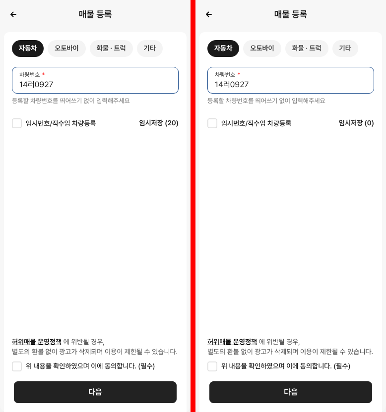
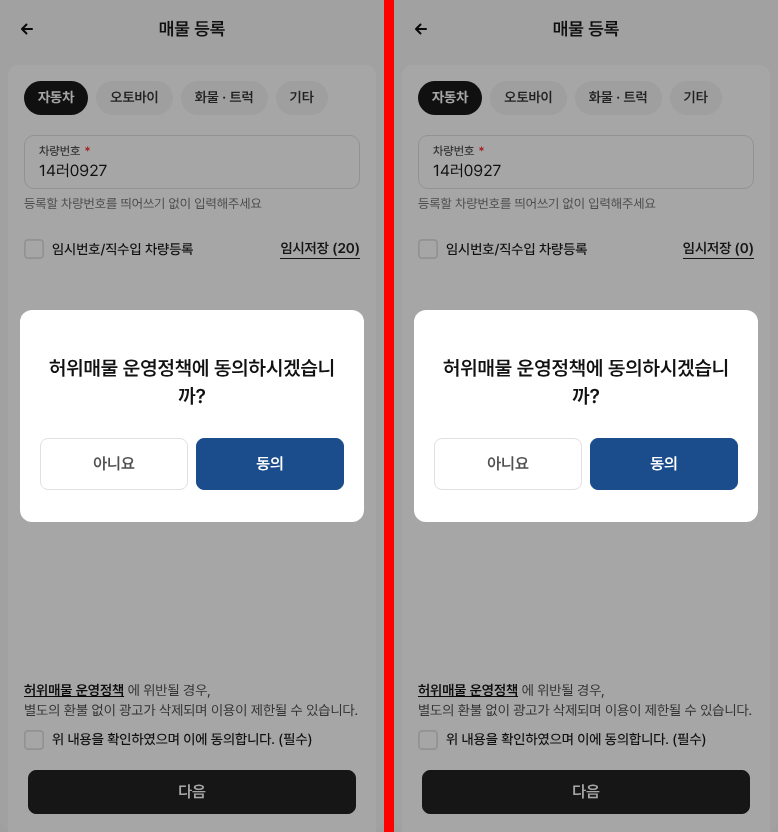
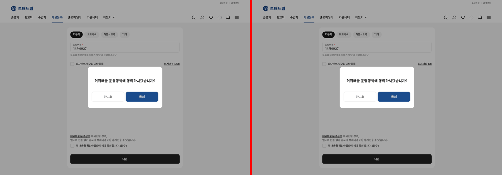
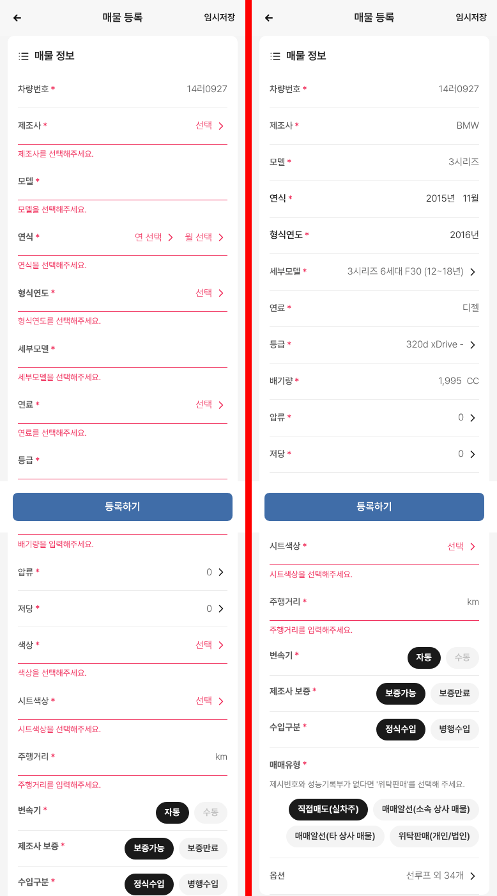

# PR #293 매물 등록 dev 크로스체크

① 한 줄 요약: dev 테스트 서버 매물등록과 우리 `?register`를 같은 순서로 눌러 비교했고, 다른 점 3가지(다음 버튼 켜지는 조건 · 동의 확인창 · 입력칸 포커스 테두리)를 dev에 맞췄다.

② 과제 ID 미지정(JOB-7 화면) · 브랜치 `claude/usedcar-list-detail-category-otcx1u` · 커밋 2a66067 · PR https://github.com/bobaekimboae/bobaedream/pull/293 · 상태: 병합(4db2df3)·배포 v=4db2df3, 번들 `index-Dsuf4uK9.js`

③ 한 일
- dev(`https://dev.bbmuseum.co.kr/car/register`)에 테스트 계정으로 로그인해 384·1280 두 폭에서 1단계 → 차량번호 입력 → 다음 → 등록 폼까지 우리 배포본과 나란히 돌렸다.
- 다른 점 1: dev는 차량번호만 넣으면 「다음」이 켜진다. 우리는 동의까지 해야 켜졌다 → dev와 같게.
- 다른 점 2: dev는 동의 전에 「다음」을 누르면 「허위매물 운영정책에 동의하시겠습니까?」 확인창(아니요 / 동의)을 띄우고, 동의를 누르면 바로 등록 폼으로 간다. 우리는 이 창이 없었다 → dev 확인창 규칙(크기·글자·버튼 색)을 그대로 옮겨 만들었다.
- 다른 점 3: 우리 입력칸에만 파란 포커스 테두리가 보였다(모바일 런타임 공통 규칙). dev는 커서만 → 이 화면 입력창에서만 끔.

④ 원본과 비교
| 화면 | 384 작업 전 → 후 | 1280 작업 전 → 후 |
|---|---|---|
| 1단계(빈 화면) | 0.18% → 0.18% | 0.03% → 0.03% |
| 차량번호 입력 후 | 5.06% → 0.18% | 2.56% → 0.05% |
| 동의 확인창 | (없음) → 0.17% | (없음) → 0.05% |

남은 차이는 「임시저장 (20)」(dev 테스트 계정의 실제 저장 수) vs 「(0)」이다.

동작 점검표(384·1280 모두 dev와 같음)
| 항목 | dev | 우리 |
|---|---|---|
| 빈칸일 때 다음 | 꺼짐 | 꺼짐 |
| 칸 탭/클릭 → 입력 | 됨 | 됨 |
| 입력 후 다음 | 켜짐 | 켜짐 |
| 동의 전 다음 | 확인창 | 확인창 |
| 확인창 아니요 | 닫힘 · 미동의 | 닫힘 · 미동의 |
| 확인창 동의 | 등록 폼 | 등록 폼 |

| 입력 후(왼쪽 dev · 오른쪽 우리) | 확인창 384 | 확인창 1280 |
|---|---|---|
|  |  |  |

⑤ 검증: verify:qf 통과 · 콘솔 오류 모바일·PC 0(dev 쪽 웹소켓·502 오류는 dev 서버 것) · 퀵필터 규격과 무관(등록 화면만 변경). dev에서는 차량번호 조회(register-check)만 했고 등록하기·임시저장·결제·사진 업로드는 누르지 않았다. 테스트 계정 정보는 저장소에 넣지 않았다.

⑥ 원본과 다르게 남긴 것과 이유
- 등록 폼 내용: 지금 dev(staging) 조회는 14러0927에 차량 정보를 돌려주지 않아 제조사·모델 등이 빈칸 + 빨간 안내 문구로 뜬다(384 폼 차이 8.83%). 우리는 지난번(10/07) dev 조회 결과로 만든 BMW 3시리즈 목업을 계속 채운다. dev 조회 데이터 쪽 변화라 우리 화면은 고치지 않았다.

- 임시저장 개수 (0): 테스트 계정 실제 값 (20)은 넣지 않음.

⑦ 못 한 것·다음에 할 것
- 등록 폼 안 팝업 14종은 이번에 다시 비교하지 않았다(PR #210 때 비교 완료, 이번 변경과 무관).
- 목록 하단 「매물등록」 버튼 연결은 미정.

⑧ 확인 링크: https://bobaekimboae.github.io/bobaedream/?register&v=4db2df3 (차량번호 14러0927). 비교 대상: `https://dev.bbmuseum.co.kr/car/register`
