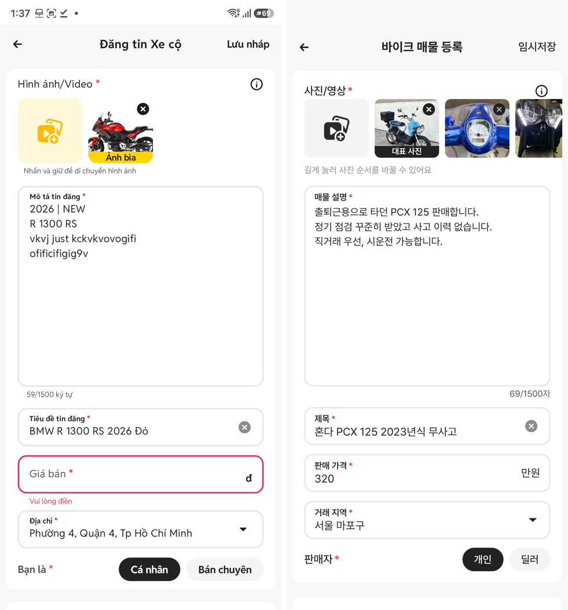
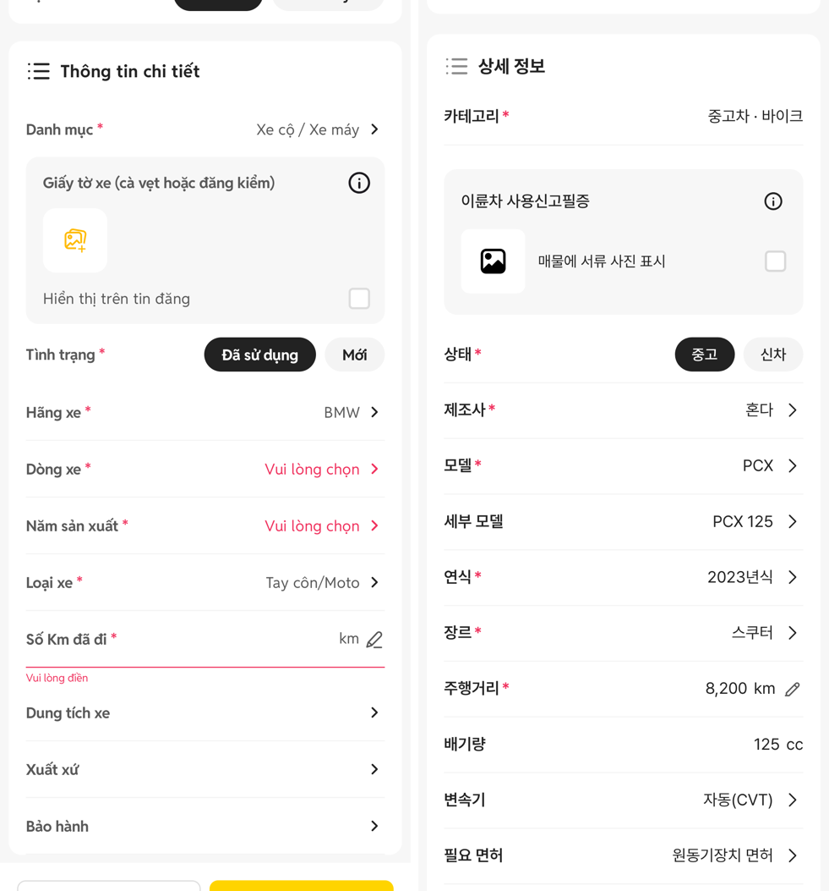
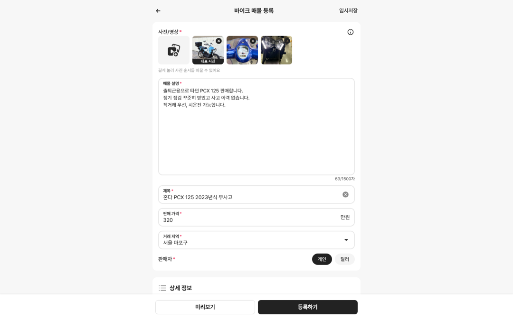
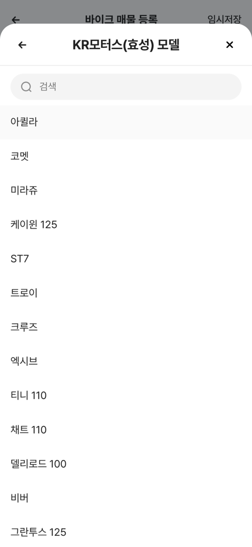

# PR #304 바이크 매물 등록 시안 (?register=bike)

## ① 한 줄 요약
초톳 앱 등록 화면(Đăng tin Xe cộ)을 뼈대로 바이크 매물 등록 시안을 새로 만들었습니다. 노란색은 보배드림 검정 `#222`로 바꿨습니다.

## ② 과제 정보
- 과제 ID: 미지정
- 브랜치: `claude/usedcar-list-detail-category-otcx1u`
- 커밋: 982ebdc(시안). 이 보고서는 그다음 커밋에 들어 있습니다.
- PR: https://github.com/bobaekimboae/bobaedream/pull/304
- 상태: 푸시만 했습니다. 병합·배포는 하지 않았습니다(요청하실 때 합니다).
- 이번 PR에 함께 들어가는 것: 초톳 등록 아이콘 19종(`public/assets/register/chotot-v01`), 작업 계획 `docs/register-bike-plan.md`

## ③ 한 일
- `?register=bike`로 여는 새 화면을 `src/prototype/register/bike/`에 만들었습니다. 중고차 등록(`?register`)은 바꾸지 않았습니다.
- 기본 정보 카드: 사진/영상 → 설명(1500자) → 제목 → 가격(만원) → 거래 지역(시도·구군) → 판매자(개인/딜러)
- 상세 정보 카드: 카테고리 「중고차 · 바이크」(고정이라 선택창 없음) → 이륜차 사용신고필증 사진 → 상태(중고/신차) → 제조사 → 모델 → 세부 모델 → 연식 → 장르 → 주행거리 → 배기량 → 변속기 → 면허 → 제조국 → 보증 → 튜닝 → 정비 이력
- 제조사·모델 목록은 바이크 기준표를 읽기만 하고, KR모터스·디앤에이모터스를 맨 앞에 둡니다. 세부 모델을 고르면 장르와 배기량이 자동으로 채워집니다.
- 필수 칸을 비우고 「등록하기」를 누르면 빨간 테두리와 안내 문구가 나오고, 첫 오류 칸으로 스크롤합니다.
- 사진은 실제로 올리지 않고 바이크 예시 사진을 붙입니다. 등록·미리보기·임시저장은 안내 문구만 띄웁니다.
- 모바일에서는 바텀시트(아래에서 올라오는 선택창), PC(768px 이상)에서는 가운데 모달로 엽니다. PC 화면 최대 폭은 600px입니다.

## ④ 원본과 비교
앱 캡처(1080÷2.8125, 상태바 34 제외)와 우리 화면(384)의 위치 차이입니다. 단위는 CSS px이고, `&sample=1` 기준입니다.

| 영역 | 처음 만든 직후 | 보정 후 |
|---|---|---|
| 첫 카드 시작 | +0.4 | +0.4 |
| 사진 추가 칸(88×80) | +3.6 | +0.1 |
| 설명칸(높이 274) | +2.5 | −1.0 |
| 제목 칸(52) | +5.6 | −1.9 |
| 가격 칸(52) | +5.2 | −2.3 |
| 둘째 카드 시작 | −1.0 | −8.5 (원본 캡처에 가격 오류 문구 10.7px가 있어서 생긴 차이) |
| 서류 상자 높이 | 128 → 원본 137 | 136 |
| 하단 버튼 | 높이 40 · 반경 8 · 좌우 16 · 간격 8 | 같음 |

## ⑤ 검증
- `npm run verify:qf` 통과. 번들: `index-DMm2krfJ.js`(로컬 빌드)
- 콘솔 오류: PC 1440 없음, 모바일 384 없음
- 이 화면은 퀵필터를 바꾸지 않았습니다. 그래서 퀵필터 규격 측정(`measure:qf`)은 해당하지 않습니다.

## ⑥ 원본과 다르게 남긴 것과 이유
- 노란 강조색(사진 추가 칸, 등록 버튼, 서류 아이콘)은 `#222` 계열로 바꿨습니다. 시안 작업 마스터 확정 사항 7번을 따랐습니다.
- 헤더 뒤로가기 ← 는 노션·180개 아이콘에 없어서 기존 `m-header-back.svg`를 썼습니다.
- 주행거리 연필 아이콘은 원본이 없어서 임시로 선 연필을 직접 그렸습니다(inline SVG).
- 체크박스도 원본이 없어서 CSS로 그렸습니다.
- 글꼴은 Pretendard입니다. 원본은 Reddit Sans라서 글자 폭은 비교하지 않았습니다(확정 사항 6번).

## ⑦ 못 한 것·다음에 할 것
- 상세 정보 칸은 코덱스가 DOM으로 재지 못했습니다. 실제 사진을 올려야 열리는 칸이라서, 지금 값은 앱 캡처 픽셀로 잰 값입니다. 3군 측정값이 오면 다시 맞춥니다.
- 선택창(제조사·모델·연식·주소)과 미리보기 화면은 원본 캡처가 없어서 QF-117 시트 규격으로 만들었습니다.
- 다음 차례는 트럭/특장, 건설기계, 캠핑카, 부품/용품입니다. 같은 틀에 항목만 바꿔 넓힙니다.

## ⑧ 확인 링크(배포 뒤)
- 모바일: `https://bobaekimboae.github.io/bobaedream/?qf=guazi&register=bike&v=<커밋>`
- 예시 채움: `…&register=bike&sample=1`
- PC: `…?qf=guazi&register=bike&pc=1&v=<커밋>`
