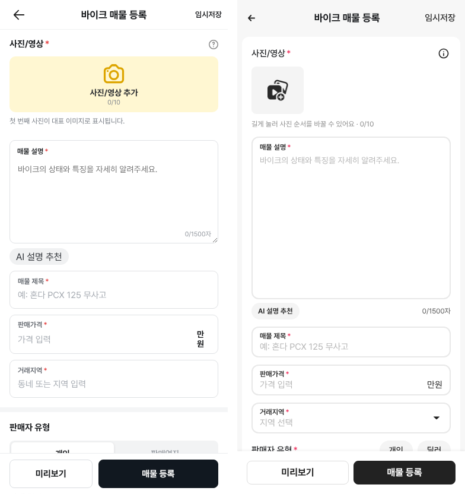
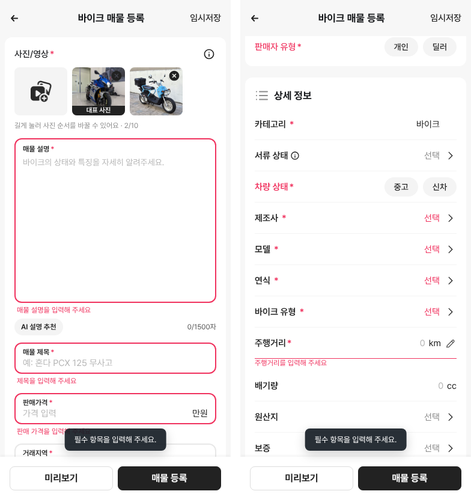
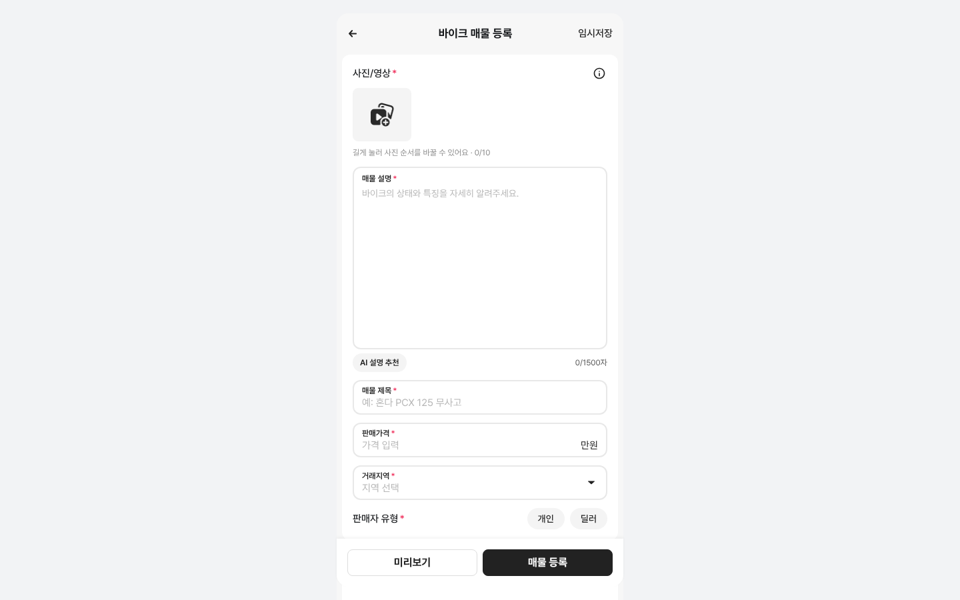

# PR #304 바이크 매물 등록 시안 1차 수정

## ① 한 줄 요약
코덱스가 만든 바이크 등록 시안(main 6d4617e)에 노션 「시안 수정 사항」의 클로드 코드 의견 1~15번을 반영했습니다. 노란색을 없애고, 초톳 앱 크기와 필수 항목 검사를 넣었습니다.

## ② 과제 정보
- 과제 ID: 미지정
- 브랜치: `claude/usedcar-list-detail-category-otcx1u`
- PR: https://github.com/bobaekimboae/bobaedream/pull/304
- 상태: 병합·배포 진행 (v 값은 채팅 보고에 적습니다)
- 이번 병합으로 함께 들어간 것: 초톳 등록 아이콘 19종(`public/assets/register/chotot-v01`), `docs/register-bike-plan.md`
- 처음 PR에 있던 클로드 쪽 바이크 화면(`register/bike/`)은 지웠습니다. 코덱스 뼈대(`BikeRegister.tsx`) 하나만 남겼습니다.

## ③ 한 일
- 노란색을 없앴습니다(노션 1번). 사진 추가 칸은 88×80 회색 칸에 검정 아이콘이고, 누르면 예시 사진이 붙습니다. 첫 장에는 「대표 사진」 띠와 삭제 X가 달립니다.
- 「만원」이 두 줄로 깨지던 것을 고쳤습니다(2번).
- 거래지역을 시도 → 구군 선택창으로 바꿨습니다(3번).
- 제조사 순서를 KR모터스 · 디앤에이모터스 다음에 인기순으로 바꿨습니다(4번).
- 필수 항목 검사를 넣었습니다(5번). 빈칸은 빨간 테두리와 안내 문구가 뜨고, 첫 오류 칸으로 이동합니다.
- 임시저장 안내 문구를 사실대로 고쳤습니다(6번).
- 페이지 틀을 초톳에 맞췄습니다(7~15번): 회색 바탕에 흰 카드 2장, 헤더 60, 설명칸 274, 알약 버튼(개인/딜러 · 중고/신차), 상세 정보 아이콘, 선택 행 52, 주행거리 연필, 하단 버튼 40·같은 폭·`#222`, 선택창 체크 `#222`

## ④ 원본과 비교

| 영역 | 수정 전(배포본) | 수정 후 | 초톳 앱 |
|---|---|---|---|
| 헤더 높이 | 50 | 60 | 60 |
| 사진 추가 칸 | 352×94 노랑 | 88×80 회색 | 88×80 |
| 설명칸 높이 | 174 | 274 | 274 |
| 입력칸 높이 | 64~66 | 52 | 52 |
| 알약 높이 | 38(분할 버튼) | 32 | 32 |
| 선택 행 높이 | 58 | 52 | 52 |
| 하단 버튼 | 48, 140:202 | 40, 172:172 | 40, 171.7:171.7 |

## ⑤ 검증
- `npm run verify:qf` 통과
- 콘솔 오류: 모바일 384 없음, PC 1440 없음
- 퀵필터는 바꾸지 않아서 퀵필터 규격 측정은 해당하지 않습니다.

## ⑥ 원본과 다르게 남긴 것과 이유
- 뒤로 아이콘은 `m-header-back.svg`, 연필은 직접 그린 선 아이콘을 썼습니다. 초톳 원본 아이콘이 없어서입니다.
- 설명 글자 수는 칸 아래 「AI 설명 추천」 오른쪽으로 옮겼습니다.

## ⑦ 못 한 것·다음에 할 것 (결정 필요)
- 서류: 「서류 상태」 선택 행을 그대로 둘지, 사용신고필증 사진 칸으로 바꿀지 정해야 합니다(13번).
- 「AI 설명 추천」 버튼을 둘지, 둔다면 위치와 모양을 정해야 합니다(16번).
- PC 최대 폭은 지금 430입니다. 480과 600 중에서 정해야 합니다(17번).
- 선택창 모양은 초톳 원본 캡처를 받은 뒤 맞춥니다(18번).
- 변속기·면허·튜닝·정비 이력 칸을 추가할지 정해야 합니다(19번).

## ⑧ 확인 링크
- 모바일: `https://bobaekimboae.github.io/bobaedream/?register=bike&category=바이크&v=<커밋>`
- PC: 위 주소에 `&pc=1`
