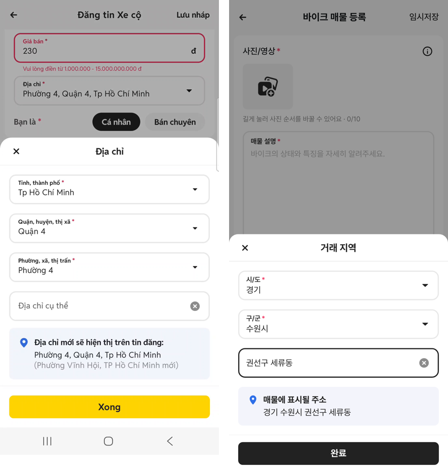
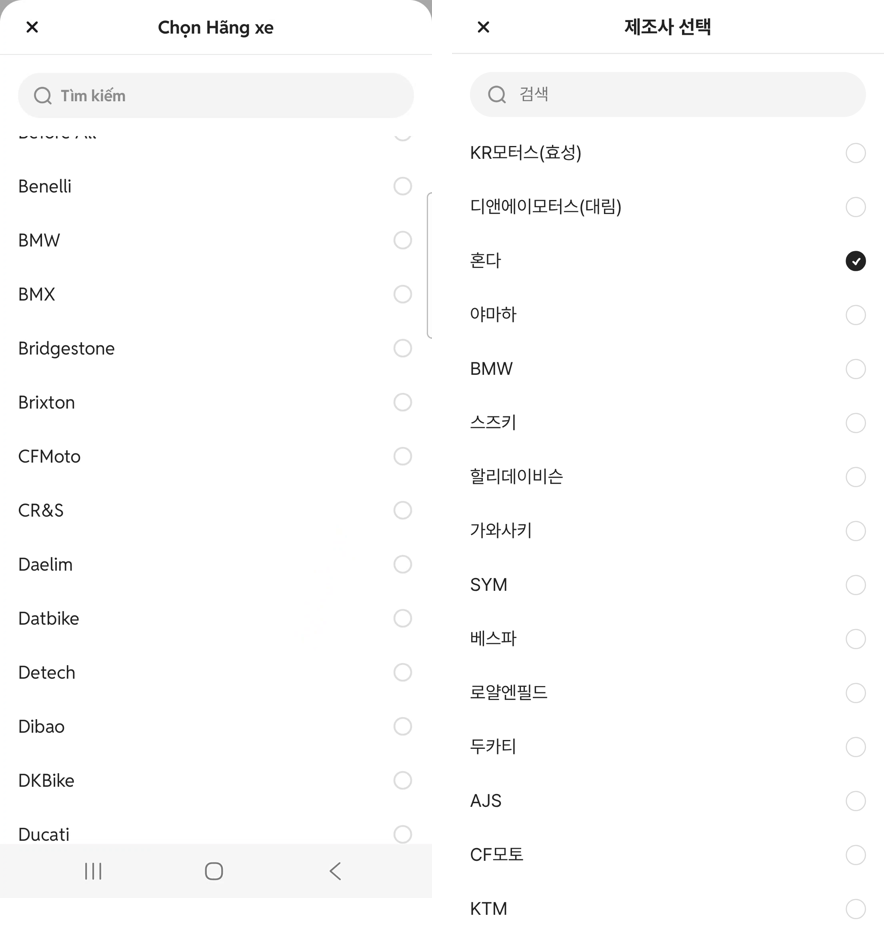
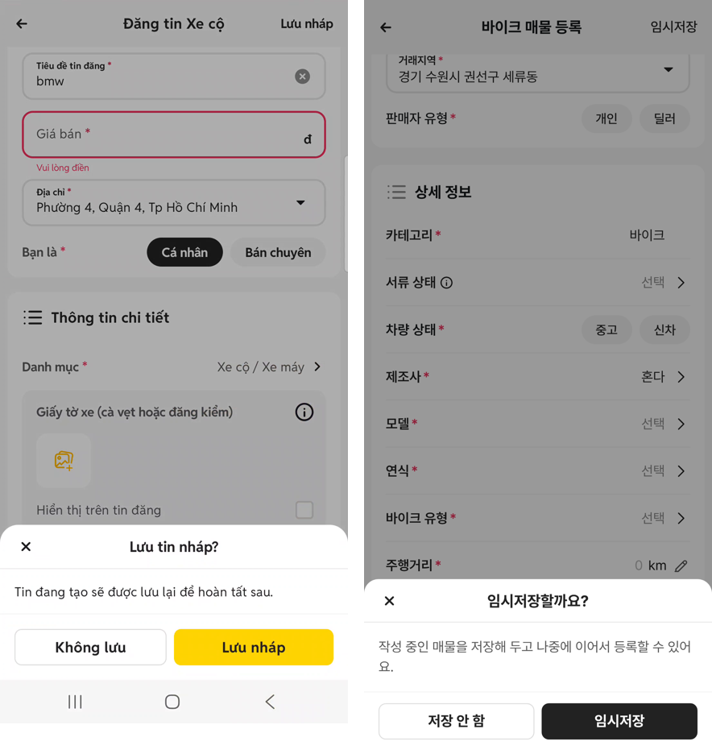
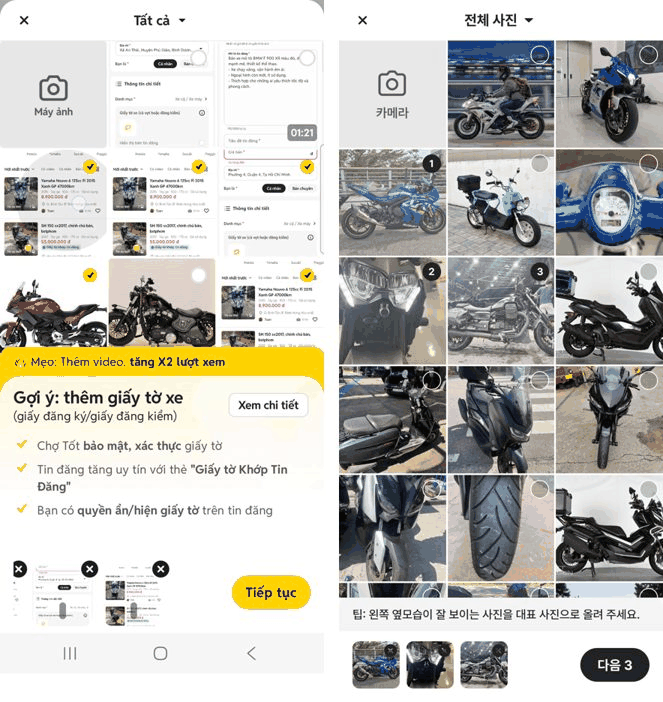
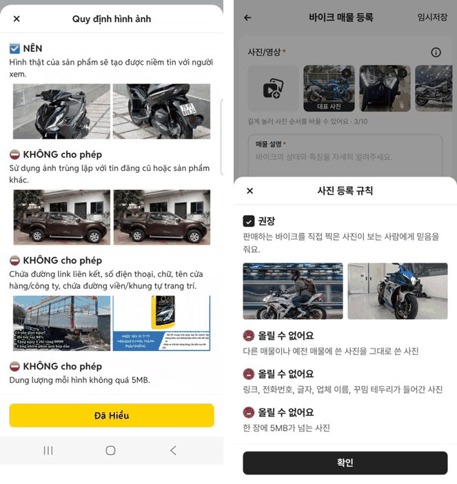
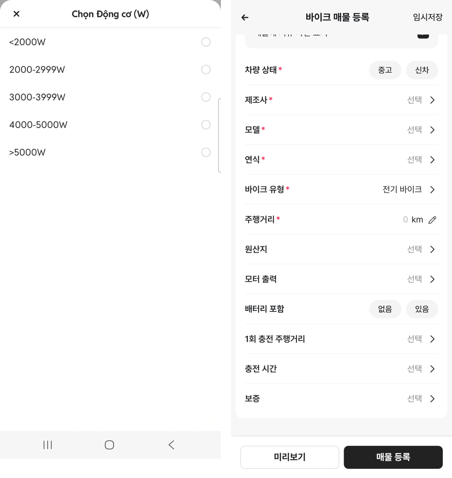

# PR #310 바이크 매물 등록 2·3차 수정 (초톳 녹화 기준 시트·선택창·사진·전기 바이크)

## ① 한 줄 요약
사용자가 준 초톳 등록 화면 녹화 두 편(80초, 풀버전 160초)을 재서 화면을 초톳에 맞췄습니다. 2차에서 거래 지역 시트·임시저장 확인 시트·선택창을, 3차에서 사진 고르기·사진 규칙·서류 사진 칸·전기 바이크 전용 칸·보증 기간을 넣었습니다.

## ② 과제 정보
- 과제 ID: 미지정
- 브랜치: `claude/usedcar-list-detail-category-otcx1u`
- 커밋: dc23c64. 이 보고서는 그다음 커밋에 들어 있습니다.
- PR: https://github.com/bobaekimboae/bobaedream/pull/310
- 상태: 푸시만 했습니다. 병합·배포는 요청하실 때 합니다.
- 근거 영상: 드라이브 `Screen_Recording_20261009_175600_Chợ Tốt.mp4`, `초톳 매물등록 동영상 풀버전.mp4` (1080×2340, ÷2.8125로 환산)

## ③ 한 일
- **거래 지역:** 칸을 누르면 아래에서 시트가 올라옵니다.
  - 순서: 시/도 → 구/군 → 상세 주소(선택) → 「매물에 표시될 주소」 미리보기 → 「완료」
  - 시/도와 구/군은 전체 화면 선택창에서 고릅니다.
  - 「완료」를 누르기 전에는 입력한 값이 화면에 적용되지 않습니다.
- **뒤로가기:** 누르면 바로 나가지 않고 「임시저장할까요?」 시트가 뜹니다. 버튼은 저장 안 함 / 임시저장입니다.
- **선택창(제조사·모델·연식 등):** 헤더 48, 검색칸 40, 행 48, 글자 16, 라디오 18로 맞췄습니다. 선택 표시는 노랑 대신 #222 체크입니다.
- **제목:** 아래에 글자 수(0/50)를 보여줍니다.
- **가격:** 10만원 미만이거나 99,999만원 초과면 범위 안내를 띄웁니다.
- (3차) **사진 고르기:** 사진 추가 칸을 누르면 초톳 「Tất cả」처럼 전체 화면 사진 고르기가 열립니다.
  - 화면: 카메라 칸 + 3열 사진 목록, 고른 순서 번호(#222), 아래에 팁 줄과 고른 사진 줄, 「다음 N」 버튼
  - 예시 사진은 바이크 v08 사진을 씁니다. 실제 업로드는 하지 않습니다.
- (3차) **사진 규칙:** 사진 옆 (i)를 누르면 「사진 등록 규칙」 시트가 열립니다(권장 1개, 올릴 수 없어요 3개). 초톳 「Quy định hình ảnh」를 따랐습니다.
- (3차) **서류:** 「서류 상태」 선택 행을 초톳처럼 바꿨습니다.
  - 회색 상자 안에 「이륜차 사용신고필증」 사진 칸(60×60, 2장까지)과 「매물에 서류 사진 표시」 체크박스를 둡니다.
  - (i)를 누르면 서류 사진 안내 시트가 열립니다.
- (3차) **전기 바이크:** 바이크 유형에 「전기 바이크」를 추가했습니다. 고르면 배기량 칸이 빠지고 아래 네 칸이 나옵니다.
  - 모터 출력, 배터리 포함(없음/있음), 1회 충전 주행거리, 충전 시간
  - 구간 값은 초톳과 같습니다.
- (3차) **보증:** 초톳 구간(1~6개월 · 7~11개월 · 1년 · 2년 · 3년 · 3년 초과)으로 바꿨습니다.

## ④ 원본과 비교 (CSS px)

| 항목 | 초톳 녹화 | 우리 |
|---|---|---|
| 시트 헤더 | 48 + 구분선 | 48 + 구분선 |
| 주소 입력칸 높이 · 간격 | 51 · 17 | 52 · 16 |
| 주소 미리보기 바탕 | #F3F4FB | #F3F4FB |
| 시트 버튼 높이 | 40 | 40 |
| 선택창 검색칸 | 40, 좌우 16 | 40, 좌우 16 |
| 선택창 행 간격 | 48 | 48 |
| 라디오 지름 | 약 17 | 18 |

## ⑤ 검증
- `npm run verify:qf` 통과
- 콘솔 오류: 모바일 384 없음

## ⑥ 원본과 다르게 남긴 것과 이유
- 주소 단계: 초톳은 3단계(시 · 구 · 동)입니다. 우리 지역 자료(`regions-kr.json`)는 시도 · 구군까지라서 2단계 + 상세 주소로 했습니다.
- 초톳의 「신 행정구역」 보조 줄은 우리에 해당하지 않아 넣지 않았습니다.
- 노란 버튼과 선택 표시는 확정 사항 7번에 따라 #222로 했습니다.
- 초톳 문구 중 「영상을 올리면 조회수 2배」, 「초톳이 서류를 확인」 같은 효과·서비스 약속은 우리에게 근거가 없어서 넣지 않았습니다. 중립적인 안내 문구로 바꿨습니다.
- 사진 규칙의 「올릴 수 없어요」 예시 사진은 쓸 수 있는 원본이 없어서 글만 넣었습니다.

## ⑦ 못 한 것·다음에 할 것
- 13번 서류는 녹화와 계획서대로 사진 칸으로 바꿨습니다. 16번 AI 버튼, 17번 PC 폭, 19번 추가 칸은 아직 결정 대기입니다.
- 사진 길게 눌러 순서 바꾸기, 영상 썸네일(재생 시간 표시), 업로드 진행률(0~99%)은 아직 넣지 않았습니다.
- 녹화에 나온 카테고리 시트(Chọn Loại xe 등)는 우리 카테고리가 「바이크」 고정이라 적용하지 않았습니다.

## ⑧ 확인 링크(배포 뒤)
- 모바일: `https://bobaekimboae.github.io/bobaedream/?register=bike&category=바이크&v=<커밋>`
- PC: 위 주소에 `&pc=1`
