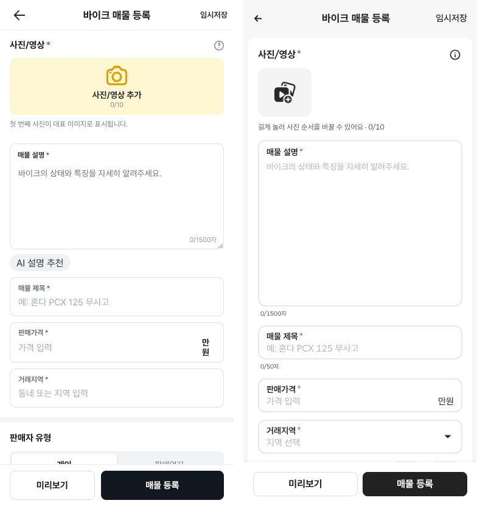
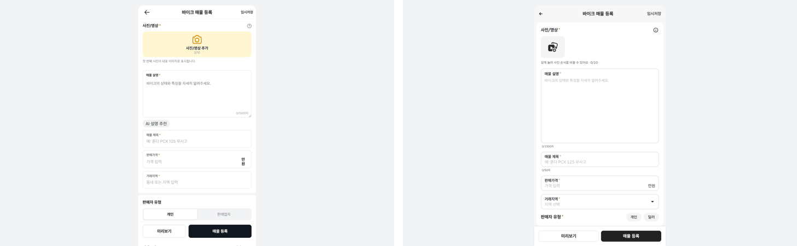
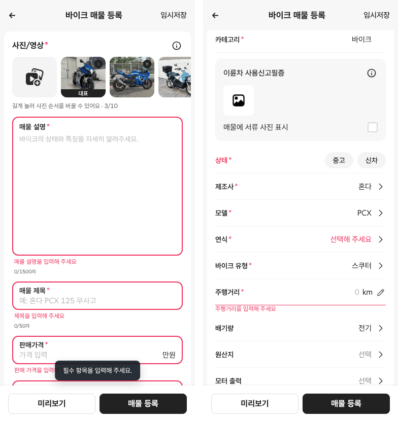
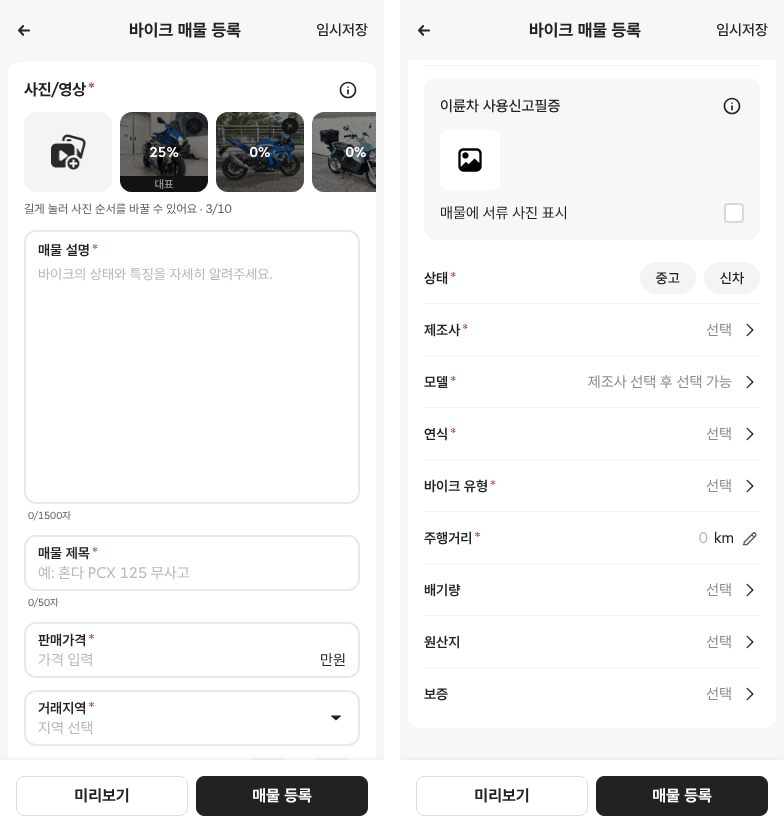

# PR #311 바이크 매물 등록 시안 수정 (노션 「시안 수정 사항」 1~8 · 1차·2차)

## ① 한 줄 요약
노션 검수 1~8번과 마스터 지시(10/9)대로 바이크 매물 등록 시안의 1차 10개, 2차 11개를 고쳤습니다. 노란색은 모두 #222이고, 아이콘은 초톳 원본이 있는 것만 썼습니다.

## ② 과제 정보
- 과제 ID: 미지정
- 브랜치: `feat/bike-register-fix-1009`. 아직 병합되지 않은 PR #310(2·3차) 위에서 시작했습니다.
- 커밋: a2e735e(1차), f999a83(2차). 이 보고서는 그다음 커밋에 들어 있습니다.
- PR: https://github.com/bobaekimboae/bobaedream/pull/311
- 상태: 병합·배포 (v 값은 채팅 보고에 적음)
- 이번 병합으로 main에 함께 들어간 것: PR #310의 거래 지역 시트, 임시저장 확인 시트, 선택창 크기, 사진 고르기, 사진 규칙, 서류 사진 칸

## ③ 한 일
- **1차:**
  - 「AI 설명 추천」을 뺐습니다.
  - 글꼴을 Reddit Sans로 바꾸고(한글은 Pretendard), 숫자 폭을 일정하게(tabular-nums) 했습니다.
  - 마스터 PC DOM 값을 적용했습니다: 섹션 제목 16/700/24, 라벨 14, 카운터 10/15, 보조 글자 #595959.
  - 사진 칸을 radius 12로 맞췄고, 「기타 제조사」를 맨 아래로 옮겼습니다.
  - 닫기·검색·체크·위치 아이콘을 초톳 원본으로 바꿨습니다.
- **2차 · 배기량:** 기준표 구간에서 고르는 시트로 바꿨습니다. 「전기」를 고르면 전기 바이크 칸 4개가 나옵니다.
- **2차 · 연식·모델:**
  - 연식에 검색창과 맨 아래 「1979년 이전」을 넣었습니다.
  - 모델 목록 끝에 「기타 모델」을 넣었고, 모델을 고르면 장르·배기량이 자동으로 채워집니다.
  - 제조사를 고르기 전에는 모델 줄에 「제조사 선택 후 선택 가능」이 보입니다.
- **2차 · 사진·기타:**
  - 사진을 올리면 업로드 %를 화면에만 보여줍니다(0→100%). 첫 장 배지는 「대표」입니다.
  - 카테고리 줄은 눌리지 않게 했고, 「차량 상태」는 「상태」로 고쳤습니다.
  - 선택창에 라디오 역할과 방향키 이동을 넣었고, 닫으면 연 줄로 포커스가 돌아갑니다.
  - PC 최대 폭은 `--register-max-w` 한 줄로 바꿀 수 있습니다(지금 480).

## ④ 원본과 비교 (수정 전 v=6d4617e → 수정 후, CSS px)

| 항목 | 수정 전 | 수정 후 | 기준 |
|---|---|---|---|
| 사진 칸 | 352×94, r10, #FFF7D2 | 88×80, r12, #F4F4F4 | 마스터 r12, 크기는 초톳 앱 |
| 등록 버튼 | #111820, 높이 48 | #222222, 높이 40 | 확정색 #222 |
| AI 설명 추천 | 있음 | 없음 | 지시 |
| 「만원」 | 두 줄 | 한 줄(nowrap) | 지시 |
| 설명칸 손잡이 | 보임 | resize: none | 지시 |
| 글꼴 | Inter | Reddit Sans(+Pretendard) | 마스터 DOM |
| 섹션 제목 | 15/700 | 16/700/24 | 마스터 DOM |
| 라벨 | 12/600 · 14/600 섞임 | 14 하나 | 마스터 DOM |
| 카운터 | 11, 「0」「/1500자」 따로 | 10/15 한 덩어리 「0/1500자」 | 마스터 DOM |
| 맨 아래 가림 | 가려짐 | 마지막 줄 720 < 바 시작 760(모바일), 768 < 828(PC) | 지시 |
| 제조사 순서 | 가나다(KR모터스 61번째, 기타 3번째) | KR모터스 → 디앤에이 → 기준표 순서 → 기타 제조사 | 확정 8 |
| PC 폭 | 430 | 480(`--register-max-w`) | 결정 대기 |

## ⑤ 검증
- `npm run verify:qf` 통과
- 콘솔 오류: 모바일 384 없음, PC 1440 없음
- 퀵필터 파일은 바꾸지 않았습니다. 그래서 퀵필터 규격 측정(`measure:qf`)은 해당하지 않습니다.

## ⑥ 원본과 다르게 남긴 것과 이유
- 모바일 384 크기는 초톳 DOM 값이 없어 「미확인」입니다. 사진 칸 88×80, 입력 52, 버튼 40, 행 52, 헤더 60은 앱 캡처를 픽셀로 잰 값입니다.
- 사진 추가 아이콘은 초톳 `upload-media.png`(노란 PNG)입니다. SVG가 아니라 색 토큰을 쓸 수 없어서 CSS filter로 검게 표시합니다.
- 주소는 시/도·구/군 2단과 상세 주소입니다. 우리 지역 자료에 동 단위가 없어서입니다.
- 바이크 유형은 기준표 12종을 유지했습니다. 「전기 바이크」는 유형이 아니라 배기량 구간 「전기」로 옮겼습니다(기준표 구조와 같게).

## ⑦ 못 한 것·다음에 할 것
- **아이콘 없음(임시 사용, 코드에 「임시」 주석):**
  - 헤더 ← 화살표 → 보배드림 `m-header-back.svg`로 대신함
  - 카메라 → 사진 고르기 첫 칸, 직접 그린 SVG
  - 선 연필 → 주행거리, 직접 그린 SVG
  - 체크박스·라디오 → CSS 테두리, 체크 표시만 초톳 check-mark
  - 플러스 → 별도 파일 없음, upload-media.png 안에 포함
  - 우측 셰브론 → 180개 묶음에는 없음. 노션 초톳 DB 원본 `chevron-right.svg`를 사용
- **값 미확인:** 모바일 384 초톳 DOM 전체, 입력칸 테두리 두께(1.6 재측정 대기), 사진 칸 높이 140(PC)과 모바일의 관계
- **결정 대기:** PC 폭 480/600, 상세 정보를 사진·설명 입력 전까지 잠글지(시안 작업 마스터 A5), 배기량 필수 여부
- **동(읍/면/동) 3단 선택:** 자료가 없어 못 했습니다.

## ⑧ 확인 링크
- 모바일: `https://bobaekimboae.github.io/bobaedream/?register=bike&category=바이크&v=<커밋>`
- PC: 위 주소에 `&pc=1`
