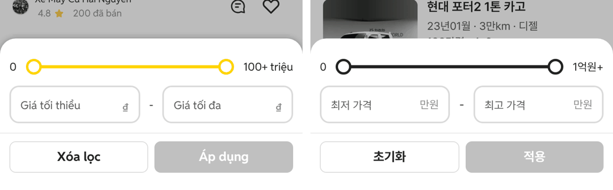
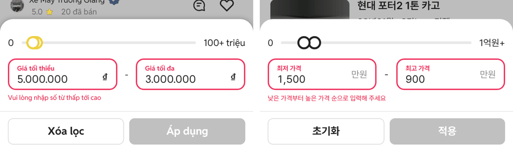
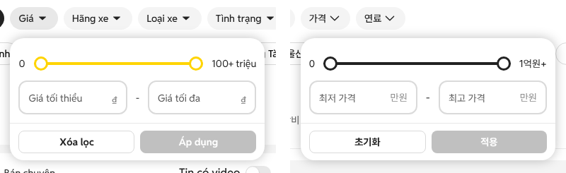
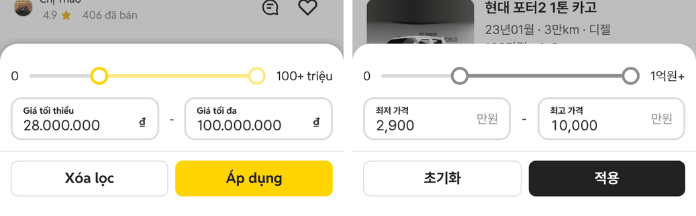

# PR #313 가격 필터를 초톳 가격 필터와 같게

## ① 한 줄 요약
초톳(xe.chotot.com) 가격 필터를 모바일웹 384·PC 1440에서 직접 열어 재고, 입력·선택 동작을 그대로 옮겨 과쯔 가격 필터를 다시 만들었습니다(노랑 → #222).

## ② 과제 정보
- 과제 ID: 미지정
- 브랜치: `feat/price-filter-chotot-1009` (main ce0b806에서 시작)
- 커밋: 7b73352. 이 보고서는 그다음 커밋에 들어 있습니다.
- PR: https://github.com/bobaekimboae/bobaedream/pull/313
- 상태: 푸시만 했습니다. 병합·배포는 요청하실 때 합니다.

## ③ 한 일
- 초톳 가격 필터에서 확인한 동작:
  - 숫자만 입력되고 천 단위로 나뉩니다. 라벨은 칸 안에 있다가 입력하면 위로 작게 올라갑니다.
  - 입력하면 슬라이더 손잡이가 따라 움직이고, 손잡이를 끌면 두 칸이 함께 채워집니다.
  - 최저가 최고보다 크면 빨간 테두리와 안내가 뜨고 「적용」이 꺼집니다.
  - 「Xóa lọc(필터 지우기)」는 지우고 닫고, 배경을 누르면 입력하던 값을 버립니다.
  - 적용하면 칩에 범위가 표시되고, 다시 열면 값이 남아 있습니다.
- 우리 가격 필터를 같은 구조로 바꿨습니다: 슬라이더 → 최저·최고 입력 → 초기화/적용.
- 없앤 것: 일반/리스·렌트 탭, 구간 칩, 제목 줄, 「N대 보기」
- PC는 칩으로 열면 칩 아래 12px에 팝오버로 뜹니다. 좌측 필터에서 열면 기준 칩이 없어서 가운데에 같은 카드로 엽니다.
- 상한: 승용 1억원+(1칸 100만원), 부품·용품 500만원+(1칸 5만원)
- 규칙 문서 `docs/quick-filter-spec.md` 「Price Filter」를 새로 썼습니다.

## ④ 원본과 비교 (모바일 384 / PC 1440, CSS px)

| 항목 | 초톳 | 우리 |
|---|---|---|
| 시트 위치·높이(모바일) | 639 · 193 | 639 · 193 |
| 슬라이더 줄 | y651, 높이 48 | y651, 높이 48 |
| 입력칸 | y699, 165.5×48, 테두리 2 #DADADA, 모서리 12 | y699, 165×48, 같음 |
| 사이 「-」 | 좌우 12 | 좌우 12 |
| 버튼 | y770, 높이 40, 모서리 8 | y770, 높이 40, 모서리 8 |
| 오류 시 | 시트 20 위로 늘어남 | 20 위로 늘어남 |
| 트랙·손잡이 | 4px #E8E8E8, 20px 원 3px #FFD400 | 4px #E8E8E8, 20px 원 3px #222 |
| PC 팝오버 | 칩 아래 12, 폭 360, 모서리 20, 버튼 32 | 같음 |
| 배경 어둡기 | 26% | 26% |

## ⑤ 검증
- `npm run verify:qf` 통과
- 콘솔 오류: 모바일 0건, PC 0건(`measure:qf`)
- `measure:qf` 퀵필터 규격은 이번 변경과 상관없이 그대로입니다(레일 110/102, 카드 76×102 · 84×102). 가격 필터 외 화면은 바꾸지 않았습니다.

## ⑥ 원본과 다르게 남긴 것과 이유
- 단위는 초톳 「₫」 대신 「만원」, 천 단위는 「.」 대신 「,」입니다(한국 표기).
- 슬라이더 상한은 1억원+입니다(우리 승용 가격대). 부품·용품은 500만원+입니다.
- 색: 노랑 → #222, 옅은 노랑(마우스 올림) → #8C8C8C
- 글꼴은 과쯔 규칙(QF-120)대로 Pretendard입니다. 초톳은 Reddit Sans입니다.
- 적용 뒤 칩 문구는 기존 형식(「2,900만원부터 10,000만원까지」)을 그대로 두었습니다. 초톳은 「28 triệu đ - 72 triệu đ」입니다.

## ⑦ 못 한 것·다음에 할 것
- 칩 문구를 초톳처럼 「2,900만원 - 1억원」으로 바꿀지 결정이 필요합니다.
- 리스·렌트 가격 구분을 없앴습니다. 따로 필요하면 다른 필터로 옮겨야 합니다.
- 주행거리·연식 필터도 같은 초톳 범위 필터로 맞출지 정해야 합니다.

## ⑧ 확인 링크
- 모바일 `?qf=guazi` → 가격 칩
- PC `?qf=guazi&pc=1` → 가격 칩
- 배포 뒤에는 `&v=<커밋>`을 붙입니다.
