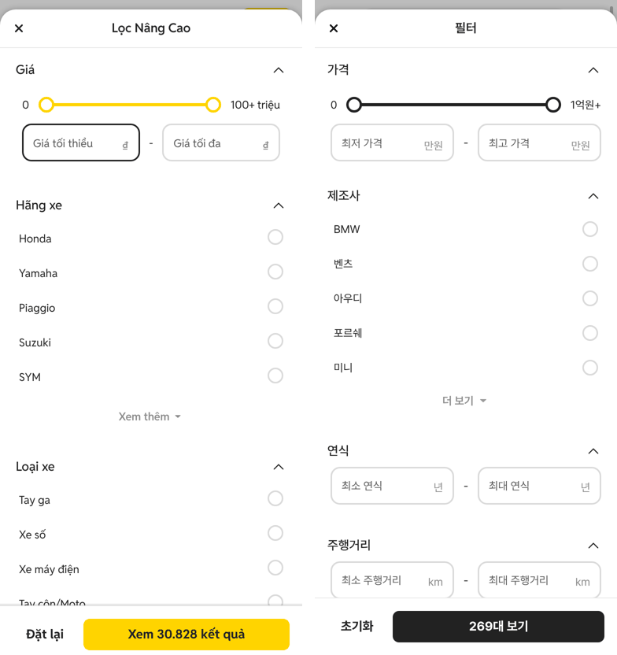
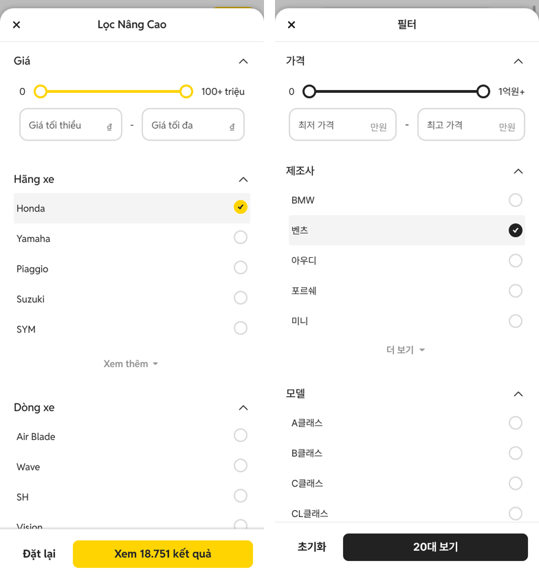
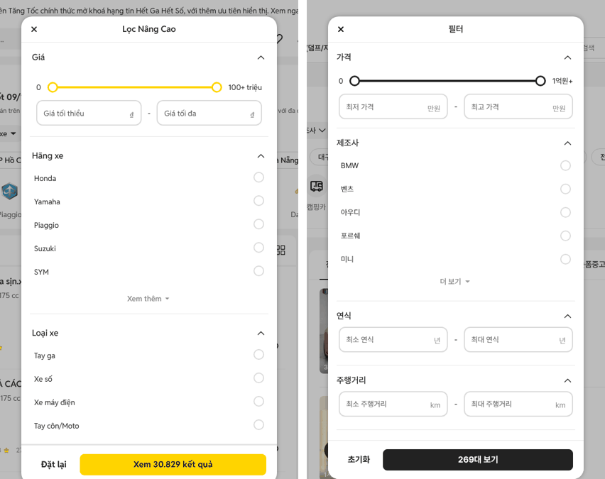

# PR #315 전체 필터를 초톳 「Lọc Nâng Cao」와 같게

## ① 한 줄 요약
초톳 전체 필터를 모바일 384·PC 1440에서 직접 열어 줄 색·크기·글자·동작을 재고, 과쯔 전체 필터를 같은 구조로 다시 만들었습니다(노랑 → #222, 아이콘은 초톳 원본).

## ② 과제 정보
- 과제 ID: 미지정
- 브랜치: `feat/full-filter-chotot-1009`. 가격 필터 PR #313 위에서 시작해서, 병합하면 #313도 함께 들어갑니다.
- 커밋: 25e4704. 이 보고서는 그다음 커밋에 들어 있습니다.
- PR: https://github.com/bobaekimboae/bobaedream/pull/315
- 상태: 푸시만 했습니다. 병합·배포는 요청하실 때 합니다.

## ③ 한 일
- 초톳 「Lọc(필터)」에서 실측한 내용:
  - 머리·섹션·줄·라디오·체크박스·스위치·더 보기·아래 버튼의 크기와 색
  - CSS 원본 규칙: 줄 마우스 올림 #F4F4F4, 체크 줄 구분 #F4F4F4, 배경 #222 30%
  - 동작: 다시 누르면 해제, 대수가 바로 바뀜, 제조사를 고르면 모델 섹션이 생김, 섹션 접기, 초기화
- 새 부품 `chotot-full-filter`를 만들었습니다. 우리 필터 항목을 초톳 섹션 형태로 바꿔 넣었습니다.
  - 체크 항목 → 체크박스
  - 구간 항목·제조사·모델·광고기간 → 라디오
  - 가격 → 슬라이더와 입력
  - 연식·주행거리 → 입력 두 칸
  - 차량번호 → 입력 한 칸
  - 영상·거래 상태 → 스위치
- 모바일 「필터」와 PC 「필터」 칩이 모두 이 화면을 엽니다. PC는 가운데 480, 위 31입니다.
- 순서는 초톳처럼 가격 → 제조사(→ 모델) → 나머지입니다. 항목이 많아 기본 9개 밖 섹션은 처음에 접어 둡니다.
- 아이콘은 초톳 원본을 썼습니다: 접기 화살표(180개 묶음 toggle-arrow, 새로 받음), 닫기 close-window, 더 보기 caret-down, 체크 check-mark.
- 규칙 문서 `docs/quick-filter-spec.md`에 「Full Filter (초톳)」 섹션을 새로 썼습니다(이전 당근식 규칙을 대체).

## ④ 원본과 비교 (CSS px)

| 항목 | 초톳 | 우리 |
|---|---|---|
| 시트(모바일) | 위 12, 모서리 20 | 같음 |
| 모달(PC) | x480 y31, 폭 480, 모서리 20 | x480 y31, 폭 480, 모서리 20 |
| 머리 | 48 + 1px #E8E8E8, 제목 16/600 | 같음 |
| 첫 섹션 제목 | y69, 높이 40, 16/500 | y69, 높이 40, 16/500 |
| 목록 줄 | 44(위아래 10), 14/400/24 | 같음 |
| 라디오·체크박스 | 20, 테두리 2 #DADADA, 선택 노랑 채움 | 20, 테두리 2 #DADADA, 선택 #222 채움 |
| 체크 줄 구분 | 안쪽 1px #F4F4F4 | 같음 |
| 더 보기 | 높이 40, 14/600 #8C8C8C | 같음 |
| 스위치 | 52×32, 손잡이 28 | 같음 |
| 섹션 구분선 | PC만 1px #E8E8E8 | PC만 1px #E8E8E8 |
| 아래 버튼 | 높이 40, 모서리 8, 「Đặt lại」 글자 버튼 | 높이 40, 모서리 8, 「초기화」 글자 버튼 |
| 배경 | #222 30% | #222 30% |

## ⑤ 검증
- `npm run verify:qf` 통과
- 콘솔 오류: 모바일 0건, PC 0건(`measure:qf`)
- 승용·바이크·트럭·부품 카테고리 모두 열림 확인, 콘솔 오류 없음
- `measure:qf` 퀵필터 규격은 그대로입니다. 퀵필터 레일은 바꾸지 않았습니다.

## ⑥ 원본과 다르게 남긴 것과 이유
- 항목 수: 초톳은 7개, 우리는 승용 28개입니다. 기본 9개 밖은 처음에 접어 둡니다.
- 우리 체크 항목은 여러 개를 고를 수 있어서 체크박스입니다. 초톳은 「Đăng bởi」만 체크박스입니다.
- 「숏폼중고차」와 「거래 상태」 스위치를 넣었습니다. 초톳 「Tin có video」 자리입니다.
- 글꼴은 과쯔 규칙대로 Pretendard입니다(초톳은 Reddit Sans).
- PC 왼쪽 필터는 남겨 두었습니다. 초톳 PC에는 왼쪽 필터가 없습니다.

## ⑦ 못 한 것·다음에 할 것
- PC 왼쪽 필터를 없애고 초톳처럼 「필터」 모달만 둘지 결정이 필요합니다.
- 제조사 목록은 퀵필터 레일 제조사(상위 브랜드)만 보여줍니다. 전체 브랜드를 넣을지 결정이 필요합니다.
- 예전 당근식 필터 코드(항목별 시트)는 아직 남아 있습니다. 확정되면 지웁니다.

## ⑧ 확인 링크
- 모바일 `?qf=guazi` → 「필터」
- PC `?qf=guazi&pc=1` → 「필터」 칩
- 배포 뒤에는 `&v=<커밋>`을 붙입니다.
