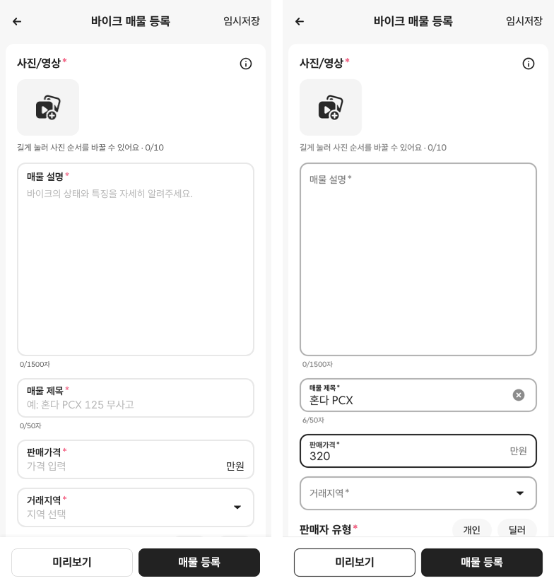
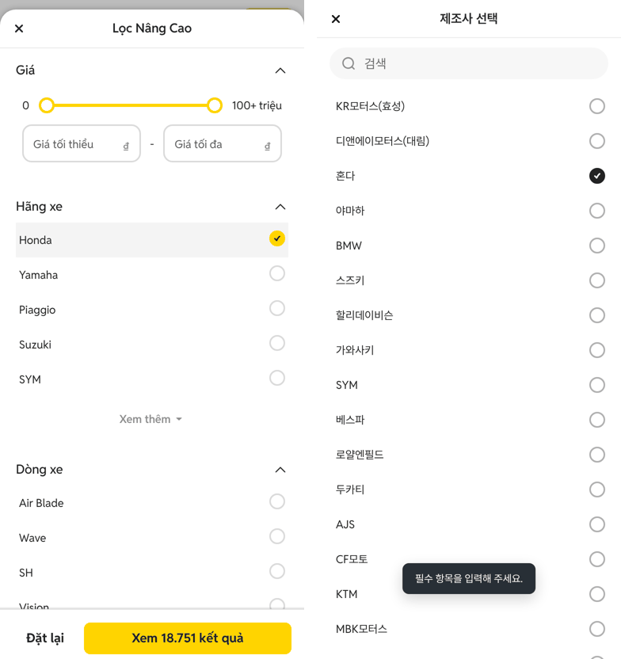
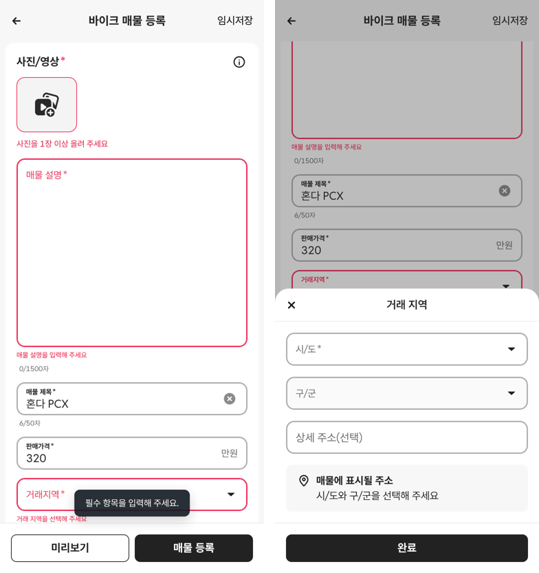
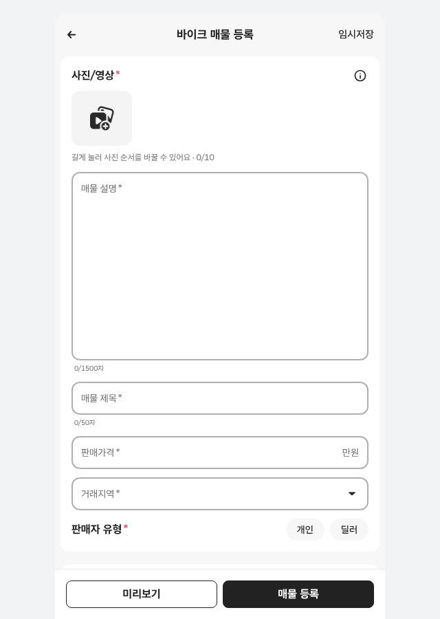

# PR #317 바이크 매물 등록에 초톳 필터 UI·UX 적용

## ① 한 줄 요약
초톳 가격 필터·전체 필터에서 실측한 입력·선택·시트 방식을 바이크 매물 등록 화면에 적용하고, 색을 에어비앤비 블랙·그레이로 맞췄습니다. 목록 필터는 건드리지 않았습니다.

## ② 과제 정보
- 과제 ID: 미지정
- 브랜치: `feat/bike-register-filter-ux-1009` (main e478468에서 시작)
- 커밋: 060b0e7. 이 보고서는 그다음 커밋에 들어 있습니다.
- PR: https://github.com/bobaekimboae/bobaedream/pull/317
- 상태: 병합·배포 완료(main ad035bb, v=ad035bb, 번들 index-BOn08N_3.js)
- 목록 필터를 바꾼 PR #313·#315는 「[보류]」 초안으로 돌려 두었습니다(병합 안 함).

## ③ 한 일
- **입력칸** (초톳 「Input Field」):
  - 높이 48, 테두리 2, 모서리 12
  - 비어 있으면 라벨이 칸 안에 있다가, 값이 있거나 누르면 위로 작게 올라갑니다.
  - 단위는 오른쪽 위에 둡니다.
  - 오류 문구는 10/16 빨강입니다.
- **선택창** (초톳 필터 선택 목록):
  - 머리 48, 제목 16/600, 닫기 40 원형
  - 검색칸 40·모서리 24
  - 줄 44, 라디오 20. 다시 누르면 해제됩니다.
- **바텀시트:** 머리 48·제목 16/600, 아래 버튼 줄에 구분선, 배경 #222 30%
- **색**(에어비앤비 블랙·그레이):
  - 글자·선택 #222, 보조 #6A6A6A
  - 빈칸 테두리 #B0B0B0, 버튼 외곽·트랙 #DDDDDD
  - 구분선 #EBEBEB, 연한 바탕 #F7F7F7

## ④ 원본과 비교 (CSS px)

| 항목 | 수정 전 | 수정 후 | 초톳 필터 기준 |
|---|---|---|---|
| 입력칸 높이·테두리 | 52 · 2 #E8E8E8 | 48 · 2 #B0B0B0 | 48 · 2 (#DADADA) |
| 라벨 | 항상 위 14/600 | 비면 칸 안 14/400, 값·포커스면 10/700 | 같음 |
| 값 글자 | 15 | 16 | 16 |
| 오류 문구 | 12/16 | 10/16 #E5193B | 10/16 |
| 선택창 줄 | 48 · 16px | 44 · 14/400/24 | 44 · 14/400/24 |
| 선택창 라디오 | 18 · 1.5 | 20 · 2 #B0B0B0 | 20 · 2 |
| 선택창 제목 | 17/700 | 16/600 | 16/600 |
| 다시 눌러 해제 | 안 됨 | 됨 | 됨 |
| 「미리보기」 외곽선 | #DDDDDD | #222 | (노랑 버튼 대신 에어비앤비) |

## ⑤ 검증
- `npm run verify:qf` 통과
- 콘솔 오류: 모바일 384 없음, PC 1440 없음
- 퀵필터·목록 필터 파일은 바꾸지 않았습니다.

## ⑥ 원본과 다르게 남긴 것과 이유
- 색은 초톳 노랑·회색 대신 에어비앤비 블랙·그레이입니다(사용자 결정).
- 판매자·상태 알약은 초톳 등록 앱과 같은 알약 모양을 유지했습니다. 초톳 필터는 라디오 목록입니다.
- 오류 빨강은 그대로 두었습니다(#F0325E 테두리, #E5193B 글자).

## ⑦ 못 한 것·다음에 할 것
- 목록 필터 고도화(가격·전체 필터)는 보류 PR #313·#315를 바탕으로 다음에 합니다.
- 오류 문구 10px이 작다는 의견이 있으면 12px로 되돌릴 수 있습니다.

## ⑧ 확인 링크
- 모바일 `?register=bike&category=바이크`
- PC `?register=bike&category=바이크&pc=1`
- 배포 뒤에는 `&v=<커밋>`을 붙입니다.
