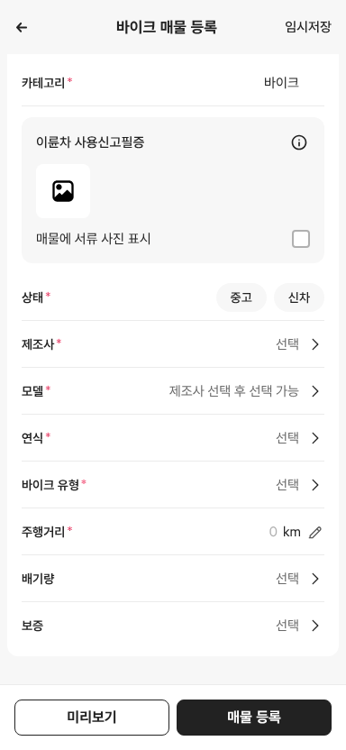

# PR #321 바이크 매물 등록: 원산지 항목 제거

## ① 한 줄 요약
사용자 지시대로 바이크 매물 등록 상세 정보에서 「원산지」를 뺐습니다.

## ② 과제 정보
- 과제 ID: 미지정
- 브랜치: `feat/bike-register-remove-origin-1009` (main ae0a24b에서 시작)
- 커밋: ce68162. 이 보고서는 그다음 커밋에 들어 있습니다.
- PR: https://github.com/bobaekimboae/bobaedream/pull/321
- 상태: 푸시만 했습니다. 병합·배포는 요청하실 때 합니다.

## ③ 한 일
- 「원산지」 줄, 선택창, 선택 목록(국산·일본·유럽·미국·중국·대만·기타), 저장 값을 지웠습니다.
- 지난 PR #317 보고서의 상태 줄을 배포 값(v=ad035bb)으로 고쳤습니다.

## ④ 원본과 비교
| 상세 정보 순서 | 수정 전 | 수정 후 |
|---|---|---|
| 항목 | 카테고리 · 상태 · 제조사 · 모델 · 연식 · 바이크 유형 · 주행거리 · 배기량 · 원산지 · 보증 | 카테고리 · 상태 · 제조사 · 모델 · 연식 · 바이크 유형 · 주행거리 · 배기량 · 보증 |

## ⑤ 검증
- `npm run verify:qf` 통과
- 콘솔 오류: 모바일 384 없음
- 퀵필터 파일은 바꾸지 않았습니다.

## ⑥ 원본과 다르게 남긴 것과 이유
- 없음

## ⑦ 못 한 것·다음에 할 것
- 없음

## ⑧ 확인 링크
- 모바일 `?register=bike&category=바이크`
- PC 위 주소에 `&pc=1`
- 배포 뒤에는 `&v=<커밋>`을 붙입니다.
