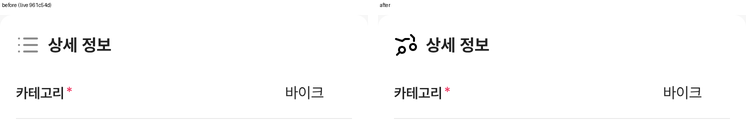
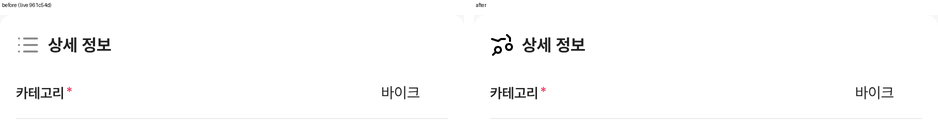

# PR #323 바이크 매물 등록 「상세 정보」 아이콘 교체

## ① 한 줄 요약
「상세 정보」 제목 옆 아이콘을, 지정해 주신 오토스카우트24 원본(icons-sprite-c3315a3d-symbol-167, 오토바이 모양)으로 바꿨습니다.

## ② 과제 정보
- 과제 ID: 미지정
- 브랜치: `feat/bike-register-detail-icon-1009`
- 커밋: c180acb. 이 보고서는 그다음 커밋에 들어 있습니다.
- PR: https://github.com/bobaekimboae/bobaedream/pull/323
- 상태: 병합·배포(v 값은 채팅 보고에 적음)
- 이번 병합으로 main에 함께 들어간 것: 없음

## ③ 한 일
- 노션 「N_독일_오토스카우트 24」 아이콘 DB(분류: 검색)에서 원본 SVG를 받았습니다. 내용을 바꾸지 않고 `public/assets/register/autoscout24/icons-sprite-c3315a3d-symbol-167.svg`로 복사했습니다.
- `BikeRegister.tsx`의 `icons.detail` 경로를 이 파일로 바꿨습니다. 이전 값은 초톳 `detail-info.svg`입니다. 코드에는 출처 주석을 달았습니다.
- 표시 크기는 이전과 같은 24×24이고, CSS는 바꾸지 않았습니다.
- `reports/pr-321.md`의 상태 줄을 배포 값(v=961c54d)으로 고쳤습니다.

## ④ 원본과 비교
| 항목 | 수정 전 | 수정 후 |
|---|---|---|
| 아이콘 | 초톳 목록형(줄 3개) | 오토스카우트24 오토바이(symbol-167) |
| 표시 크기 | 24×24 | 24×24 |
| 색 | 원본 회색 | 원본 `currentColor`. img로 넣어서 검정으로 보입니다 |

## ⑤ 검증
- `npm run verify:qf` 통과
- 콘솔 오류: 모바일 384와 PC 1440 모두 없음
- 퀵필터 파일은 바꾸지 않았습니다. 그래서 `measure:qf`는 해당하지 않습니다.

## ⑥ 원본과 다르게 남긴 것과 이유
- 원본 색이 `currentColor`라서 ``로 넣으면 검정(#000)으로 보입니다. 다른 글자는 #222라서 아주 조금 다릅니다. 원본 파일을 고치지 않으려고 그대로 두었습니다.

## ⑦ 못 한 것·다음에 할 것
- 없음. #222로 맞추고 싶으면 CSS mask 방식으로 바꿀 수 있습니다(원본 파일은 그대로 둠).

## ⑧ 확인 링크
- 모바일: `https://bobaekimboae.github.io/bobaedream/?register=bike&category=%EB%B0%94%EC%9D%B4%ED%81%AC&v=<커밋>`
- PC: 위 주소에 `&pc=1`
