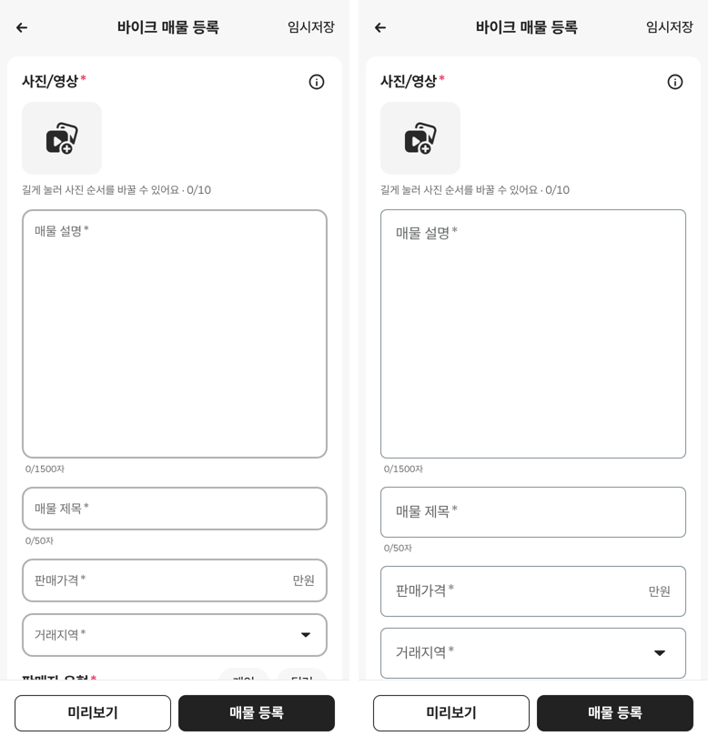
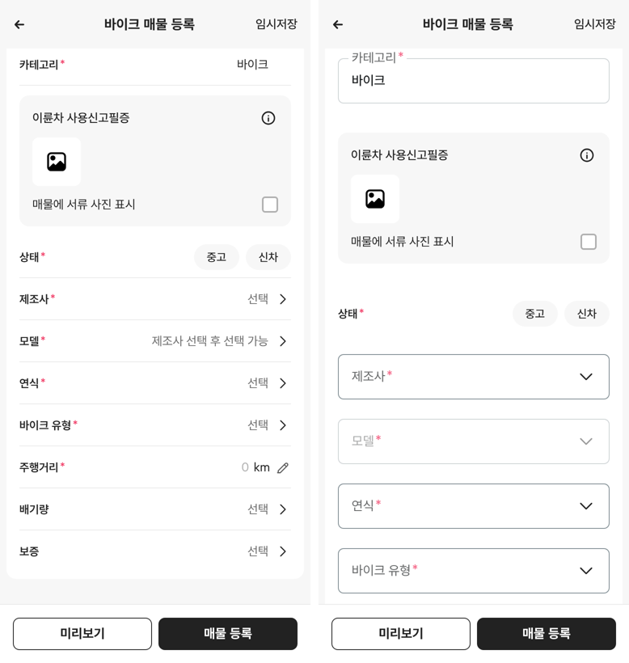
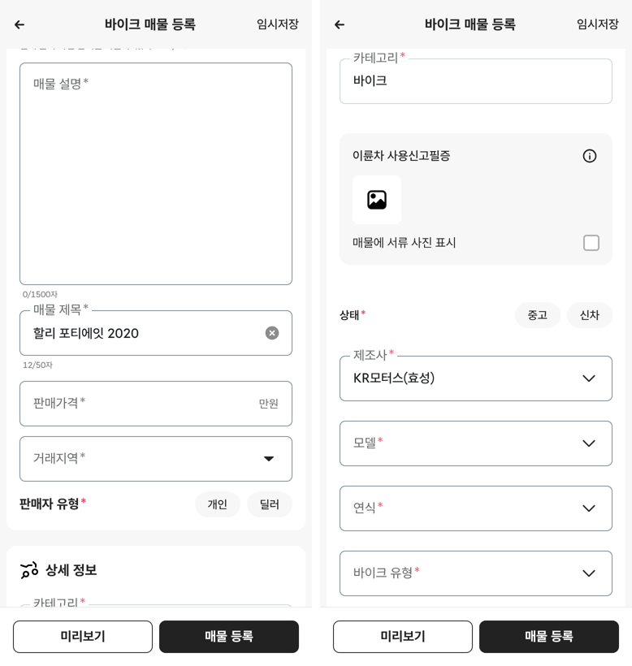

# PR #325 바이크 매물 등록 입력칸 비교용 시안(밀라눈시오스형, `&field=mila`)

## ① 한 줄 요약
등록 화면 주소에 `&field=mila`를 붙이면, 입력칸이 밀라눈시오스 앱 모양으로 바뀝니다. 붙이지 않으면 지금 화면 그대로입니다. 두 모양을 나란히 비교하려고 만든 시안입니다.

## ② 과제 정보
- 과제 ID: 미지정
- 브랜치: `feat/bike-register-field-mila-1009`
- 커밋: c60d16a. 이 보고서는 그다음 커밋에 들어 있습니다.
- PR: https://github.com/bobaekimboae/bobaedream/pull/325
- 상태: 병합·배포 완료(v=dafd576, 번들 index-D7Pt0EMw.js)
- 이번 병합으로 main에 함께 들어갈 것: 없음

## ③ 한 일
- 사용자 캡처(밀라눈시오스 「Publica tu anuncio」, 1080×2340)를 384 CSS(÷2.8125)로 바꿔서 칸 크기·색을 쟀습니다.
- 맨 위 카드의 입력칸(설명·제목·가격·거래지역): 높이 56, 테두리 1px, 모서리 7, 글자 시작 16으로 바꿨습니다.
- 이름표: 칸이 비면 칸 안에 16px로, 값이 있거나 누르면 테두리 선 위에 걸칩니다.
- 상세 정보의 「구분선 + ›」 줄은 「상자 + ∨」로 바꾸고, 상자 사이는 24로 띄웠습니다.
- 제조사를 고르기 전 모델 칸은 연한 테두리(#CFD4D6)와 연한 글자로 보이게 했습니다. 「제조사 선택 후 선택 가능」 글자는 이 시안에서만 숨깁니다.

## ④ 원본과 비교(지금 화면 → 비교 시안, 384 기준)
| 항목 | 지금(초톳 기준) | 비교 시안 | 밀라눈시오스 실측 |
|---|---|---|---|
| 칸 높이 | 48 | 56 | 약 56 |
| 테두리 | 2px #B0B0B0 | 1px #808D93 | 1px #808D93 |
| 모서리 | 12 | 7 | 약 7 |
| 글자 시작 | 12 | 16 | 약 16 |
| 이름표 | 칸 안, 값 있으면 10px로 줄어듦 | 값 있으면 테두리 위 16px | 테두리 위 |
| 상세 정보 | 줄 52 + 구분선 + › | 상자 56 + ∨, 사이 24 | 상자 + ∨, 사이 약 24.5 |
| 못 고르는 칸 | 「제조사 선택 후 선택 가능」 글자 | 연한 테두리 #CFD4D6 · 글자 #A8A9A9 | 같음 |

## ⑤ 검증
- `npm run verify:qf` 통과
- 콘솔 오류: 모바일 384와 PC 1440, 두 모드 모두 없음
- 퀵필터 파일은 바꾸지 않았습니다. 그래서 `measure:qf`는 해당하지 않습니다.

## ⑥ 원본과 다르게 남긴 것과 이유
- 비교가 목적이라 색도 캡처 값(#808D93, #636566, #191C1E)을 그대로 썼습니다. 기본 화면의 에어비앤비 토큰은 바꾸지 않았습니다.
- 「상태」 알약, 서류 칸, 「판매자 유형」 알약은 밀라눈시오스에 같은 칸이 없어서 그대로 두었습니다.
- 오류 빨강(#F0325E)은 그대로 두었습니다.

## ⑦ 못 한 것·다음에 할 것
- 둘 중 하나를 고르시면, 고른 쪽을 기본으로 하고 다른 쪽 코드를 지우겠습니다.
- 밀라눈시오스 칸은 높이가 8 더 커서 상세 정보 카드가 세로로 약 200px 길어집니다(상자 사이 24 포함).

## ⑧ 확인 링크
- 모바일: `https://bobaekimboae.github.io/bobaedream/?register=bike&category=%EB%B0%94%EC%9D%B4%ED%81%AC&field=mila&v=<커밋>` (`&field=mila`를 빼면 지금 화면)
- PC: 위 주소에 `&pc=1`
