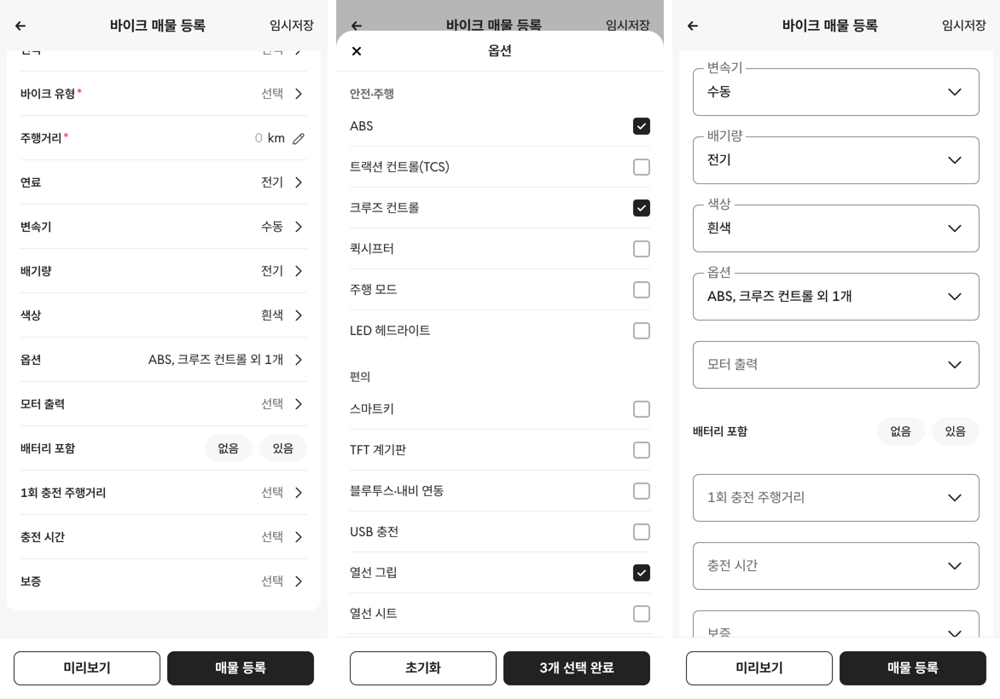

# PR #326 바이크 매물 등록 상세 정보에 연료·변속기·색상·옵션 추가

## ① 한 줄 요약
상세 정보에 연료·변속기·색상·옵션 칸을 넣고, 원래 있던 배기량 칸을 그 사이로 옮겼습니다. 순서는 연료 → 변속기 → 배기량 → 색상 → 옵션입니다.

## ② 과제 정보
- 과제 ID: 미지정
- 브랜치: `feat/bike-register-more-fields-1009`
- 커밋: d56dcd4. 이 보고서는 그다음 커밋에 들어 있습니다.
- PR: https://github.com/bobaekimboae/bobaedream/pull/326
- 상태: 병합·배포 완료(v=27f7608, 번들 index-CLyxL1UP.js)
- 이번 병합으로 main에 함께 들어갈 것: PR #325 보고서 상태 줄 수정

## ③ 한 일
- 상세 정보 순서: 주행거리 → 연료 → 변속기 → 배기량 → 색상 → 옵션 → (전기 바이크 칸) → 보증
- **연료:** 가솔린 · 전기 · 하이브리드 · 기타
  - 「전기」를 고르면 배기량 구간도 「전기」가 되고, 그 반대도 같습니다.
  - 전기에서 다른 연료로 바꾸면 배기량 「전기」는 비워집니다.
- **변속기:** 수동 · 자동(CVT) · 자동(DCT) · 전자제어 수동(E-Clutch). 바이크 가상 매물 시트 v08에 쓰인 값 그대로입니다.
- **색상:** 목록 필터 「외부색상」 23가지를 읽어서 씁니다. 필터 파일은 고치지 않았습니다.
- **옵션:** 아래 시트에서 여러 개 고릅니다.
  - 체크는 시트 안에서만 임시로 바뀌고, 「N개 선택 완료」를 눌러야 반영됩니다.
  - 닫기·배경·Esc는 고른 것을 버립니다.
  - 줄에는 「ABS, 크루즈 컨트롤 외 1개」처럼 줄여서 보입니다.
- 모든 칸은 선택 사항입니다(빨간 * 없음).

## ④ 원본과 비교
| 항목 | 전 | 후 |
|---|---|---|
| 상세 정보 칸 수(전기 아님) | 9 | 13 |
| 연료 · 변속기 · 색상 · 옵션 | 없음 | 있음 |
| 배기량 위치 | 주행거리 다음 | 변속기 다음 |
| 전기 바이크 칸이 나오는 조건 | 배기량 「전기」 | 배기량 「전기」 또는 연료 「전기」(서로 맞춰짐) |

## ⑤ 검증
- `npm run verify:qf` 통과
- 콘솔 오류: 모바일 384, 기본 화면과 `&field=mila` 모두 없음
- 동작 점검표

| 동작 | 결과 |
|---|---|
| 연료 「전기」 → 배기량 | 「전기」로 바뀜 |
| 옵션 3개 체크 → 선택 완료 | 「ABS, 크루즈 컨트롤 외 1개」 |
| `&field=mila`에서 새 칸 | 상자 + ∨, 값이 있으면 이름표가 테두리 위로 |

- 퀵필터 파일은 바꾸지 않았습니다. 그래서 `measure:qf`는 해당하지 않습니다.

## ⑥ 원본과 다르게 남긴 것과 이유
- 색상은 승용 목록 필터의 23가지를 그대로 씁니다. 바이크 전용 색상 목록이 없어서입니다.
- 연료는 바이크에 없는 디젤·LPG를 뺀 4가지입니다.

## ⑦ 못 한 것·다음에 할 것
- **옵션 목록은 가안(임시)입니다.** 안전·주행 6, 편의 7, 수납·보호 4로 모두 17개이며, 코드에 「임시」 주석을 달았습니다. 확정 목록을 주시면 바꾸겠습니다.
- 바이크 전용 색상 목록이 필요하면 알려 주세요.
- 연료·변속기 중 필수로 할 칸이 있는지 정해 주세요.

## ⑧ 확인 링크
- 모바일: `https://bobaekimboae.github.io/bobaedream/?register=bike&category=%EB%B0%94%EC%9D%B4%ED%81%AC&v=<커밋>`
- PC: 위 주소에 `&pc=1`
- 밀라눈시오스형: 위 주소에 `&field=mila`
