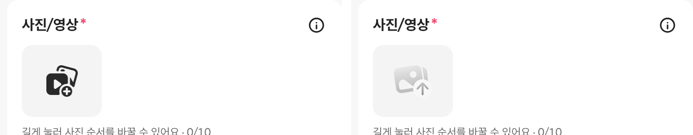

# PR #327 바이크 매물 등록 사진 추가 아이콘 교체

## ① 한 줄 요약
사진/영상 추가 칸의 아이콘을, 지정해 주신 틱톡 「업로드할 사진 선택」 원본 SVG로 바꿨습니다.

## ② 과제 정보
- 과제 ID: 미지정
- 브랜치: `feat/bike-register-upload-icon-1009`
- 커밋: 9ffd4fa. 이 보고서는 그다음 커밋에 들어 있습니다.
- PR: https://github.com/bobaekimboae/bobaedream/pull/327
- 상태: 병합·배포(v=34fb147, 번들 index-DkHq6DsD.js) → 사용자 지시 「원복하자」로 원복(PR #328)
- 이번 병합으로 main에 함께 들어간 것: PR #326 보고서 상태 줄 수정

## ③ 한 일
- 노션 「베스트 › 틱톡」 아이콘 DB의 「업로드할 사진 선택」(분류: 업로드용 아이콘) SVG를 받았습니다. 이 파일을 고치지 않고 `public/assets/register/tiktok/upload-photo-select.svg`로 복사했습니다.
- `icons.upload`를 이 파일로 바꾸고 출처 주석을 달았습니다.
- 높이 40을 유지하고 원본 비율(77×72)대로 폭 42.8로 보이게 했습니다. 이전 초톳 PNG를 검게 만들던 CSS filter는 뺐습니다.

## ④ 원본과 비교
| 항목 | 전 | 후 |
|---|---|---|
| 아이콘 | 초톳 upload-media.png(검게 보정) | 틱톡 「업로드할 사진 선택」 SVG |
| 크기 | 40×40 | 42.8×40 |
| 색 | filter로 검정 | 원본 회색 그라데이션 그대로 |

## ⑤ 검증
- `npm run verify:qf` 통과
- 콘솔 오류: 모바일 384와 PC 1440 모두 없음
- 퀵필터 파일은 바꾸지 않았습니다. 그래서 `measure:qf`는 해당하지 않습니다.

## ⑥ 원본과 다르게 남긴 것과 이유
- 없음. 원본 색 그대로입니다.
- 다만 원본이 연한 회색(#BEBEBE~#EDEDED)이고 칸 바탕이 #F4F4F4라서, 이전 검은 아이콘보다 흐리게 보입니다.

## ⑦ 못 한 것·다음에 할 것
- 더 또렷하게 보이게 하려면 둘 중 하나를 고르면 됩니다.
  - 칸 바탕을 흰색으로 바꾸고 테두리를 넣습니다.
  - 칸 크기를 키웁니다.
- 원본 파일은 고치지 않습니다.

## ⑧ 확인 링크
- 모바일: `https://bobaekimboae.github.io/bobaedream/?register=bike&category=%EB%B0%94%EC%9D%B4%ED%81%AC&v=<커밋>`
- PC: 위 주소에 `&pc=1`
