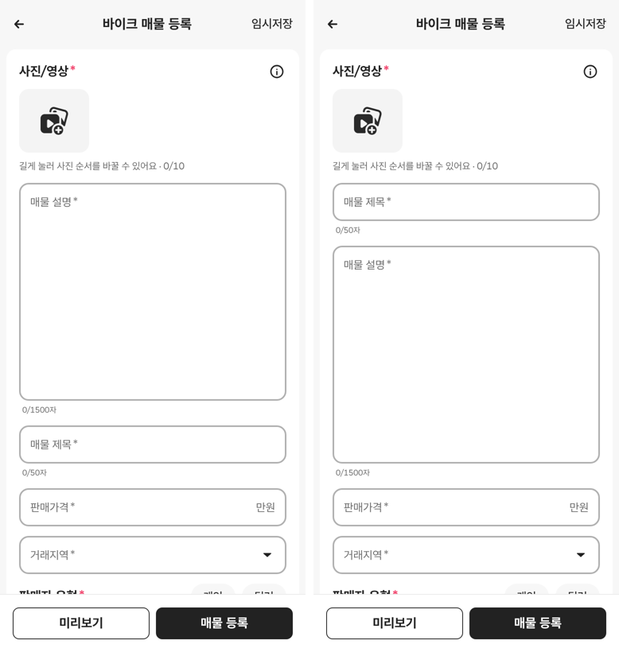

# PR #329 바이크 매물 등록 매물 제목을 설명 위로 이동

## ① 한 줄 요약
첫 카드에서 매물 제목을 매물 설명 위로 올렸습니다.

## ② 과제 정보
- 과제 ID: 미지정
- 브랜치: `feat/bike-register-title-first-1009`
- 커밋: f107419. 이 보고서는 그다음 커밋에 들어 있습니다.
- PR: https://github.com/bobaekimboae/bobaedream/pull/329
- 상태: 병합·배포(v 값은 채팅 보고에 적음)
- 이번 병합으로 main에 함께 들어간 것: PR #327 보고서의 원복 배포 값 기록

## ③ 한 일
- 첫 카드 순서를 바꿨습니다.
  - 전: 사진 → 매물 설명 → 매물 제목 → 판매가격 → 거래지역
  - 후: 사진 → 매물 제목 → 매물 설명 → 판매가격 → 거래지역
- 칸 크기, 글자 수 표시(제목 0/50자, 설명 0/1500자), 오류 표시는 그대로입니다.
- 등록을 눌렀을 때 첫 번째 오류 칸으로 이동하는 순서도 화면 순서를 따라 제목이 먼저입니다.

## ④ 원본과 비교
| 항목 | 전 | 후 |
|---|---|---|
| 첫 입력칸 | 매물 설명(높이 274) | 매물 제목(높이 48) |
| 사진 아래 → 첫 칸 위 | 같음 | 같음 |

## ⑤ 검증
- `npm run verify:qf` 통과
- 콘솔 오류: 모바일 384와 PC 1440 모두 없음
- 퀵필터 파일은 바꾸지 않았습니다. 그래서 `measure:qf`는 해당하지 않습니다.

## ⑥ 원본과 다르게 남긴 것과 이유
- 없음

## ⑦ 못 한 것·다음에 할 것
- 앞서 이야기한 「카테고리를 사진 아래 작은 줄로 올리기」는 아직 하지 않았습니다. 지시하시면 하겠습니다.

## ⑧ 확인 링크
- 모바일: `https://bobaekimboae.github.io/bobaedream/?register=bike&category=%EB%B0%94%EC%9D%B4%ED%81%AC&v=<커밋>`
- PC: 위 주소에 `&pc=1`
