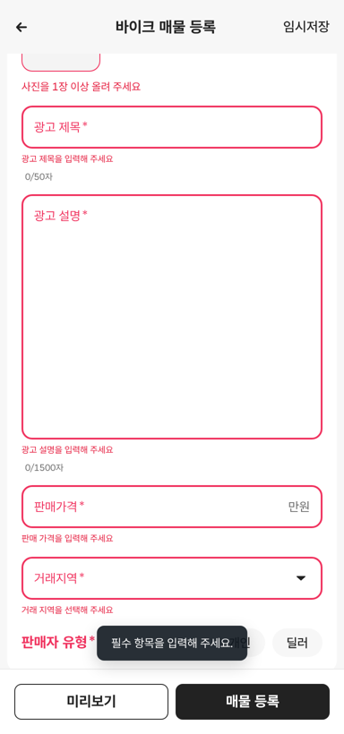

# PR #330 바이크 매물 등록 「광고 제목·광고 설명」 문구 교체

## ① 한 줄 요약
「매물 제목」과 「매물 설명」을 「광고 제목」과 「광고 설명」으로 바꿨습니다.

## ② 과제 정보
- 과제 ID: 미지정
- 브랜치: `feat/bike-register-ad-labels-1009`
- 커밋: 65c784d. 이 보고서는 그다음 커밋에 들어 있습니다.
- PR: https://github.com/bobaekimboae/bobaedream/pull/330
- 상태: 푸시까지 했습니다. 병합·배포는 요청하실 때 합니다.
- 이번 병합으로 main에 함께 들어갈 것: PR #329 보고서 상태 줄 수정

## ③ 한 일
- 칸 이름표: 매물 제목 → 광고 제목, 매물 설명 → 광고 설명
- 빈칸 오류 문구: 「광고 제목을 입력해 주세요」, 「광고 설명을 입력해 주세요」
- 제목 지우기 버튼의 aria-label(화면 읽기 프로그램용 이름): 「광고 제목 지우기」
- 칸 순서와 모양은 그대로입니다.

## ④ 원본과 비교
| 항목 | 전 | 후 |
|---|---|---|
| 첫 칸 이름표 | 매물 제목 | 광고 제목 |
| 둘째 칸 이름표 | 매물 설명 | 광고 설명 |
| 제목 오류 | 제목을 입력해 주세요 | 광고 제목을 입력해 주세요 |
| 설명 오류 | 매물 설명을 입력해 주세요 | 광고 설명을 입력해 주세요 |

## ⑤ 검증
- `npm run verify:qf` 통과
- 콘솔 오류: 모바일 384와 PC 1440 모두 없음
- 퀵필터 파일은 바꾸지 않았습니다. 그래서 `measure:qf`는 해당하지 않습니다.

## ⑥ 원본과 다르게 남긴 것과 이유
- 화면 제목 「바이크 매물 등록」과 아래 버튼 「매물 등록」은 지시 범위 밖이라 그대로 두었습니다.

## ⑦ 못 한 것·다음에 할 것
- 입력 예시 문구(「예: 혼다 PCX 125 무사고」 등)는 그대로입니다.

## ⑧ 확인 링크
- 모바일: `https://bobaekimboae.github.io/bobaedream/?register=bike&category=%EB%B0%94%EC%9D%B4%ED%81%AC&v=<커밋>`
- PC: 위 주소에 `&pc=1`
