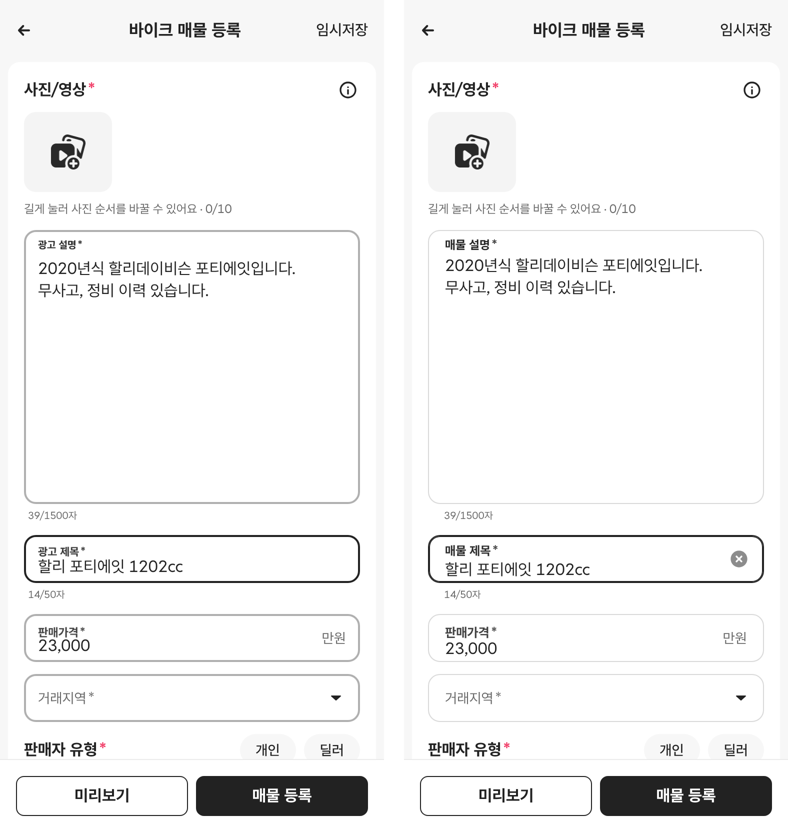
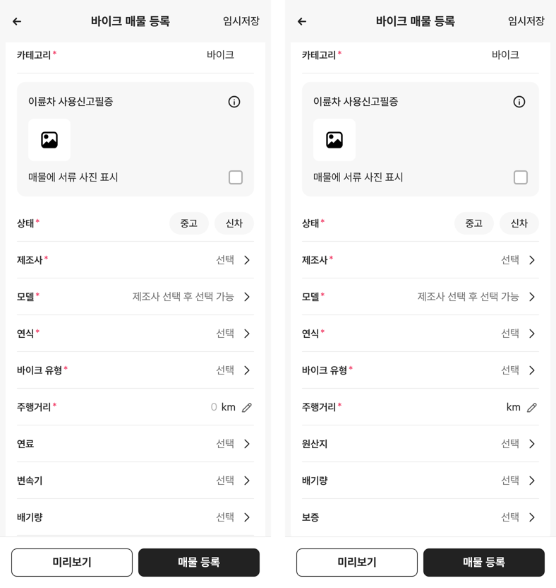
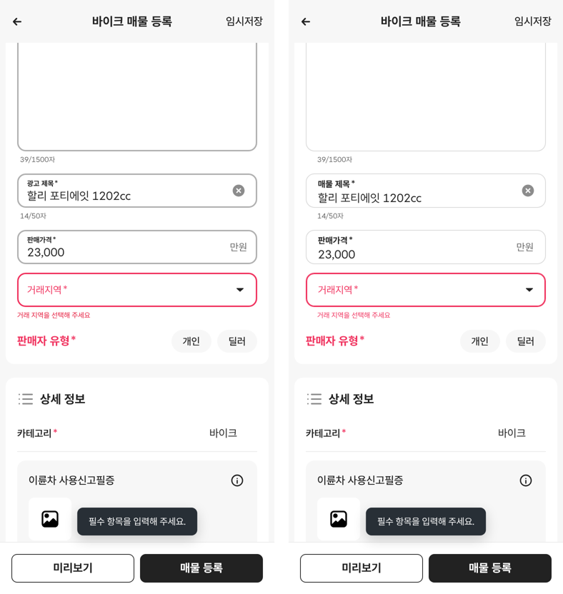
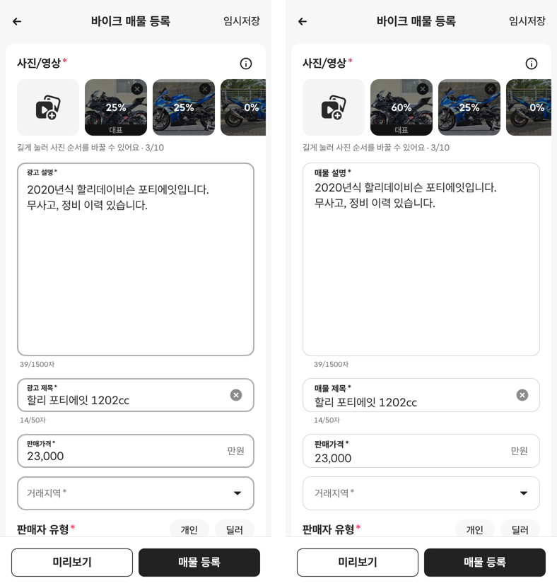
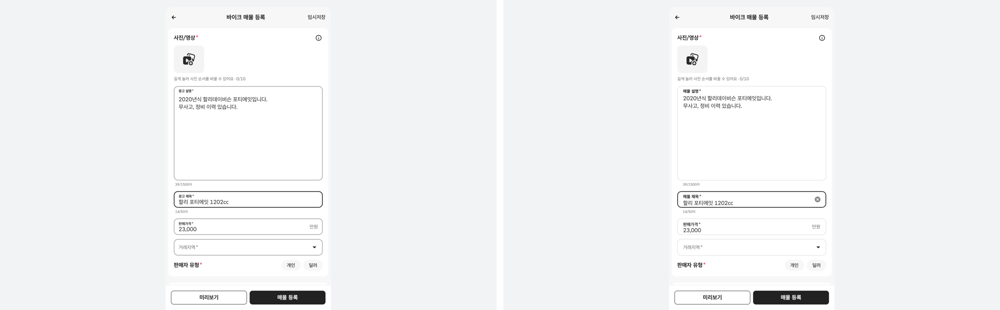
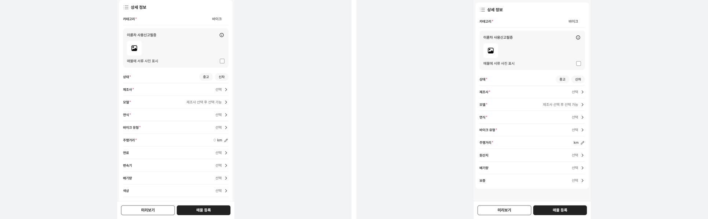
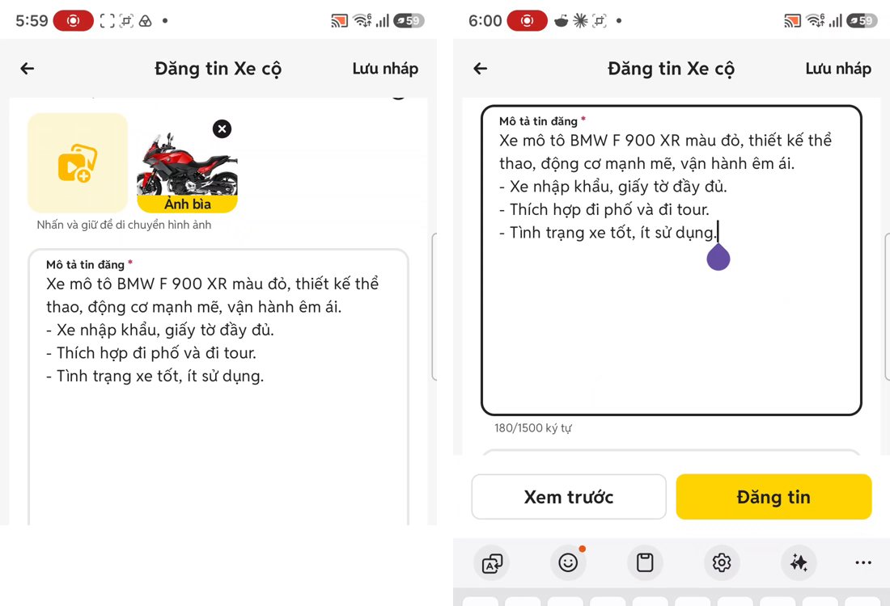

# PR #332 바이크 매물 등록 2차 수정(노션 「시안 수정 사항」 9번 · 마스터 지시)

## ① 한 줄 요약
입력칸을 초톳처럼 얇고 가볍게 바꿨습니다(1px 연회색, 라벨은 칸 안쪽 위). 용어는 「매물」로 되돌리고 원산지를 다시 넣었습니다. 연료·변속기·색상·옵션은 숨기고, 배기량에서 「전기」를 뺐습니다.

## ② 과제 정보
- 과제 ID: 미지정
- 브랜치: `feat/bike-register-2nd-fix-1009` (main 75eef20에서 새로 땀, 바이크 등록 파일 2개만 수정)
- 커밋: d6c86aa. 이 보고서는 그다음 커밋에 들어 있습니다.
- PR: https://github.com/bobaekimboae/bobaedream/pull/332
- 상태: 병합·배포(v 값은 채팅 보고에 적음)
- 이번 병합으로 main에 함께 들어간 것: 없음

## ③ 한 일 (지시 항목별)
| 번호 | 지시 | 결과 |
|---|---|---|
| 1-1 | 테두리 1px 연회색, 포커스 #222 굵게, 오류 빨강 | 했다. 1px #D9D9D9(변수 `--field-border-w`·`--field-border-color`), 포커스 #222 2px, 오류 #F0325E 2px. 두께 차이는 안쪽 그림자로 처리해 칸이 흔들리지 않는다 |
| 1-2 | 라벨: 작은 라벨이 칸 안쪽 위, 값은 아래 | 했다. 값이 있거나 누르면 12/16 700 라벨이 칸 위쪽 6에, 값 16/20은 그 아래. 빈 칸일 때 크게 보이다 올라가는 동작은 영상에 빈 칸 장면이 없어 **미확인**. 기존(초톳 웹 필터 입력칸) 동작을 그대로 유지했다 |
| 1-3 | 글자수를 칸 안쪽 왼쪽 아래로 | **못 했다(영상과 다름).** 초톳 풀버전 영상(0:01, 1:06)에서 「180/1500 ký tự」는 칸 **밖** 바로 아래 왼쪽이다(캡처 7). 그래서 칸 밖 아래에 두고 라벨과 같은 왼쪽 선(16)에 맞췄다. 칸 안으로 옮길지 결정해 주세요 |
| 1-4 | 주행거리 「0 km」 제거 | 했다. 빈 칸 + 「km」 + 연필. 미입력 오류는 아래 빨간 「주행거리를 입력해 주세요」 |
| 1-5 | 글꼴 Reddit Sans(영문·숫자) + 한글 프로젝트 글꼴, tabular-nums | 했다(기존 적용 유지). 실제 렌더 확인: 헤더 「바이크 매물 등록」은 Pretendard 7자 + Reddit Sans 2자(공백), 글자수 「39/1500자」는 Reddit Sans 6자 + Pretendard 1자(「자」) |
| 2-1 | 광고 → 매물 설명·제목 | 했다(이름표·오류 문구·지우기 버튼 이름) |
| 2-2 | 「딜러」를 기존 보배드림 용어로 | 했다(변경 없음). 코드베이스 판매자 값이 모두 「딜러」(67곳, 필터 `sellerKind`와 같다) |
| 2-3 | 필수·선택 항목 정리, 연료·변속기·색상·옵션 숨김 | 했다. 필수: 카테고리·상태·제조사·모델·연식·바이크 유형·주행거리. 선택: 원산지·배기량·보증·서류. 숨김은 `showExtraSpecs = false` 한 줄 |
| 2-4 | 배기량 구간에서 「전기」 빼기 | 했다. 구간 6개 유지. 기준표에서 모델 구간이 「전기」면 배기량 대신 연료 값으로 넘긴다. 전기 바이크 칸은 연료=전기일 때만 나와서, 지금은 연료 행이 꺼져 있어 나오지 않는다 |
| 2-5 | 서류 영역(연회색 박스 + (i) + 업로드 칸 + 표시 체크) | 했다(1차에서 이미 이 구조, 그대로 유지) |
| 3-1 | 사진 칸 88×80 유지, CSS 변수로 | 했다. `--photo-tile-w: 88px; --photo-tile-h: 80px;` |
| 3-2 | 「다음」 → 썸네일 줄·대표 배지·✕·최대 10장·업로드 % | 했다(기존 기능 확인). 3장 고르고 「다음」 → 25%→100% 뒤 썸네일 3장, 첫 장 「대표」 |
| 3-3 | 「다음」 0장 회색 비활성, 1장 이상 #222 | 했다(확인). 0장 비활성 #DDDDDD, 1장 이상 #222 |
| 3-4 | 사진 올리면 사진 오류가 사라짐 | 했다(확인). 사진이 있으면 빨간 테두리·안내가 없다 |
| 4-1 | 빈칸 등록 → 빨간 오류 + 토스트 + 첫 오류 칸 스크롤 | 했다. 덧붙여 시트·선택창을 열면 토스트를 바로 닫는다(노션 2차 평가 🔴3) |
| 4-2 | 제조사 전 모델 비활성, 제조사 바꾸면 모델 초기화 | 했다(기존 유지) |
| 4-3 | 가격 숫자 키패드·천 단위·「만원」 한 줄 | 했다(확인). 23000 입력 → 23,000 |
| 5-1 | PC 최대폭 480, 변수 한 줄로 전환 | 했다(기존 `--register-max-w: 480px`) |
| 5-2 | PC 하단 바는 카드 폭, 바깥 연회색 | 했다(기존 유지) |
| 추가 | 오류 빨강 통일(노션 2차 평가 🔴1) | 했다. #E5193B를 없애고 #F0325E 하나로 |

## ④ 원본과 비교 (v=75eef20 → 이번, 렌더 실측)
| 항목 | 전 | 후 | 초톳 영상 실측(1080÷2.8125) |
|---|---|---|---|
| 입력칸 테두리 | 2px #B0B0B0 | 1px #D9D9D9 | 약 2.1px #E7E7E7 |
| 포커스 테두리 | 2px #222 | 2px #222 | 약 2.1px #202020 |
| 값이 있을 때 라벨 | 10px(14×0.71) 700, 위 5 | 12/16 700, 위 6 | 굵은 작은 글자, 칸 위 +10, 칸 왼쪽 +17 |
| 칸 안 왼쪽 여백 | 12 + 테두리 2 | 16 + 테두리 1 | 17 |
| 오류 빨강 | #E5193B · #F0325E 두 가지 | #F0325E 하나 | – |
| 상세 정보 항목 | 14개(연료·변속기·색상·옵션 포함) | 11개(원산지 추가, 4개 숨김) | – |
| 주행거리 빈 칸 | 「0 km」 | 「km」 | 「km」 + 연필 |
| 배기량 구간 | 7개(전기 포함) | 6개 | – |

| 동작 | 결과(모바일 384 · PC 1440 같음) |
|---|---|
| 「다음」 0장 / 1장 이상 | 비활성 #DDDDDD / #222 |
| 사진 3장 → 업로드 % | 25% → 100%, 썸네일 3장, 「대표」 |
| 빈칸 등록 | 빨간 오류(#F0325E만), 토스트, 첫 오류로 스크롤 |
| 오류 뒤 거래지역 시트 열기 | 토스트가 바로 닫힘 |
| 가격 23000 | 23,000 |

## ⑤ 검증
- `npm run verify:qf` 통과
- 콘솔 오류: 모바일 384와 PC 1440 모두 없음. `&field=mila` 비교 시안도 그대로 나온다(1px #808D93, 모서리 7)
- 퀵필터 파일은 바꾸지 않았다. 그래서 `measure:qf`는 해당하지 않는다

## ⑥ 원본과 다르게 남긴 것과 이유
- **테두리:** 지시값 1px #D9D9D9로 했다. 초톳 영상 실측은 약 2.1px #E7E7E7이다(더 굵지만 더 연함). 변수 두 줄만 바꾸면 초톳 값으로 맞출 수 있다.
- **글자수 위치:** 지시는 칸 안쪽이었지만 영상은 칸 밖 아래라서 영상대로 두었다(③ 1-3).
- **원산지:** 앞서 대표님이 「원산지는 빼라」로 뺐던 항목이다. 이번 지시(선택 항목에 원산지)에 따라 다시 넣었다. 다시 뺄지 확인해 주세요.

## ⑦ 못 한 것·다음에 할 것
- **부족한 아이콘(임시 사용, 코드에 「임시」 주석):**
  - 헤더 ← 화살표: 드라이브 초톳 폴더에 ← 원본이 없다. chevron-left만 있다.
  - 카메라, 연필
- **미확인 수치:**
  - 초톳 모바일 384 DOM 값 전체
  - 빈 칸 라벨 동작
  - 업로드 전 사진 칸 크기
  - 입력칸 높이(지금 48, 앱 캡처 52)
- **2차 후보(숨김 상태):** 연료·변속기·색상·옵션, 전기 바이크 칸(모터 출력·배터리·1회 충전 주행거리·충전 시간)
- **노션 2차 평가 중 이번 지시에 없어 남긴 것:**
  - 판매자·상태 기본 선택(개인·중고)
  - 오류 문구와 글자수를 한 줄로
  - 신차일 때 주행거리 필수 해제
  - 제조사 영문 검색
  - 색상 12종 축소
  - PC 선택창 바깥 어둡게(dim)

## ⑧ 확인 링크
- 모바일: `https://bobaekimboae.github.io/bobaedream/?register=bike&category=%EB%B0%94%EC%9D%B4%ED%81%AC&v=<커밋>`
- PC: 위 주소에 `&pc=1`
