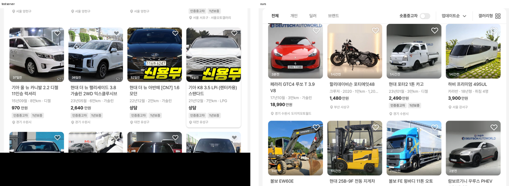
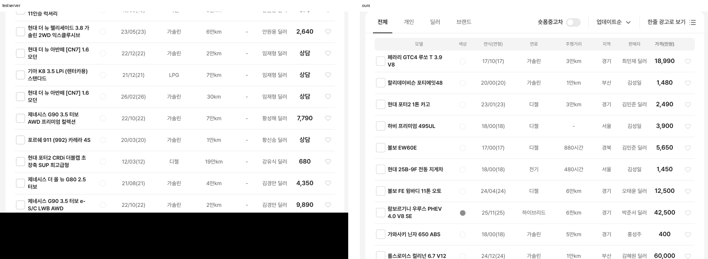
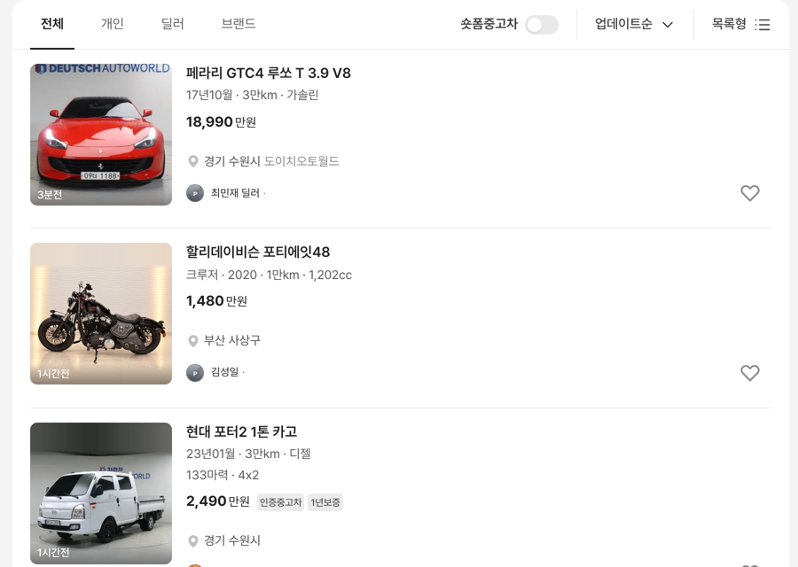

# PR #333 개발 시안 PC 보기 방식(갤러리형 · 한줄 광고) 전환

## ① 한 줄 요약
테스트 서버(dev.bbmuseum.co.kr/car/list)처럼 PC에서도 보기 방식을 고르면 화면이 바뀌게 했습니다(목록형 · 갤러리형 · 한줄 광고).

## ② 과제 정보
- 과제 ID: 미지정(받은 번호 없음)
- 브랜치: `feat/qf-pc-view-modes-1009` (main 1935db5에서 새로 땀)
- 커밋: 9501c6e. 이 보고서는 그다음 커밋에 들어 있습니다.
- PR: https://github.com/bobaekimboae/bobaedream/pull/333
- 상태: 푸시까지 했습니다. 병합·배포는 요청하실 때 합니다.
- 이번 병합으로 main에 함께 들어갈 것: 없음

## ③ 한 일
- **보기 방식 연결:** 전에는 PC에서 갤러리·한줄 광고를 골라도 목록만 보였습니다. 이제 고른 방식대로 바뀌고, 버튼 글자와 아이콘(목록형/갤러리형/한줄 광고로 보기)과 메뉴의 선택 표시도 함께 바뀝니다.
- **갤러리형(서버 실측):**
  - 배치: 4열, 간격 16, 바깥 여백 20
  - 사진: 정사각, 반경 12, 아래 시간 띠 30, 오른쪽 위 4에 흰 하트
  - 글자: 사진 아래 10부터 제목 16/22.88 두 줄 → 사양 14 #8C8C8C → 가격 16 700 → 배지 20 → 지역 12
- **한줄 광고(서버 실측):**
  - 열 10개: 선택 30 · 모델(170 이상, 남는 폭을 가져감) · 색상 56 · 연식(연형) 102 · 연료 108 · 주행거리 98 · 지역 72 · 판매자 72 · 가격 84 · 찜 36
  - 머리줄: #F4F4F4, 반경 8, 높이 32.8
  - 줄: 높이 56, 아래 1px #EBEBEB
  - 글자: 모델 14 600 왼쪽 정렬, 나머지 14 #616161 가운데, 가격 16 600
  - 연식 표기: 서버처럼 「15/07(16)」 형식. 등록 월을 모르면 「18/00(18)」로 보여준다
- **주소로 바로 열기:** `&view=list · feed · gallery · oneline · text`를 붙이면 모바일·PC 모두 그 방식으로 열린다(검수 링크용).

## ④ 원본과 비교 (PC 1440)
| 항목 | 서버 | 작업 전(우리) | 작업 후(우리) |
|---|---|---|---|
| 갤러리 선택 | 4열 카드 | 목록 그대로 | 4열 카드 |
| 갤러리 카드 폭 · 간격 | 196 · 16 | – | 197 · 16 |
| 갤러리 첫 카드 x | 464 | – | 464 |
| 한줄 광고 선택 | 표 | 목록 그대로 | 표 |
| 표 폭 · 머리줄 높이 · 줄 높이 | 828 · 32.8 · 56 | – | 828 · 32.8 · 56 |
| 버튼 글자 | 목록형/갤러리형/한줄 광고로 보기 | 늘 「목록형」 | 서버와 같음 |

| 동작 | 결과 |
|---|---|
| 메뉴에서 갤러리 → 한줄 광고 → 목록 | 화면·버튼 글자가 매번 바뀜 |
| `&pc=1&view=gallery` / `&view=oneline` | 처음부터 그 방식으로 열림 |
| 모바일 `&view=oneline` | 모바일 한줄 광고로 열림 |
| 한줄 광고 선택 칸 · 찜 | 눌러도 상세로 넘어가지 않고 그 칸만 바뀜 |

## ⑤ 검증
- `npm run verify:qf` 통과
- 콘솔 오류: PC 1440과 모바일 393 모두 0건
- `measure:qf`: 퀵필터 레일은 바뀌지 않음. 현재 기준(QF-106 안정 상단)으로 제조사 칸은 모바일 76×102 · PC 84×102, 모델 칸은 모바일 72×102(이미지 64×40) · PC 84×102(이미지 76×40), 가로 넘침 없음
- 이번에는 필터를 건드리지 않아 「시안형 필터 선택지 · 시트 마감 · 광고기간」 항목은 해당하지 않음

## ⑥ 원본과 다르게 남긴 것과 이유
- **한줄 광고 「지역」:** 서버는 데이터가 없어 「-」로 나온다. 우리는 매물 지역의 시·도(예: 경기)를 넣었다.
- **색상 점:** 우리 샘플 데이터의 색상 값으로 칠한다. 색상 값이 없는 매물은 「-」로 보여준다.
- **선택 체크박스:** 선택 상태만 바뀌고, 비교 담기 같은 기능은 연결하지 않았다.
- **한줄 광고 아이콘:** 서버 원본 아이콘을 확인하지 못해 목록형 아이콘(view-list-chotot-v02)을 같이 쓴다.

## ⑦ 못 한 것·다음에 할 것
- **쇼츠 영상 화면:** 지금은 「준비 중」 안내만 뜬다. 빈 창 모양만 만들지, 숏폼 영상까지 넣을지 결정이 필요하다.
- **모바일 피드:** 서버처럼 모든 카드를 크게 할지, 지금 초톳 규칙(첫 카드만 크게)을 유지할지 결정이 필요하다.
- **모바일 세부 수치 대조:** 목록·갤러리·한줄 광고·텍스트 수치를 서버와 대조하는 일이 남아 있다.

## ⑧ 확인 링크
- PC 목록: `https://bobaekimboae.github.io/bobaedream/?qf=guazi&pc=1&v=<커밋>`
- PC 갤러리: 위 주소에 `&view=gallery`
- PC 한줄 광고: 위 주소에 `&view=oneline`
- 모바일: `https://bobaekimboae.github.io/bobaedream/?qf=guazi&v=<커밋>`
