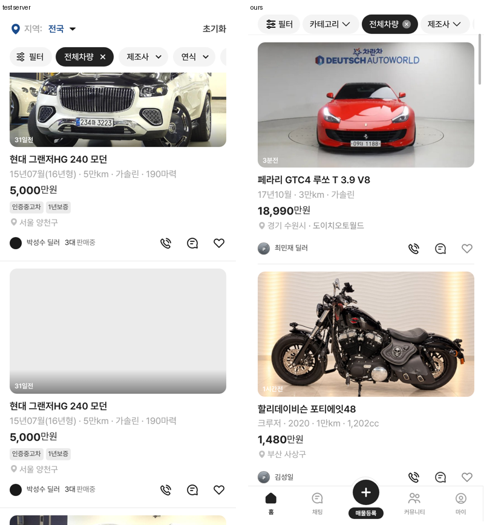

# PR #336 개발 시안 모바일 피드 — 모든 매물을 큰 피드 카드로

## ① 한 줄 요약
모바일 피드 보기에서 첫 매물만 크게 나오던 것을, 테스트 서버처럼 모든 매물이 같은 큰 피드 카드로 나오게 바꿨습니다.

## ② 과제 정보
- 과제 ID: 미지정
- 브랜치: `feat/qf-m-feed-all-1010` (main c510cc2에서 새로 땀)
- 커밋: 36f34e1. 이 보고서는 그다음 커밋에 들어 있습니다.
- PR: https://github.com/bobaekimboae/bobaedream/pull/336
- 상태: 푸시까지 했습니다. 병합·배포는 요청하실 때 합니다.
- 이번 병합으로 main에 함께 들어갈 것: PR #333 보고서 상태 줄 수정

## ③ 한 일
- 사용자 지시 「피드형이니 다 전체가 피드형 되야지」에 따라, 피드 보기의 모든 카드에 큰 카드 모양을 적용했다.
- 수치는 테스트 서버 `car-list-feed-card`(390) 실측값이다.
  - 카드: 위아래 12, 아래 1px #EBEBEB
  - 사진: 358:207.3, 반경 12. 시간 글자 11/600
  - 글자: 사진 → 제목 10, 제목 16/22.4 600, 사양 15/24 #9E9E9E, 가격 18/25.2 700(만원 16), 배지 20(11/500), 지역 14/18 #9E9E9E
  - 판매자 줄 34: 프로필 20, 이름 12/16.8 #3A3A3A. 오른쪽에 전화 · 채팅 · 찜 20(간격 24)
- 전화 아이콘은 dev 원본 `ic_car_list_phone_20`을 `public/assets/bbm/card-phone.svg`로 복사했다. 채팅은 기존 `card-chat.svg`(dev 원본과 같은 모양)를 쓴다.
- 전화·채팅을 누르면 안내 토스트만 뜬다(실제 연결 없음).
- `docs/quick-filter-spec.md`: 「첫 매물만 강조」 규칙과 피드 간격 규칙을 지우고 새 피드 규칙을 적었다.

## ④ 원본과 비교 (모바일 390)
| 항목 | 서버 | 작업 전 | 작업 후 |
|---|---|---|---|
| 큰 카드 수 | 전부 | 첫 1개 | 전부(20/20) |
| 사진 | 358×207.3 반경 12 | 첫 카드 7:5 반경 8, 나머지 120×120 | 358×207.3 반경 12 |
| 제목 위치(카드 위 기준) | 229 | – | 229 |
| 사양 · 가격 위치 | 252 · 278 | – | 252 · 278 |
| 전화 · 채팅 · 찜 x | 248 · 292 · 336 | 찜만 | 248 · 292 · 336 |

## ⑤ 검증
- `npm run verify:qf` 통과
- 콘솔 오류: 모바일 0건 · PC 0건(`measure:qf`)
- 퀵필터 레일은 바꾸지 않았다(`measure:qf` 값 변화 없음)

## ⑥ 원본과 다르게 남긴 것과 이유
- 카드 아래 구분선이 서버는 화면 끝까지인데, 우리는 목록 좌우 여백(16) 안에서 끝난다. 목록 틀을 다른 보기와 같이 쓰기 때문이다.
- 찜 하트 색은 서버가 진한 색이고, 우리는 공용 하트 아이콘(회색)을 그대로 쓴다.
- 사양에 「190마력」 같은 마력은 넣지 않았다. 모바일 카드는 마력을 빼는 기존 규칙을 따른다.

## ⑦ 못 한 것·다음에 할 것
- 판매자 「N대 판매중」 표시는 서버에 있지만 우리 샘플 데이터에는 없어서 넣지 않았다.

## ⑧ 확인 링크
- 모바일 피드: `https://bobaekimboae.github.io/bobaedream/?qf=guazi&view=feed&v=<커밋>`
