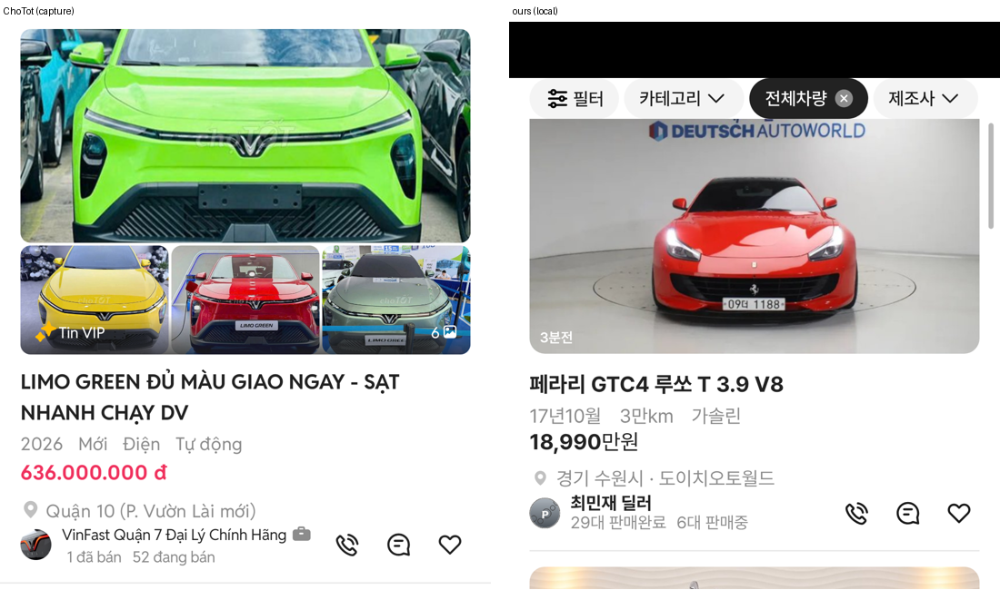

# PR #339 개발 시안 모바일 피드 — 사진 아래 글자·판매자 줄을 초톳 기준으로

## ① 한 줄 요약
피드 카드의 사진 칸은 그대로 두고, 그 아래 제목·사양·가격·지역·판매자 줄을 초톳 피드와 같게 맞췄습니다. 가격은 목록형처럼 검정입니다.

## ② 과제 정보
- 과제 ID: 미지정
- 브랜치: `feat/qf-m-feed-chotot-1010` (main에서 새로 땀)
- 커밋: 35a85e3. 이 보고서는 그다음 커밋에 들어 있습니다.
- PR: https://github.com/bobaekimboae/bobaedream/pull/339
- 상태: 병합·배포(v 값은 채팅 보고에 적음)
- 이번 병합으로 main에 함께 들어간 것: PR #336 보고서 상태 줄 수정

## ③ 한 일
- 기준: 사용자 제공 초톳 피드 캡처(「초톳 피드형 판매자 판매완료 표기버전」, 1080×2340 → 384 CSS ÷2.8125).
- 사진 칸(358:207.3 · 반경 12 · 시간 띠)은 지시대로 건드리지 않았다.
- 글자:
  - 제목 17/24 700 #222, 두 줄까지
  - 사양 15 #8C8C8C, 항목 사이 점 대신 간격 14(초톳처럼)
  - 가격 17 700 **#222**(초톳의 빨강 대신 목록형 검정, 만원 400)
  - 지역 15 #8C8C8C
- 판매자 줄:
  - 왼쪽: 프로필 24, 이름 14/16 400 #222, 그 아래 「N대 판매완료 N대 판매중」 13 #8C8C8C(딜러만)
  - 오른쪽: 전화·채팅·찜 20, 간격 20, #222
- 우리 화면을 초톳 캡처와 같은 배율(×2.8125)로 찍고, 사진 아래 글자 윗선 위치를 픽셀로 맞췄다.

## ④ 원본과 비교 (사진 아래 끝 기준 글자 윗선, 제목 한 줄 카드로 환산, CSS px)
| 항목 | 초톳 | 작업 전 | 작업 후 |
|---|---|---|---|
| 제목 | 15.6 | 약 17(16/600) | 16.4 |
| 사양 | 약 42.6 | 약 42(15 #9E9E9E, 점 구분) | 42.3 |
| 가격 | 62.2 | 약 66(18/700) | 61.9 |
| 지역 | 92.4 | – | 91.4 |
| 판매자 프로필 위 | 113.0 | 20 크기 | 113.0(24) |
| 판매자 이름 | 110.9 | – | 110.9 |
| 판매완료·판매중 줄 | 125.8 | 없음 | 126.9 |
| 카드 구분선 | 154.7 | – | 154.3 |
| 전화·채팅·찜 x | 261.5 · 301.6 · 341.8 | 248 · 292 · 336 | 262 · 302 · 342 |

## ⑤ 검증
- `npm run verify:qf` 통과
- 콘솔 오류: 모바일 0건 · PC 0건(`measure:qf`)
- 퀵필터 레일은 바꾸지 않았다(`measure:qf` 값 변화 없음)

## ⑥ 원본과 다르게 남긴 것과 이유
- 가격: 초톳은 빨강이고, 우리는 지시대로 검정이다.
- 판매완료 대수: 우리 샘플 데이터에 없어서 매물 번호로 정한 가상 값이다. 판매중 대수는 데이터의 `stock` 값이다. 개인 판매자는 이 줄을 보여주지 않는다.
- 이름 옆 가방(전문 판매자) 아이콘: 원본 아이콘이 없어서 넣지 않았다. 럭셔리 인증딜러는 기존 인증 배지를 그대로 쓴다.

## ⑦ 못 한 것·다음에 할 것
- 판매완료 대수를 실제 데이터와 연결하는 일이 남았다.
- 초톳 첫 매물의 사진 4장 묶음과 「Tin VIP」 표시는 「이미지 안 디자인 건드리지 말 것」 지시에 따라 넣지 않았다.

## ⑧ 확인 링크
- 모바일 피드: `https://bobaekimboae.github.io/bobaedream/?qf=guazi&view=feed&v=<커밋>`
