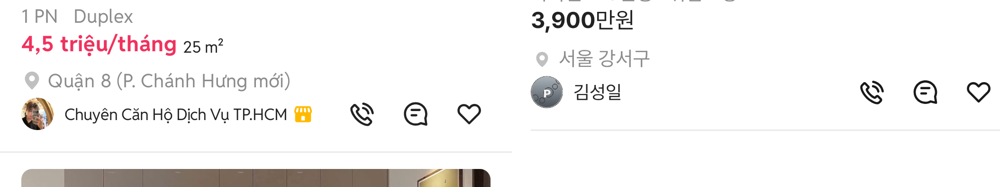

# PR #341 모바일 피드 구분선·지역↔프사 간격 초톳 재실측

① 피드 카드의 지역 → 판매자 프사, 프사 → 매물간 구분선 간격을 초톳 캡처 실측값에 맞췄다.

② 과제 ID 미지정 · 브랜치 `feat/qf-m-feed-gap-1010` · 커밋 c6eaa37 · PR https://github.com/bobaekimboae/bobaedream/pull/341 · 상태 병합·배포 v=60a059a · 함께 들어간 과제 없음

③ 한 일
- 사용자 제공 초톳 피드 캡처(1080×2340)를 384 CSS(÷2.8125)로 환산해 지역 글자·프사·구분선·다음 사진 위치를 쟀다.
- 우리 카드도 같은 배율로 찍어 같은 방법으로 쟀다.
- 판매자 줄을 2px 올리고(지역→프사), 카드 아래 여백을 1px 줄였다(프사→구분선).

④ 원본과 비교
| 간격 | 초톳 | 작업 전 | 작업 후 |
|---|---|---|---|
| 지역 글자 중심 → 프사 중심 | 24.4 | 26.6 | 24.7 |
| 프사 아래 → 구분선 | 16.0 | 17.0 | 16.0 |
| 구분선 → 다음 사진 | 12.1 | 12.0 | 12.0 |

⑤ 검증
- `npm run verify:qf` 통과
- 콘솔 오류 모바일 0건 · PC 0건
- measure:qf 퀵필터 규격 변화 없음(차종 시트 대기 시간초과 1건은 main에서도 같음)

⑥ 원본과 다르게 남긴 것: 딜러는 이름 아래 「N대 판매완료 N대 판매중」 줄이 있어 프사 옆이 두 줄이다(초톳 캡처 판매자는 한 줄). 프사 기준으로 맞췄다.

⑦ 못 한 것·다음에 할 것: 없음

⑧ 확인 링크: 모바일 `?qf=guazi&view=feed`
