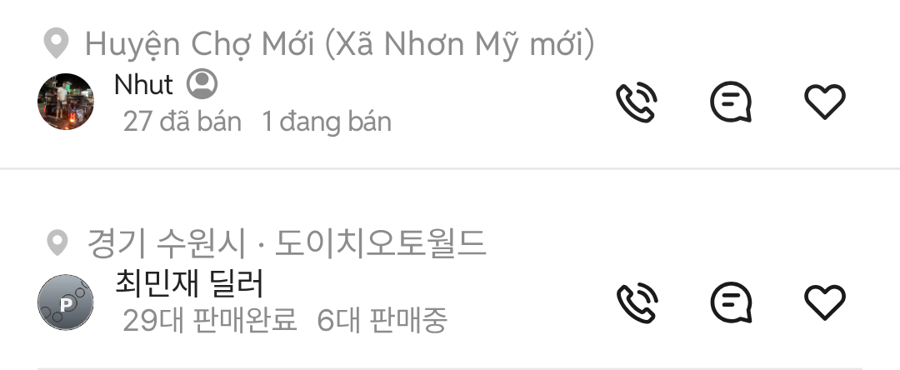

# PR #343 모바일 피드 두 줄 판매자 초톳 크로스체크

① 초톳 두 줄 판매자(이름 + 판매 대수) 캡처와 우리 피드 카드를 같은 배율로 대조해, 가로 위치 두 곳만 맞췄다.

② 과제 ID 미지정 · 브랜치 `feat/qf-m-feed-seller-1010` · 커밋 4d92098 · PR https://github.com/bobaekimboae/bobaedream/pull/343 · 상태 병합·배포 v=b9c8b50 · 함께 들어간 과제 없음

③ 한 일
- 사용자 제공 초톳 캡처(1080×2340)를 384 CSS로 환산해 프사·지역·이름·판매 대수·아이콘·구분선 위치를 잉크(실제 그려진 점) 기준으로 쟀다.
- 프사 크기(24×24)·위치, 세로 간격, 아이콘 위치는 이미 같았다.
- 다른 곳은 가로뿐: 프사 → 이름 간격을 8 → 9로, 판매 대수 줄을 이름보다 3 들여 썼다(초톳도 약 3.6 들여 씀).

④ 원본과 비교
| 항목 | 초톳 | 작업 전 | 작업 후 |
|---|---|---|---|
| 프사 크기 · x | 24×24 · 16 | 24×24 · 16 | 그대로 |
| 지역 글자 중심 → 프사 중심 | 24.4 | 24.7 | 그대로 |
| 이름 글자 x | 49.4 | 48.4 | 49.4 |
| 판매 대수 줄 글자 x | 53.0 | 48.7 | 53.0 |
| 이름 세로 중심(프사 위 기준) | 4.6 | 4.4 | 그대로 |
| 판매 대수 숫자 세로 중심 | 20.1 | 19.9 | 그대로 |
| 찜 아이콘 x · y | 343.1 · 4.6 | 343.1 · 4.9 | 그대로 |
| 프사 아래 → 구분선 | 16.0 | 16.0 | 그대로 |

⑤ 검증
- `npm run verify:qf` 통과
- 콘솔 오류 모바일 0건 · PC 0건
- measure:qf 퀵필터 규격 변화 없음(차종 시트 대기 시간초과 1건은 main에서도 같음)

⑥ 원본과 다르게 남긴 것
- 초톳은 이름 뒤에 사람 모양 배지가 있지만 원본 아이콘이 없어 넣지 않았다.
- 판매 대수 순서는 초톳과 같은 「판매완료 → 판매중」.

⑦ 못 한 것·다음에 할 것: 배지 아이콘(원본 필요)

⑧ 확인 링크: 모바일 `?qf=guazi&view=feed`
