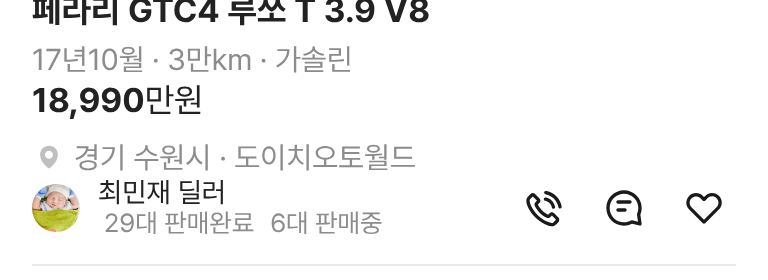

# PR #345 모바일 피드 판매자 프사 실제 사진

① 피드 카드 판매자 프사를 일러스트에서 승인된 실제 인물 사진으로 바꿨다.

② 과제 ID 미지정 · 브랜치 `feat/qf-m-feed-avatar-1010` · 커밋 d325faf · PR https://github.com/bobaekimboae/bobaedream/pull/345 · 상태 푸시(병합·배포 전) · 함께 들어간 과제 없음

③ 한 일
- 기존에 승인해 둔 초톳 인물 사진 26장(허용 목록)만 사용한다. 광고·차량·로고 사진은 쓰지 않는다.
- 매물 번호로 돌려 써서 이웃 매물은 서로 다른 얼굴이 나온다. 이미 초톳 사진이 정해진 매물은 그대로 둔다.
- 피드 보기에만 적용했다. 목록·갤러리·PC는 기존 프사 그대로다.

④ 원본과 비교: 크기(24×24 원형 크롭)·위치는 그대로, 이미지만 교체.

⑤ 검증: `npm run verify:qf` 통과 · 콘솔 오류 모바일 0건 · PC 0건 · measure:qf 규격 변화 없음(차종 시트 대기 시간초과 1건은 main에서도 같음)

⑥ 원본과 다르게 남긴 것: 같은 딜러 이름이 매물마다 다른 얼굴로 보일 수 있다(번호 기준 순환).

⑦ 못 한 것·다음에 할 것: 판매자별로 얼굴을 고정하거나 다른 보기에도 적용할지 결정 필요.

⑧ 확인 링크: 모바일 `?qf=guazi&view=feed`
