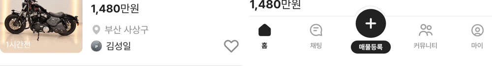

# PR #346 피드 사양 줄 색·지역↔판매자 간격 목록 기준 통일

① 피드 카드의 사양 줄 색과 지역↔판매자 간격을 목록 보기와 같은 값으로 맞췄다.

② 과제 ID 미지정 · 브랜치 `feat/qf-m-feed-unify-1010` · 커밋 75735ac · PR https://github.com/bobaekimboae/bobaedream/pull/346 · 상태 병합·배포 v=b7d1316 · 함께 들어간 과제 없음

③ 한 일
- 사양(메타) 줄 색을 `#8C8C8C` → `#595959`로 바꿨다(목록과 같은 값).
- 지역 글자 중심 → 판매자 중심 간격을 25 → 24로 줄였다(목록 24). 프사 아래 → 구분선 16은 그대로 둬 카드 높이는 같다(366.8).
- 지역·판매 대수 색(`#8C8C8C`)과 목록·갤러리 등 다른 보기는 건드리지 않았다.

④ 원본과 비교
| 항목 | 목록 | 피드 작업 전 | 피드 작업 후 |
|---|---|---|---|
| 사양 줄 색 | #595959 | #8C8C8C | #595959 |
| 지역 중심 → 판매자 중심 | 24 | 25 | 24 |
| (참고) 차란차 메타 색 | #505C6C | - | 사용자 결정으로 목록 기준 |

⑤ 검증: `npm run verify:qf` 통과 · 콘솔 오류 모바일 0건 · PC 0건 · measure:qf 규격 변화 없음(차종 시트 대기 시간초과 1건은 main에서도 같음)

⑥ 원본과 다르게 남긴 것: 피드의 초톳 기준 사양 색(#8C8C8C)은 목록 기준으로 바뀌었다. 지역·판매 대수 색은 목록과 같은 #8C8C8C.

⑦ 못 한 것·다음에 할 것: 필요하면 메타 색을 차란차 값 #505C6C로 목록·피드 함께 바꾸기.

⑧ 확인 링크: 모바일 `?qf=guazi&view=feed`
