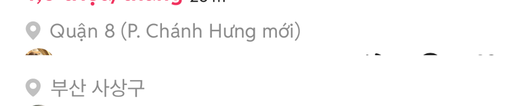

# PR #347 모바일 피드 위치 아이콘 크기 크로스체크

① 초톳 캡처 2장에서 위치 아이콘의 그려진 크기를 재서, 우리 피드 아이콘을 키워 맞췄다.

② 과제 ID 미지정 · 브랜치 `feat/qf-m-feed-locicon-1010` · 커밋 dc11672 · PR https://github.com/bobaekimboae/bobaedream/pull/347 · 상태 병합·배포 v=2f1ec40 · 함께 들어간 과제 없음

③ 한 일
- 초톳 피드 캡처 2장(1080×2340 → 384 CSS)에서 지역 줄 아이콘의 실제 그려진 크기와 위치를 쟀다. 두 장의 값이 같았다.
- 우리 피드 아이콘은 상자 13px라 그려진 크기가 8.5×11.0으로 초톳보다 작았다.
- 상자를 15.6px로 키우고(그려진 크기 11.0×13.2), 왼쪽 여백 2 → 0, 글자와 간격 6 → 5로 맞췄다. 아이콘 윗선과 글자 윗선도 같은 줄에 놓았다.

④ 원본과 비교
| 항목 | 초톳(2장 일치) | 작업 전 | 작업 후 |
|---|---|---|---|
| 그려진 크기 | 10.7×13.5 | 8.5×11.0 | 11.0×13.2 |
| 왼쪽~오른쪽 x | 18.5~29.2 | 20.3~28.8 | 18.5~29.5 |
| 글자 시작 x | 36.6~37.0 | 37.0 | 37.0 |
| 아이콘 윗선 − 글자 윗선 | 0 | 약 +1.0 | 0 |

⑤ 검증: `npm run verify:qf` 통과 · 콘솔 오류 모바일 0건 · PC 0건 · measure:qf 규격 변화 없음(차종 시트 대기 시간초과 1건은 main에서도 같음)

⑥ 원본과 다르게 남긴 것: 아이콘 모양은 우리 원본 SVG(`card-location.svg`)를 그대로 쓴다. 크기·위치만 맞췄다.

⑦ 못 한 것·다음에 할 것: 목록·갤러리 보기의 위치 아이콘은 이번에 건드리지 않았다.

⑧ 확인 링크: 모바일 `?qf=guazi&view=feed`
