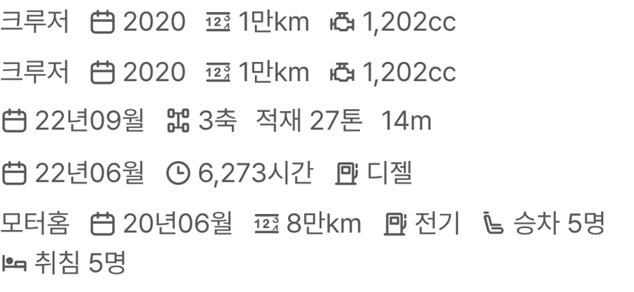

# PR #358 피드 사양 줄 아이콘 추가·교체, 간격 축소

① 피드 사양 줄에 노션 원본 아이콘 4개(배기량·취침·승차인원·사용시간)를 더하고, 마력·축 수 아이콘을 지정한 것으로 바꾸고, 간격을 줄였다.

② 과제 ID 미지정 · 브랜치 `feat/qf-m-feed-icons2-1010` · 커밋 8eb85bd · PR https://github.com/bobaekimboae/bobaedream/pull/358 · 상태 병합·배포 v=59c7e57 · 함께 들어간 과제 없음

③ 한 일
- 새로 받은 아이콘: 배기량(엔진), 취침, 승차인원(좌석), 사용시간(시계). `<symbol>` 래퍼만 벗기고 패스는 수정하지 않았다.
- 교체: 마력 → `11_마력 Power`, 축 수 → `symbol-20`.
- 간격: 항목 사이 14 → 10, 아이콘과 글자 4 → 3.
- 모터홈은 아이콘 5개가 한 줄에 안 들어가 `승차 · 취침`이 둘째 줄로 내려간다(그 줄만 높이 44). 다른 카테고리는 한 줄을 유지한다.

④ 짝 맞춤
| 항목 | 아이콘 |
|---|---|
| 연식 | 달력 |
| 주행거리 | 주행계(12₃) |
| 연료 | 주유기 |
| 마력 | 11_마력 Power (교체) |
| 축 수 | symbol-20 (교체) |
| 배기량 | 엔진 symbol-81 (추가) |
| 취침 | symbol-23 (추가) |
| 승차인원 | 13_좌석 Seat (추가) |
| 사용시간 | symbol-204 (추가) |

⑤ 검증: `npm run verify:qf` 통과 · 콘솔 오류 모바일 0건 · PC 0건 · 전체·트럭·바이크·캠핑카·건설기계·럭셔리카 피드 사양 줄 확인(모터홈 외 한 줄) · measure:qf 규격 변화 없음(차종 시트 대기 시간초과 1건은 main에서도 같음)

⑥ 원본과 다르게 남긴 것: 모터홈 줄은 둘째 줄로 내려간다(이전엔 아이콘 없이 한 줄이었음). 지정 아이콘 `symbol-81`은 노션에서 「엔진」이라 배기량에 썼다.

⑦ 못 한 것·다음에 할 것: 모터홈도 한 줄로 두려면 아이콘 일부를 빼거나 글자 크기를 줄여야 함(결정 필요) · 목록형 적용 여부

⑧ 확인 링크: 모바일 `?qf=guazi&view=feed` (캠핑카 `&category=캠핑카`, 바이크 `&category=바이크`)
