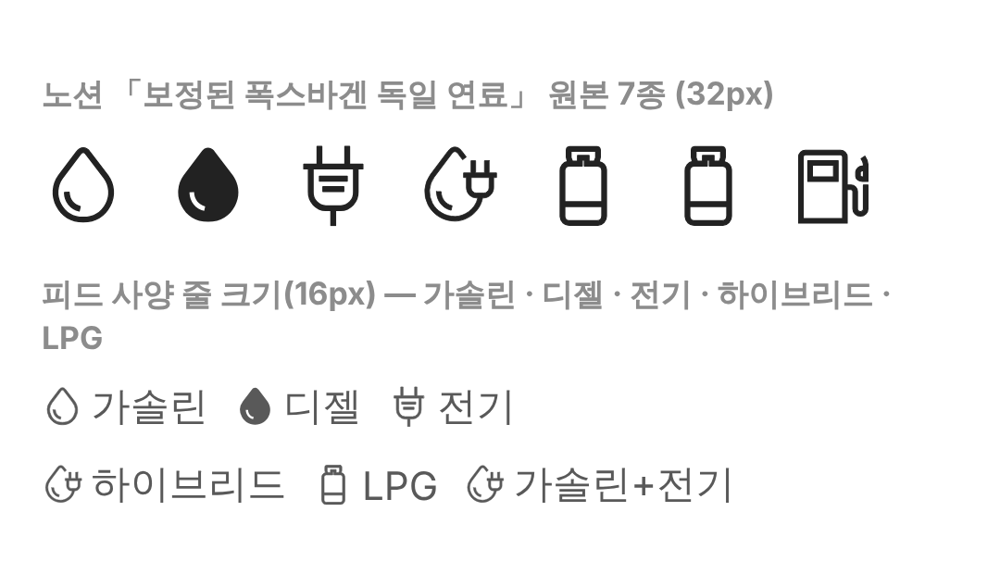

# PR #359 피드 연료 아이콘 유형별 배치

① 피드 사양 줄의 연료 아이콘을 노션 「보정된 폭스바겐 독일 연료」 원본으로 연료 종류별로 바꿨다.

② 과제 ID 미지정 · 브랜치 `feat/qf-m-feed-fuel-icons-1010` · 커밋 a6e008a · PR https://github.com/bobaekimboae/bobaedream/pull/359 · 상태 병합·배포 v=20c7ebb · 함께 들어간 과제 없음

③ 한 일
- 노션 DB의 「보정된 폭스바겐 독일 연료」 묶음에서 가솔린·디젤·전기·하이브리드(가솔린/전기)·LPG·CNG·기타 연료 7개를 원본 그대로 `public/assets/bbm/meta-icons/`에 저장했다.
- 연료 표기에 따라 알맞은 아이콘을 붙인다. 이전의 단일 주유기 아이콘은 기타 연료용으로만 남았다.
- 현재 매물에 쓰이는 연료 6종은 모두 연결됐다.

④ 짝 맞춤
| 연료 표기 | 아이콘 |
|---|---|
| 가솔린 | 01 가솔린(속 빈 물방울) |
| 디젤 | 02 디젤(속 찬 물방울) |
| 전기 | 03 전기(플러그) |
| 하이브리드 · 가솔린+전기 · 플러그인 | 04 하이브리드(물방울+플러그) |
| LPG | 06 LPG(가스통) |
| CNG | 08 CNG(노션 파일이 LPG와 같은 그림) |
| 수소 등 그 밖 | 09 기타 연료(주유기) |

⑤ 검증: `npm run verify:qf` 통과 · 콘솔 오류 모바일 0건 · PC 0건 · 전체·트럭·바이크·캠핑카·건설기계·럭셔리카 피드의 연료 6종 모두 아이콘 연결 확인 · measure:qf 규격 변화 없음(차종 시트 대기 시간초과 1건은 main에서도 같음)

⑥ 원본과 다르게 남긴 것: CNG는 노션 원본 자체가 LPG와 같은 그림이라 구분되지 않는다(노션에서 CNG 전용 아이콘 필요). 노션의 「하이브리드(디젤/전기)」, 「가솔린/LPG」는 현재 매물에 없어 쓰지 않았다.

⑦ 못 한 것·다음에 할 것: CNG 전용 아이콘 · 수소 아이콘 · 디젤 하이브리드 아이콘 사용 여부 · 목록형 적용

⑧ 확인 링크: 모바일 `?qf=guazi&view=feed` (전기 `&category=건설기계` 등 연료가 보이는 카테고리)
