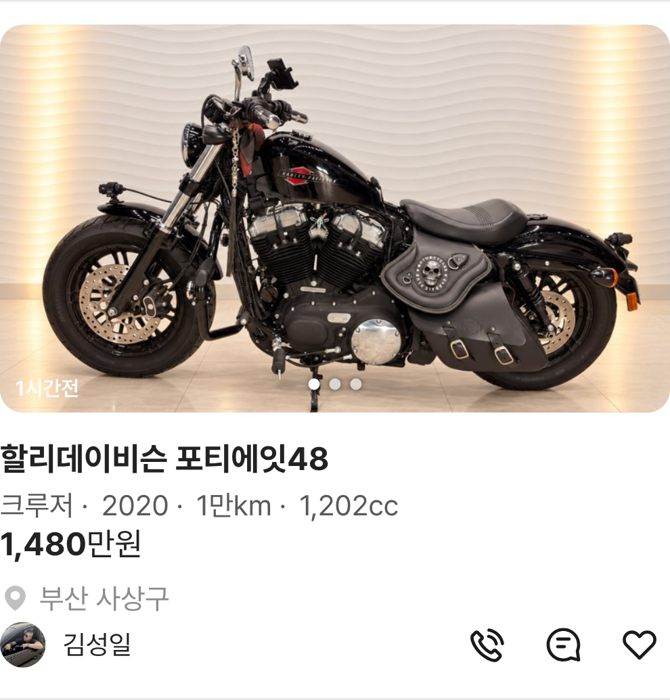

# PR #360 피드 사양 줄 아이콘 없는 비교 버전

① 피드 사양 줄을 아이콘 없이 가운데 점으로 보는 비교 버전을 주소 옵션으로 만들었다. 기본 화면(아이콘 있음)은 그대로다.

② 과제 ID 미지정 · 브랜치 `feat/qf-m-feed-noicon-1010` · 커밋 f04e3b5 · PR https://github.com/bobaekimboae/bobaedream/pull/360 · 상태 병합·배포(v 값은 채팅 보고에 적음) · 함께 들어간 과제 없음

③ 한 일
- 주소 끝에 `&specicon=off`를 붙이면 아이콘 없이 `17년10월 · 3만km · 가솔린`처럼 가운데 점 사양 줄이 나온다.
- 아이콘 없는 줄은 모터홈까지 한 줄을 유지하고, 넘치면 마지막 항목만 말줄임한다.
- 기본(옵션 없음)은 아이콘 있는 화면 그대로다.

④ 비교
| 주소 | 사양 줄 |
|---|---|
| `?qf=guazi&view=feed` | 아이콘 + 간격 |
| `?qf=guazi&view=feed&specicon=off` | 가운데 점, 아이콘 없음 |

⑤ 검증: `npm run verify:qf` 통과 · 콘솔 오류 모바일 0건 · PC 0건 · 전체·캠핑카·트럭 피드에서 켜기/끄기 비교(끄면 아이콘 0개, 모두 한 줄) · measure:qf 규격 변화 없음(차종 시트 대기 시간초과 1건은 main에서도 같음)

⑥ 원본과 다르게 남긴 것: 없음(비교용 옵션).

⑦ 못 한 것·다음에 할 것: 아이콘 있는 버전과 없는 버전 중 기본값 결정.

⑧ 확인 링크: 아이콘 없음 `?qf=guazi&view=feed&specicon=off`
