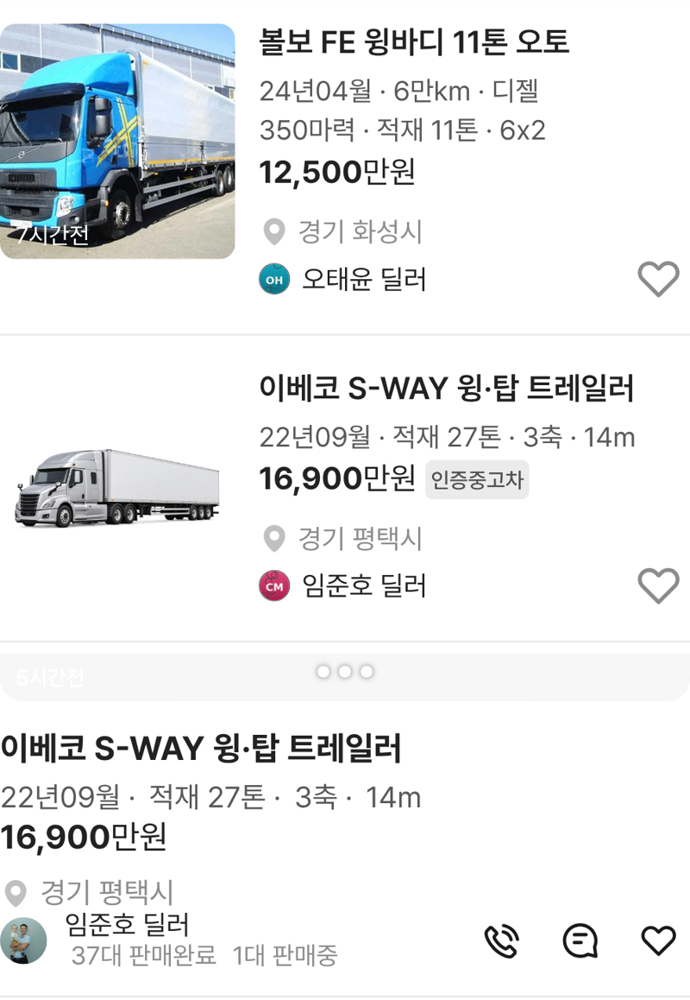

# PR #361 피드 아이콘 빼기 · 트레일러 적재 추가 · 트럭 적재 복원

① 복잡하다는 의견에 따라 피드 사양 줄 아이콘을 빼고, 트레일러에는 축 앞에 적재를, 트럭에는 기존처럼 적재를 넣었다.

② 과제 ID 미지정 · 브랜치 `feat/qf-m-feed-noicon-load-1010` · 커밋 86b4b60 · PR https://github.com/bobaekimboae/bobaedream/pull/361 · 상태 병합·배포(v 값은 채팅 보고에 적음) · 함께 들어간 과제 없음

③ 한 일
- 아이콘: 피드 사양 줄 기본을 아이콘 없는 가운데 점 줄로 되돌렸다. 아이콘 버전은 주소 끝 `&specicon=on`으로만 볼 수 있다(아이콘 파일은 보관).
- 트레일러: `22년09월 · 적재 27톤 · 3축 · 14m`처럼 등록연월 · 적재 · 축수 · 길이 순으로, 목록형·피드형 모두 한 줄로 나온다.
- 트럭: 제목에 톤수가 있어도 적재를 빼지 않고 `마력 · 적재 · 차축` 순서로 넣는다. 목록형은 `마력`부터 둘째 줄이라 예전 모양과 같다.

④ 비교
| 매물 | 작업 전 | 작업 후 |
|---|---|---|
| 트레일러(27톤·3축·14m) | `22년09월 · 3축` / `적재 27톤 · 14m`(목록형 두 줄) | `22년09월 · 적재 27톤 · 3축 · 14m` 한 줄 |
| 볼보 FE 윙바디(truck-031) | `…350마력 · 6x2` | `…350마력 · 적재 11톤 · 6x2` |
| 소형 트럭 | `41마력 · 4x2` | `41마력 · 적재 0.5톤 · 4x2` |

⑤ 검증: `npm run verify:qf` 통과 · 콘솔 오류 모바일 0건 · PC 0건 · 목록·피드 트럭 8대 사양 줄 확인 · 기본 아이콘 0개 / `specicon=on` 60개 확인 · measure:qf 규격 변화 없음(차종 시트 대기 시간초과 1건은 main에서도 같음)

⑥ 원본과 다르게 남긴 것: 명성정공 로베드(truck-032)는 적재 정보가 없어 `15년09월 · 3축`만 나온다. 적재가 차축과 같은 트랙터(`540마력`)는 기존 규칙대로 적재를 생략한다.

⑦ 못 한 것·다음에 할 것: 명성정공 적재 값 확인 · 트랙터 적재 표기 여부

⑧ 확인 링크: `?qf=guazi&category=트럭 · 특장`(피드는 `&view=feed`)
