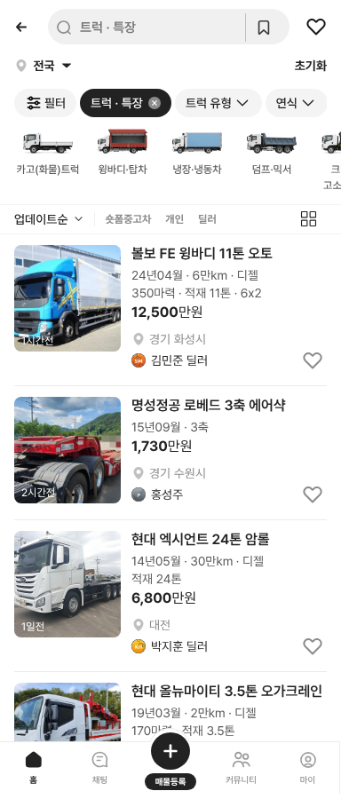

# PR #362 트럭·특장 매물 v09 (구글 시트 50대)

① 트럭·특장 목록을 바이크 v08처럼 시트 매물로 바꿨다: 사용자 지시 매물 2대 + 시트 「트럭」 50대.

② 과제 ID 미지정 · 브랜치 `feat/qf-truck-v09-1010` · 커밋 db64abc · PR https://github.com/bobaekimboae/bobaedream/pull/362 · 상태 병합·배포(v 값은 채팅 보고에 적음) · 함께 들어간 과제 없음

③ 한 일
- 시트 「가상 매물 시나리오 › 트럭」 50행을 `src/prototype/truck/scenario-v09.ts`로 옮겼다. 목록은 truck-031(볼보 FE 윙바디)·truck-032(명성정공 로베드)가 맨 위, 그 뒤가 시트 게시일 최신순이다. 예전 가상 30대는 뺐다.
- 시트 사진 50장을 `public/assets/truck/listings/v09/`에 저장했다(900px 이하 webp). 44번 사다리차 사진의 전화번호는 흐리게 했다.
- 카드는 시트의 진짜 등록연월을 써서 `24년07월 · 20만km · 디젤 · 570마력 · 적재 25.5톤 · 10x4`처럼 나온다.
- 시트의 세부 종류를 우리 형식 목록 값으로 맞췄다(냉장윙바디 → 냉장·냉동차 `냉장윙`, 탑차 → `내장탑 - 일반`, 대우 → 타타대우 등).
- 판매자는 가상 이름이다. 실제 판매자명·전화번호·원본 URL·매물 ID는 저장하지 않았다.

④ 비교
| 항목 | 작업 전 | 작업 후 |
|---|---|---|
| 트럭 목록 대수 | 32대(가상 30 + 지시 2) | 52대(시트 50 + 지시 2) |
| 사진 | 형식별 그림 | 실제 매물 사진 |
| 등록월 | 매물 번호로 만든 값 | 시트 값 |

⑤ 검증: `npm run verify:qf` 통과 · 콘솔 오류 모바일·PC 0건(기존 404 1건은 main에서도 같음) · 윙바디·탑차 14대 · 윙바디 11대 · 카고 대형 3대 · 버스 1대로 선택지 대수 일치 · PC·모바일·피드 화면 확인

⑥ 원본과 다르게 남긴 것: 시트에 없던 변속기(2018 이상 오토·미만 수동), 빈 지역 5대(경기·인천·충남·부산·대구 돌려쓰기), 빈 게시일 19대(1~3일 전)는 보정한 값이다. 연료는 전부 디젤로 했다. 모델이 없는 이베코·만(MAN) 매물은 제목에 제조사만 쓴다. 목록 썸네일 정규화 사본은 만들지 못하고 원본을 정사각 `cover`로 보여준다(차 영역 분할 모델이 없음).

⑦ 못 한 것·다음에 할 것: 썸네일 정규화 · 트럭 「트레일러」 시트 탭 50행 · 차량번호가 보이는 사진의 번호판 흐림 처리

⑧ 확인 링크: 모바일 `?qf=guazi&category=트럭 · 특장` · PC `?qf=guazi&pc=1&category=트럭 · 특장`(배포본은 `&v=<커밋>`)
