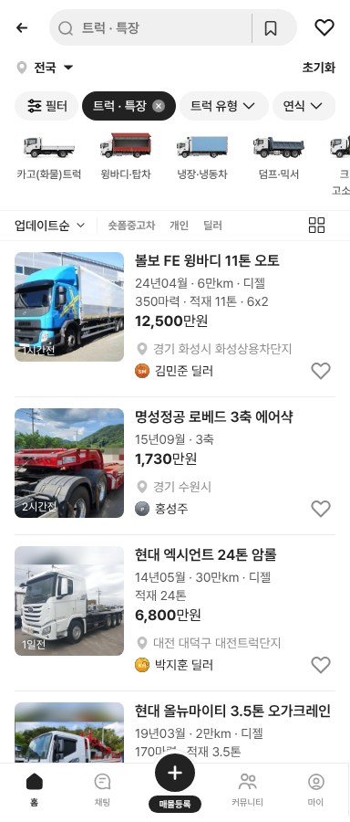
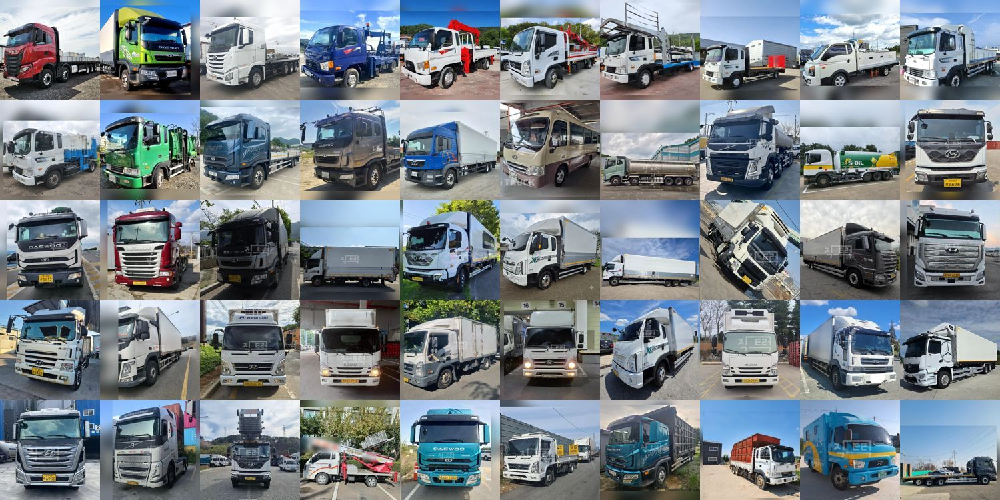

# PR #363 트럭 사진 보정 · 가상 매매단지

① 트럭 시트 사진 50장을 럭셔리카 규칙으로 보정하고, 딜러 매물에 가상 매매단지를 붙였다.

② 과제 ID 미지정 · 브랜치 `feat/qf-truck-v09-photo-danji-1010` · PR https://github.com/bobaekimboae/bobaedream/pull/363 · 상태 병합·배포(커밋·v 값은 채팅 보고에 적음) · 함께 들어간 과제 없음

③ 한 일
- 사진 보정: 분할 모델로 트럭 영역을 찾아 차 폭이 칸의 90%, 바닥선이 위에서 85%가 되게 600×600 사본 50장을 만들었다(`listings/v09/thumb/`). 남는 칸은 사진을 흐리게 키워 채웠다. 피드 대표 사진은 원본 그대로다.
- 매매단지: 17개 시도마다 구군·단지 이름을 가상으로 만들었다(예: `화성상용차단지`). 딜러 매물은 `경기 화성시 · 화성상용차단지`, 개인 직거래는 지역만 나온다.
- 지역이 비어 있던 매물은 단지의 구군이 같이 붙어 `대전 대덕구`처럼 보인다. 지역 필터는 그대로 동작한다.

④ 비교
| 항목 | 작업 전 | 작업 후 |
|---|---|---|
| 목록 썸네일 | 원본 정사각 잘라내기(차 크기 제각각) | 차 폭 90%·바닥선 85%로 통일 |
| 딜러 위치 | `대전` | `대전 대덕구 · 대전트럭단지` |

⑤ 검증: `npm run verify:qf` 통과 · 모바일 목록 화면 확인 · 썸네일 50장 모아보기 확인

⑥ 원본과 다르게 남긴 것: 단지 이름은 전부 가상이다(KB차차차 마스터에 상용차 단지가 없음). 사진 위아래 남는 칸은 흐린 배경이라 가로로 긴 사진은 띠가 보인다. 사진 속 번호판 흐림은 하지 않았다.

⑦ 못 한 것·다음에 할 것: 번호판 흐림 · 트레일러 탭 50행

⑧ 확인 링크: 모바일 `?qf=guazi&category=트럭 · 특장` · PC `?qf=guazi&pc=1&category=트럭 · 특장`(배포본은 `&v=<커밋>`)
