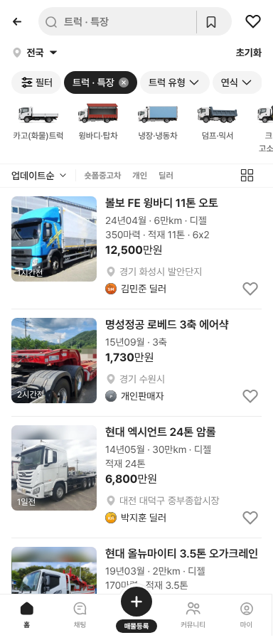

# PR #364 트럭 실제 매매단지 · 개인판매자 표기

① 가상으로 만들었던 트럭 매매단지를 KB차차차 마스터의 실제 단지로 바꾸고, 개인 판매자는 이름 없이 `개인판매자`로 표시했다.

② 과제 ID 미지정 · 브랜치 `feat/qf-truck-real-danji-1010` · PR https://github.com/bobaekimboae/bobaedream/pull/364 · 상태 병합·배포(커밋·v 값은 채팅 보고에 적음) · 함께 들어간 과제 없음

③ 한 일
- 단지: `kb-danji-master-20260826.json`(KB차차차 지역별 매매단지, 실제 이름 있는 343곳)에서 고른다. 시트 지역에 구군이 있으면 같은 구군의 매물 많은 단지, 없으면 같은 시도의 매물 많은 상위 3곳을 돌려 쓴다. 예: `경기 화성시 · 발안단지`, `대전 대덕구 · 중부종합시장`.
- 개인: 트럭 개인 직거래는 판매자 이름 대신 `개인판매자`, 위치는 지역만 나온다.
- 세종은 마스터에 단지가 없어 지역만 나온다. 앞서 만든 가상 단지 이름은 코드에서 지웠다.

④ 비교
| 항목 | 작업 전 | 작업 후 |
|---|---|---|
| 딜러 위치 | `경기 화성시 · 화성상용차단지`(가상) | `경기 화성시 · 발안단지`(KB 마스터) |
| 개인 판매자 | `홍성주` | `개인판매자` |

⑤ 검증: `npm run verify:qf` 통과 · 모바일 목록 화면 확인(실제 단지·개인판매자 표시)

⑥ 원본과 다르게 남긴 것: 마스터는 승용 중심 단지라 트럭 전용 단지는 없다. 시도만 있는 지역은 어느 단지에 배정할지 알 수 없어 매물 많은 상위 3곳을 돌려 썼다. 개인판매자 표기는 트럭에만 적용했다(다른 카테고리는 기존 가상 이름 그대로).

⑦ 못 한 것·다음에 할 것: 번호판 흐림 · 트레일러 탭 50행

⑧ 확인 링크: 모바일 `?qf=guazi&category=트럭 · 특장` · PC `?qf=guazi&pc=1&category=트럭 · 특장`(배포본은 `&v=<커밋>`)
