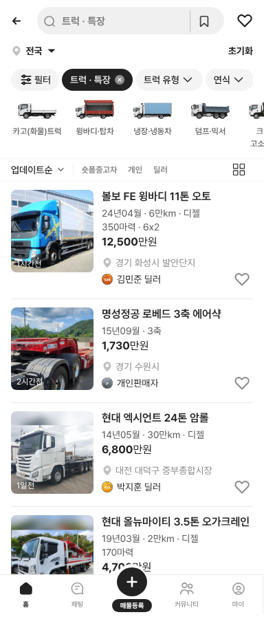

# PR #366 트럭 목록형에서 적재 빼기

① 모바일 목록형 트럭 카드의 스펙 줄에서 `적재 N톤`을 뺐다.

② 과제 ID 미지정 · 브랜치 `feat/qf-truck-list-noload-1010` · PR https://github.com/bobaekimboae/bobaedream/pull/366 · 상태 병합·배포(커밋·v 값은 채팅 보고에 적음) · 함께 들어간 과제 없음

③ 한 일
- 목록형 트럭은 2행에 톤수가 이미 있어(`24톤 암롤`) 적재가 중복이라 뺐다. 예: `350마력 · 적재 11톤 · 6x2` → `350마력 · 6x2`.
- 피드형·PC·트레일러는 적재를 그대로 둔다.

④ 비교
| 매물 | 작업 전 | 작업 후 |
|---|---|---|
| 볼보 FE 윙바디 | `350마력 · 적재 11톤 · 6x2` | `350마력 · 6x2` |
| 엑시언트 암롤(마력 없음) | `적재 24톤` | 둘째 줄 없음 |

⑤ 검증: `npm run verify:qf` 통과 · 목록형 화면 확인

⑥ 원본과 다르게 남긴 것: 피드형·PC는 적재를 유지했다(적재를 목록형에서만 빼라는 뜻으로 해석).

⑦ 못 한 것·다음에 할 것: 피드형에서도 뺄지 결정

⑧ 확인 링크: 모바일 `?qf=guazi&category=트럭 · 특장`(배포본은 `&v=<커밋>`)
