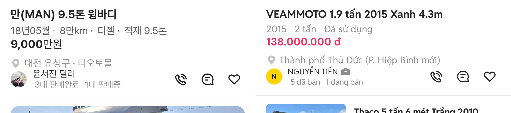

# PR #367 피드 줄 간격 재측정·보정

① 초톳 피드와 우리 피드의 줄 사이 간격을 같은 배율로 재서, 답답해 보이는 세 곳(메타→가격, 가격→지역, 지역→판매자)을 2px씩 늘렸다.

② 과제 ID 미지정 · 브랜치 `feat/qf-feed-spacing-1010` · PR https://github.com/bobaekimboae/bobaedream/pull/367 · 상태 병합·배포(커밋·v 값은 채팅 보고에 적음) · 함께 들어간 과제 없음

③ 한 일
- 사용자 폰 캡처 2장(우리 · 초톳, 1080×2340 → 384 CSS)에서 글자 기준선 간격·글자 사이 간격·글자 크기·좌우 여백을 쟀다.
- 메타→가격, 가격→지역, 지역→판매자를 각각 +2px 늘렸다. 프사 아래 → 구분선 16은 그대로다.

④ 측정 비교(CSS px)
| 항목 | 우리 | 초톳 |
|---|---|---|
| 기준선 간격 제목→메타 | 23.5 | 21.7 |
| 기준선 간격 메타→가격 | 21.0 | 19.9 |
| 기준선 간격 가격→지역 | 28.1 | 27.0 |
| 글자 사이 간격 메타→가격 | 6.4 | 5.3 |
| 글자 사이 간격 가격→지역 | 12.8 | 15.0 |
| 글자 사이 간격 지역→판매자 | 3.2 | 약 4.3 |
| 숫자 높이(메타) | 10.7 | 10.3 |
| 왼쪽 시작 | 16.7 | 16.7 |
| 지역→아이콘 중심 / 아이콘 중심→구분선 | 24.2 / 28.3 | 24.5 / 28.3 |
| 메타 색 · 가격 색 | #595959 · #222 | #8C8C8C · #F0325E |

기준선 간격은 우리가 오히려 넓다. 하지만 한글은 글자 높이가 꽉 차 같은 간격이어도 더 붙어 보이고, 메타·가격이 둘 다 진해서 구분이 약하다. 가격→지역은 글자 사이가 2.2 좁았다.

⑤ 검증: `npm run verify:qf` 통과 · 피드 화면 확인

⑥ 원본과 다르게 남긴 것: 메타 색은 목록과 같은 #595959로 두었다(초톳은 #8C8C8C). 사진→제목 간격은 우리 16.7, 초톳 13.2로 다르지만 이번에 건드리지 않았다.

⑦ 못 한 것·다음에 할 것: 메타 색을 초톳 #8C8C8C로 옅게 할지 · 사진→제목 간격 맞출지

⑧ 확인 링크: 모바일 `?qf=guazi&view=feed&category=트럭 · 특장`(배포본은 `&v=<커밋>`)
