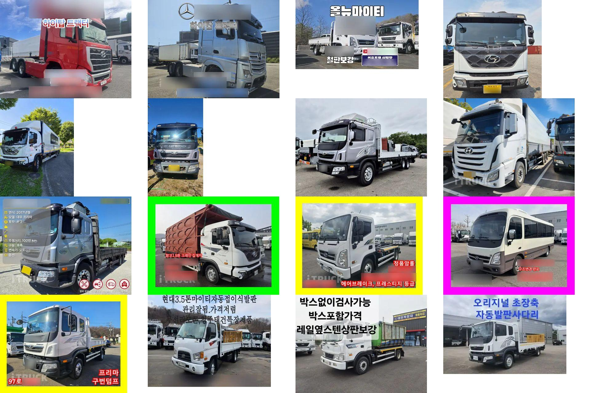
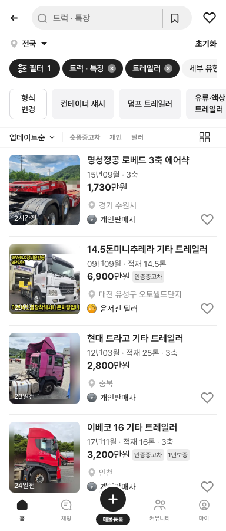

# PR #368 트럭 유형별 500대 추가 (v10)

① 구글 시트 「트럭 신규 추가」 500대를 트럭 목록에 더해 모든 트럭 유형을 눌러서 확인할 수 있게 했다(트럭 목록 52대 → 552대).

② 과제 ID 미지정 · 브랜치 `feat/qf-truck-v10-500-1010` · PR https://github.com/bobaekimboae/bobaedream/pull/368 · 상태 병합·배포(커밋·v 값은 채팅 보고에 적음) · 함께 들어간 과제 없음

③ 한 일
- 시트 500행(아이트럭 150 · 마이트럭 150 · 직트럭 100 · 특장차8949 100)을 `scenario-v10.ts`로 옮겼다. 제조사·모델·등록연월·주행·가격·적재·마력·구동은 시트 값이다.
- 시트의 유형을 우리 형식 목록 값으로 맞췄다(냉동·냉장 윙바디 → 냉장·냉동차 `냉동윙`/`냉장윙`, 홈로리 → 벌크 탱크로리, 추레라 → 트랙터 헤드 등). 형식 12종 · 세부형식 27종에 매물이 생겼다.
- 사진 500장을 내려받아 640px로 줄이고(총 22MB), 목록 썸네일 360×360 사본은 럭셔리카 규칙(차 폭 90%·바닥선 85%)으로 만들었다.
- 사진 속 글자(번호판·전화번호·광고 문구)를 글자 인식으로 찾아 657곳을 흐리게 했다. 매물 사진이 아닌 9장(자리표시·계기판·서류·타이어 등)은 형식별 그림으로 바꿨다.
- 직거래 106대는 개인(`개인판매자`), 나머지는 딜러(실제 매매단지)로 표시한다. 판매자 이름·연락처·원본 URL·매물 ID는 저장하지 않았다.

④ 비교
| 항목 | 작업 전 | 작업 후 |
|---|---|---|
| 트럭 목록 | 52대 | 552대 |
| 트럭 유형 | 제목·톤수 위주 | 12개 형식 · 27개 세부형식에 매물 |

⑤ 검증: `npm run verify:qf` 통과 · 콘솔 오류 PC 0건·모바일 0건 · 형식 12개를 차례로 눌러 화면 열림 확인 · 샘플 16장 흐림 결과 확인

⑥ 원본과 다르게 남긴 것: 시트에 없던 값은 보정했다(연료 전부 디젤, 변속기는 연식으로, 지역 빈 348행은 시도를 돌려 씀, 주행 빈 107행은 연식으로 추정, 게시일 1~34일 전). 제조사를 못 찾은 46대는 `기타`다. 번호판은 글자 인식이 놓친 일부가 남아 있을 수 있고, 매물 사진 위의 설명 문구(전화번호 아님)는 일부 그대로다. 시트의 「트레일러」로 분류된 행 중 상당수가 트랙터 헤드여서 트랙터 헤드로 옮겼다.

⑦ 못 한 것·다음에 할 것: 남은 번호판 흐림 · 광고 문구 전체 제거 · 시트 「트레일러」 탭 50행(엔 표기) · 매물 사진이 한 장뿐이라 피드의 여러 장 넘기기는 임시 슬라이드

⑧ 확인 링크: 모바일 `?qf=guazi&category=트럭 · 특장` · PC `?qf=guazi&pc=1&category=트럭 · 특장`(배포본은 `&v=<커밋>`)
