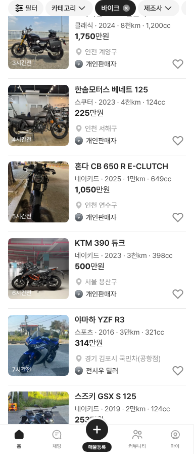
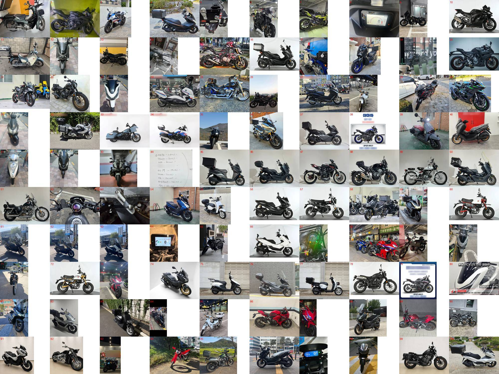

# PR #371 바이크 500대 보강 (v11)

① 구글 시트 「바이크 신규」 500대를 바이크 목록에 더했다(51대 → 551대).

② 과제 ID 미지정 · 브랜치 `feat/qf-bike-v11-500-1010` · PR https://github.com/bobaekimboae/bobaedream/pull/371 · 상태 병합·배포(커밋·v 값은 채팅 보고에 적음) · 함께 들어간 과제 없음

③ 한 일
- 시트 500행(라이트바겐 공개 목록)을 `scenario-v11.ts`로 옮겼다. 제조사·모델·연식·주행·가격·배기량·서류·게시일·인증중고 여부는 시트 값이다. 제조사 12곳(혼다 75 · 가와사키 70 · 야마하 70 · BMW 67 · 스즈키 65 · 할리 65 · 두카티 60 · KTM 22 …)이다.
- 장르는 모델 기준으로 정했다(스포츠 134 · 네이키드 100 · 스쿠터 99 · 크루저 77 · 클래식 28 · 멀티퍼포즈 24 · 투어러 24 · 언더본 13 · 삼륜 1).
- 사진 500장을 640px로 줄이고(총 32MB 안), 목록 썸네일 360×360 사본을 차 폭 90%·바닥선 85% 규칙으로 만들었다. 사진 속 글자(번호판·전화번호·광고 문구) 359곳을 글자 인식으로 흐리게 했다.
- 계기판·부품·서류·확대 사진 19장은 같은 모델(없으면 같은 제조사)의 다른 매물 사진으로 대신했다.
- 개인 판매자는 `개인판매자`, 딜러 매물은 실제 매매단지가 붙는다. 지역은 구·군까지 나온다.

④ 비교
| 항목 | 작업 전 | 작업 후 |
|---|---|---|
| 바이크 목록 | 51대 | 551대 |
| 장르 | 8종 | 9종(삼륜 포함, 클래식·투어러 늘어남) |

⑤ 검증: `npm run verify:qf` 통과 · 콘솔 오류 PC·모바일 0건 · 목록 화면 확인 · 사진 500장을 100장씩 모아 눈으로 검수

⑥ 원본과 다르게 남긴 것: 시트에 없던 값은 보정했다(지역의 구·군 돌려쓰기, 가격 7대, 게시일 26대, 판매자 구분, 연료 가솔린, 상태 `중상`). 대체 사진 19대는 실제 그 매물 사진이 아니다. 번호판 흐림은 글자 인식이 놓친 일부가 남아 있을 수 있다. 근접·밤 사진·검은 테두리 사진 등 일부는 사진 품질이 낮다.

⑦ 못 한 것·다음에 할 것: 남은 번호판 · 품질 낮은 사진 교체 · 모델별 정확한 장르(시트에 장르 열 없음)

⑧ 확인 링크: 모바일 `?qf=guazi&category=바이크` · PC `?qf=guazi&pc=1&category=바이크`(배포본은 `&v=<커밋>`)
