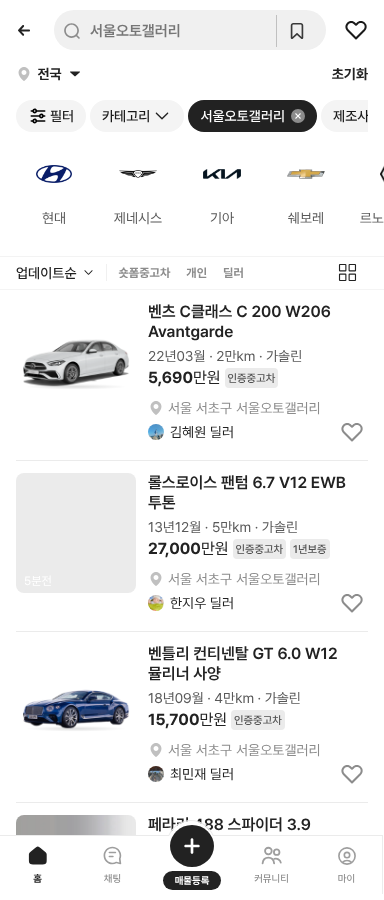

# PR #374 중고차 하위 카테고리에 서울오토갤러리 추가

① 중고차 하위 카테고리에 `서울오토갤러리`를 추가했다. 서울오토갤러리 매매단지에 등록된 매물만 보여준다.

② 과제 ID 미지정 · 브랜치 `feat/qf-seoul-autogallery-1010` · PR(번호는 채팅 보고에 적음) · 상태 병합·배포 · 함께 들어간 과제 없음

③ 한 일
- 카테고리 시트의 중고차 아래 `럭셔리카` 다음에 `서울오토갤러리` 칩을 넣었다. `?category=서울오토갤러리`로 바로 열린다.
- 목록은 승용 샘플과 럭셔리카 가상 매물 중 딜러 매물이면서 위치의 단지가 서울오토갤러리인 것만 보여준다(현재 5대, 모두 `서울 서초구 서울오토갤러리`).
- 제조사 레일·필터·정렬·목록/피드 보기는 중고차와 같다.

④ 비교
| 항목 | 작업 전 | 작업 후 |
|---|---|---|
| 중고차 하위 카테고리 | 전체차량 · 국산차 · 수입차 · 전기차 · … · 럭셔리카 · 슈퍼카 … | 럭셔리카 다음에 서울오토갤러리 |

⑤ 검증: `npm run verify:qf` 통과 · 모바일·PC 목록 5대 모두 위치가 `서울 서초구 서울오토갤러리` · 카테고리 시트에 칩 표시 · 콘솔 오류 0건

⑥ 원본과 다르게 남긴 것: 샘플 매물이 적어 5대뿐이다. 승용 샘플의 서울 서초구 딜러 매물은 위치 규칙상 서울오토갤러리로 표시되는 것을 그대로 쓴다.

⑦ 못 한 것·다음에 할 것: 매물 수를 늘릴지 · 다른 매매단지별 카테고리(매매단지별 검색)와 통합할지

⑧ 확인 링크: 모바일 `?qf=guazi&category=서울오토갤러리` · PC `?qf=guazi&pc=1&category=서울오토갤러리`(배포본은 `&v=<커밋>`)
