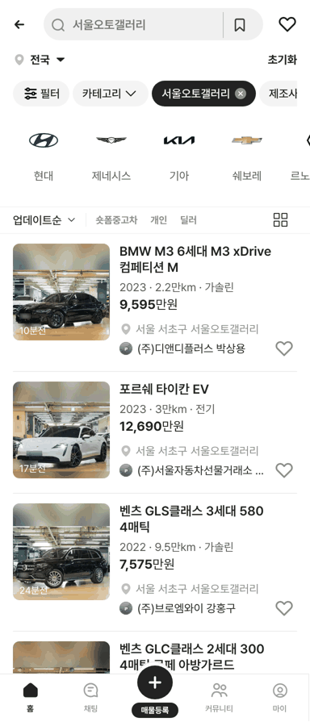
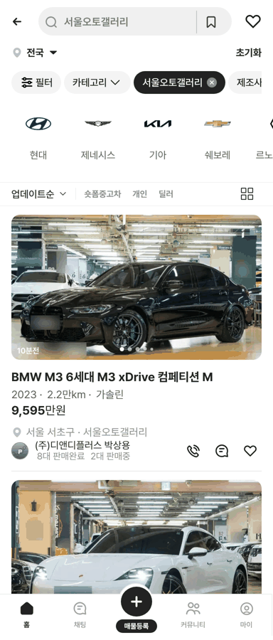

# PR #375 서울오토갤러리 실데이터(사진 5장 · 실제 상사명 · 딜러명)

① 서울오토갤러리 카테고리를 시트 「서울오토갤러리」 실데이터 23대로 바꿨다. 매물마다 사진 5장, 실제 상사명 · 딜러명을 보여준다.

② 과제 ID 미지정 · 브랜치 `feat/qf-seoul-autogallery-real-1010` · PR #375 · 상태 푸시 후 병합·배포(v 값은 채팅 보고) · 함께 들어간 과제 없음

③ 한 일
- 시트 736행 중 사진 5장이 Drive에 있는 23대(중복 행 제외)를 목록으로 만들었다. 나머지 713대는 시트에 사진 주소가 없어(원본 404) 사진이 오면 넣는다.
- 사진 115장을 내려받아 글자 인식으로 번호판·전화번호·광고 글자를 흐림 처리하고 640px로 줄였다. 목록 썸네일은 첫 장을 럭셔리카 규칙으로 맞췄다.
- 카드에 실제 상사명 + 딜러명(`(주)디앤디플러스 박상용`)을 표시한다. 위치는 `서울 서초구 · 서울오토갤러리`, 가격은 시트의 공개가/추정가다.
- 피드 보기는 임시 슬라이드 대신 이 매물의 실제 사진 5장을 넘겨 본다.

④ 원본과 비교
| 항목 | 작업 전 | 작업 후 |
|---|---|---|
| 서울오토갤러리 목록 | 샘플·럭셔리카 가상 5대 | 시트 실데이터 23대 |
| 매물당 사진 | 1장(피드는 임시 슬라이드) | 5장 |
| 판매자 | 가상 딜러명 | 실제 상사명 + 딜러명 |

 

⑤ 검증: `npm run verify:qf` 통과 · 모바일 목록·피드 23대 표시, 피드 사진 5장 확인 · 콘솔 오류는 기존 404 1건뿐

⑥ 원본과 다르게 남긴 것: 이 카테고리만 실제 상사명·딜러명을 쓴다(사용자 지시, 다른 카테고리의 가상 이름 규칙 예외). 가격은 대부분 시트 추정가다. 판매자 프로필은 기본 아이콘이다(딜러 얼굴 미수집).

⑦ 못 한 것·다음에 할 것: 사진이 없는 713대는 사진 확보 후 추가. 시트의 연식 원문(`2023 / 12식`)은 연식 숫자만 썼다.

⑧ 확인 링크: 모바일 `?qf=guazi&category=서울오토갤러리` · PC `?qf=guazi&pc=1&category=서울오토갤러리`(배포본은 `&v=<커밋>`)
