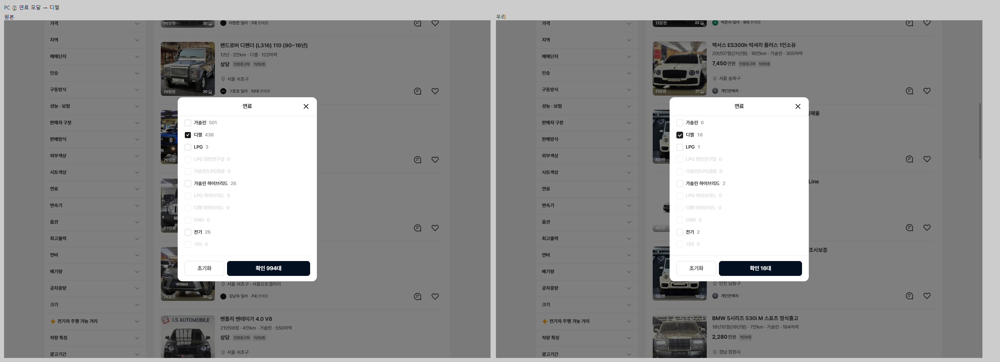
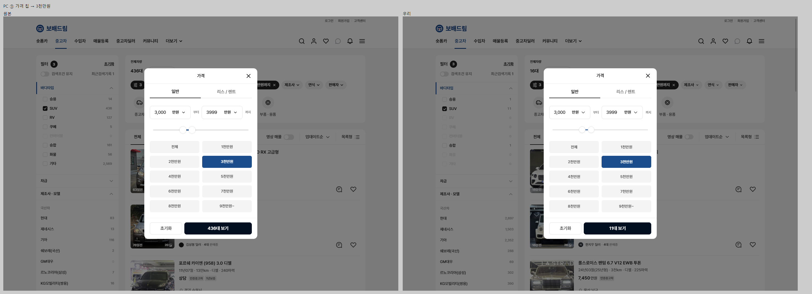
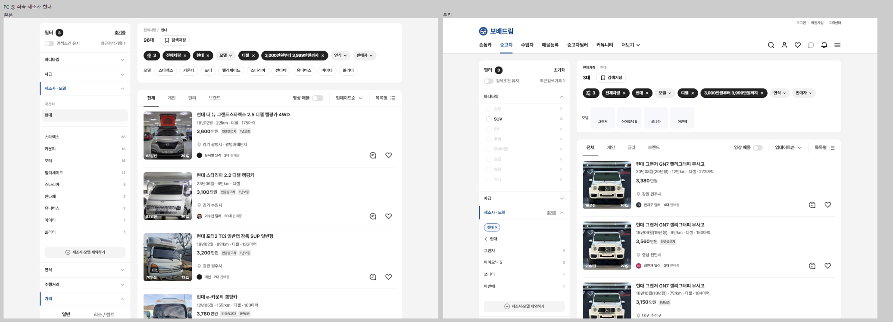
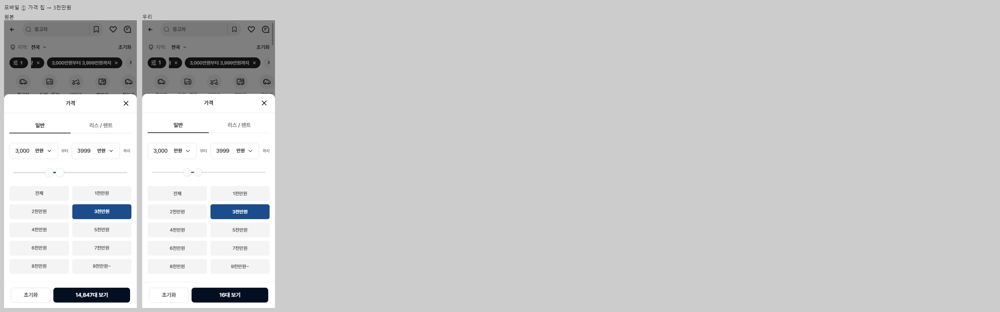
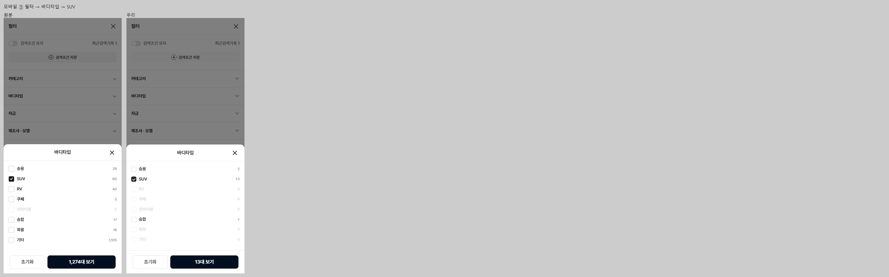

# PR #80 필터 동작을 개발 시안과 같게

## 1. 한 줄 요약
개발 시안 원본(dev.bbmuseum.co.kr/car/list)을 직접 조작해 확인한 대로 과쯔 PC·모바일 필터의 창·선택 표시·조건이 걸리는 시점·목록 거르기를 맞췄고, 시나리오 자동 대조 15개 단계·영역이 모두 차이 3% 이하, 동작 점검표 93개 항목이 모두 원본과 일치합니다.

## 2. 기본 정보
| 항목 | 내용 |
|---|---|
| 과제 ID | QF-085 · QF-086 · QF-089 · QF-090 · OP-013 |
| 브랜치 | `feat/bbm-filter-behavior` (main `3600173`에서 시작) |
| 커밋 | `58c3441` |
| PR | https://github.com/bobaekimboae/bobaedream/pull/80 |
| 상태 | 푸시 완료, PR 열림(병합·배포 안 함) |
| 시작 전 처리 | PR #79 병합·배포 완료(main `3600173`, 번들 `index-DM-EivqR.js`). PR #79가 PR #78(QF-067) 위에 쌓여 있어 기준을 main으로 바꿔 병합했고, QF-067도 함께 main에 들어갔습니다(PR #78은 병합됨으로 표시) |

## 3. 한 일
- **QF-085** PC 상단 칩(제조사·모델·연식·가격·연료·판매자)을 누르면 원본과 같은 412 모달이 열립니다. PC "필터" 칩은 원본처럼 누를 수 없고, 사이드바 "초기화"는 원본처럼 확인 창을 거칩니다.
- **QF-086** 모바일 칩은 원본 바텀시트로 바꿨습니다. 가격 시트는 예전 초톳식 대신 탭·최저/최대·슬라이더·구간 10개·"N대 보기"입니다. 모바일 필터 전체 화면의 각 항목을 누르면 그 항목의 시트가 열립니다.
- **QF-089** 조건이 걸리면 적용 칩(진한 채움 + ×)이 생기고, 값이 걸린 칩은 줄에서 빠집니다. 제조사를 고르면 [현대 ×][모델]이 되고, "필터" 칩에 개수, 사이드바에 원형 배지, 값이 걸린 항목 제목은 파랑 + 왼쪽 막대, 최근검색기록이 표시됩니다.
- **QF-090** 우리 데이터가 있는 항목(바디타입·연식·주행거리·가격·연료·변속기·인승·외부색상·판매자 구분 중 딜러·개인·지역·영상 매물·제조사·모델·등급)은 실제로 목록을 거르고, 선택지 옆 매물 수를 다른 조건을 반영해 다시 계산합니다. 과쯔 샘플 매물을 60대로 늘렸습니다.
- **OP-013** `npm run diff:bbm:flow`: 원본과 우리 화면에 같은 조작 순서를 실행해 단계마다 영역별 차이 비율과 동작 점검표를 만듭니다.

## 4. 원본과 비교

### 시나리오 단계별 차이 비율
"첫 측정"은 기능을 만든 뒤 대조 도구를 처음 제대로 돌렸을 때입니다(만들기 전에는 이 화면들이 없어 잴 수 없었음). 숫자·매물 목록·사진·로고는 두 쪽 모두 가리고 비교했습니다.

| 단계 | 영역 | 첫 측정 | 최종 |
|---|---|---|---|
| PC ① 바디타입 → SUV 체크 | 칩 줄 / 사이드바 머리 / 항목 제목 / 목록 툴바 | 5.5 / 9.7 / 1.1 / 2.6% | 0.3 / 0.2 / 0 / 2.6% |
| PC ② 연료 모달 → 디젤 → 확인 | 모달 / 칩 줄 / 머리 / 제목 | 0.7 / 5.9 / 9.6 / 64.8% | 0.7 / 0.3 / 0.1 / 0.6% |
| PC ③ 가격 칩 → 3천만원 → N대 보기 | 모달 / 칩 줄 / 머리 / 제목 | 2.8 / 7.9 / 9.6 / 7.5% | 2.8 / 0.3 / 0.1 / 1.4% |
| PC ④ 적용 칩 SUV × | 칩 줄 / 머리 / 제목 | 6.8 / 9.6 / 63.5% | 0.3 / 0.1 / 2.4% |
| PC ⑤ 좌측 제조사 현대 | 칩 줄 / 머리 / 제목 | 6.4 / 9.6 / 1.4% | 0.3 / 0.1 / 2.1% |
| PC ⑥ 사이드바 초기화 | 확인 창 / 칩 줄 / 머리 / 툴바 | 없음 / 94.8 / 97.6 / 98.6% | 0.1 / 0.3 / 0 / 2.6% |
| 모바일 ① 가격 칩 → 3천만원 | 시트 | 14.9% | 2.9% |
| 모바일 ② N대 보기 | 칩 줄 / 목록 툴바 | 14.4 / 2.4% | 2.3 / 2.4% |
| 모바일 ③ 필터 → 바디타입 → SUV | 시트 / 전체 화면 / 칩 줄 | 15.2 / 2.5 / 17% | 2.8 / 2.3 / 3% |
| 모바일 ④ 제조사 칩 | 시트 | 7.5% | 1.1% |

첫 화면 비교(`npm run diff:bbm`, 17개 영역)도 모두 3% 이하를 유지합니다(모바일 카드 1.9%, 나머지 0~2.6%).

### 동작 점검표
93개 항목 모두 원본과 일치합니다(목록 수 변화 · 적용 칩 개수와 문구 · 칩 줄에서 빠진 칩 · 배지 개수 · 파랑 제목 · 최근검색기록). 대표 단계:

| 단계 | 적용 칩 (원본 = 우리) | 칩 줄에 남은 칩 | 배지 | 파랑 제목 | 목록 수 |
|---|---|---|---|---|---|
| PC ① SUV 체크 | SUV | 제조사 연식 가격 연료 판매자 | 1 | 바디타입 | 줄어듦 |
| PC ② 모달 열린 상태 | SUV | 제조사 연식 가격 연료 판매자 | 1 | 바디타입 | 그대로 |
| PC ② 확인 | SUV · 디젤 | 제조사 연식 가격 판매자 | 2 | 바디타입, 연료 | 줄어듦 |
| PC ③ 모달 열린 상태 | SUV · 디젤 · 3,000만원부터 3,999만원까지 | 제조사 연식 판매자 | 3 | 바디타입, 가격, 연료 | 그대로 |
| PC ④ SUV × | 디젤 · 가격 | 제조사 연식 판매자 | 2 | 가격, 연료 | 늘어남 |
| PC ⑤ 현대 | 현대 · 디젤 · 가격 | 모델 연식 판매자 | 3 | 제조사 · 모델, 가격, 연료 | 줄어듦 |
| PC ⑥ 초기화 확인 | 없음 | 제조사 연식 가격 연료 판매자 | 0 | 없음 | 늘어남 |
| 모바일 ① 시트 열린 상태 | 가격 | 제조사 연식 연료 판매자 | 1 | — | 최근검색기록 0 |
| 모바일 ③ 시트 N대 보기 뒤 | SUV · 가격 | 제조사 연식 연료 판매자 | 2 | — | 최근검색기록 1 |

### 원본 · 우리 나란히
PC ② 연료 모달 → 디젤

PC ③ 가격 칩 → 3천만원

PC ⑤ 좌측 제조사 현대

모바일 ① 가격 칩 → 3천만원

모바일 ③ 필터 → 바디타입 → SUV

## 5. 원본과 다르게 남긴 것과 이유
- **데이터가 없는 항목은 목록을 거르지 않습니다**(차급·매매단지·구동방식·성능·보험·판매방식·시트색상·옵션·최고출력·연비·배기량·공차중량·크기·전기차 주행 가능 거리·차량 특징·광고기간·차량번호/판매자, 판매자 구분의 인증차량 등 4개). 우리 매물 데이터에 그 값이 없어서 선택 표시만 하고, 선택지 옆 숫자는 원본 숫자를 그대로 씁니다(CH-0029).
- **과쯔 샘플 매물 60대**: 19대로는 조건 한두 개에 0대가 되어 동작을 확인하기 어렵습니다. 차종·사진은 기존 매물을 재사용했고 초톳·동처띠는 19대 그대로입니다(CH-0030). 새 매물 값은 필터 선택지 표기가 아니라 기존 매물 표기(세단 등)로 쓰고 대응표로 맞췄습니다. 초톳 필터가 같은 필드를 쓰기 때문입니다.
- **차량 유형 줄 → 퀵필터 레일 전환**(QF-091 개선 유지, CH-0031).
- **"제조사 · 모델" 안은 QF-067 제조사 → 모델 → 등급 동작 유지**(CH-0032).
- **적용 칩 순서는 일부 추정**: 원본에서 두 번 확인한 순서(바디타입 → 연료 → 가격, 연식 → 인승 → 판매자 구분 → 주행거리)를 모두 만족하는 고정 순서로 정했습니다(CH-0033).
- **제조사 칩 창의 매물 수는 우리 데이터로 계산**하고 로고는 퀵필터 제조사 로고를 씁니다(CH-0034).

지시와 달리 원본을 따른 동작(원본 실측):
- PC 사이드바 모달은 [확인 N대]를 눌러야 조건이 걸립니다. 상단 칩 모달·모바일 칩 시트는 적용 칩·배지만 바로 바뀌고 목록·총 대수·최근검색기록은 창을 닫을 때 갱신됩니다. 모바일 전체 필터 안 항목 시트는 시트의 [N대 보기]에서 걸립니다. 사이드바 체크박스만 즉시 걸립니다.
- "확인 N대 / N대 보기" 숫자는 누르기 전 목록 수입니다.
- 최근검색기록은 조건마다 늘지 않고 첫 조건에서 1이 된 뒤 그대로입니다.
- PC "초기화"는 "필터 초기화" 확인 창을 거칩니다.

## 6. 못 한 것 · 다음에 할 것
- 조건을 건 뒤 시트에서 RV·화물·기타 같은 선택지가 우리 쪽만 흐리게(0대) 보입니다. 우리 매물 데이터에 그런 차종이 없어서입니다(비교 수치는 3% 안).
- 모바일 전체 필터 13~28번 항목 시트는 원본을 수집하지 못해 PC 모달 내용으로 만들었습니다.
- 데이터가 없는 항목의 실제 거르기, 최고출력·연비 등 제원 데이터 추가는 데이터가 생기면 할 일입니다.
- 병합·배포는 요청이 있을 때 합니다.

## 7. 확인 링크
로컬 미리보기(`feat/bbm-filter-behavior`, `58c3441` 빌드, vite preview 필요)
- 모바일: http://127.0.0.1:4173/bobaedream/?qf=guazi&debug=1
- PC: http://127.0.0.1:4173/bobaedream/?qf=guazi&pc=1&debug=1

배포본(v=3600173, main 기준이라 이번 PR 내용은 아직 없음)
- 모바일: https://bobaekimboae.github.io/bobaedream/?qf=guazi&category=%EC%A4%91%EA%B3%A0%EC%B0%A8&v=3600173&debug=1
- PC: https://bobaekimboae.github.io/bobaedream/?qf=guazi&category=%EC%A4%91%EA%B3%A0%EC%B0%A8&v=3600173&pc=1&debug=1
