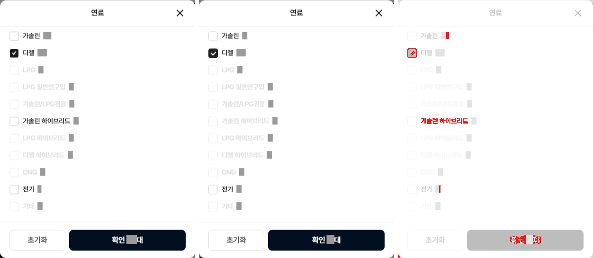
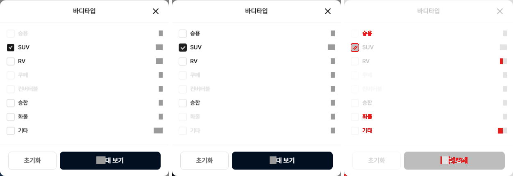
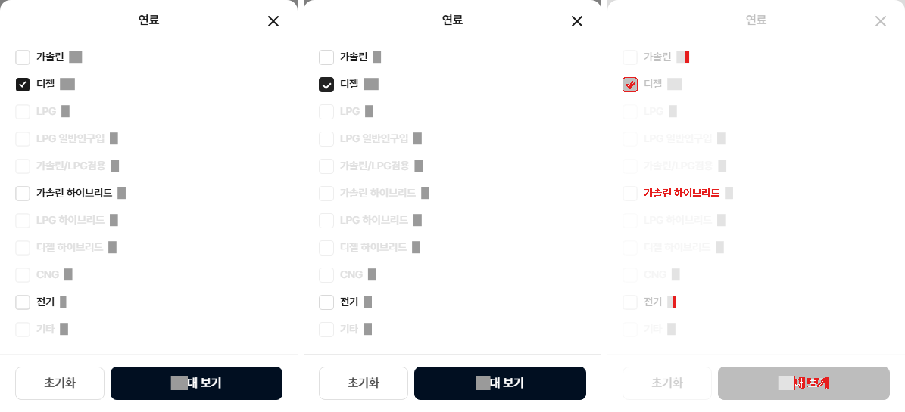

# PR #80 필터 동작을 개발 시안과 같게

## 1. 한 줄 요약
개발 시안 원본(dev.bbmuseum.co.kr/car/list)을 직접 조작해 확인한 대로 과쯔 PC·모바일 필터의 창·선택 표시·조건이 걸리는 시점·목록 거르기를 맞췄고, 크로스체크 지적(적용 칩 모달 버튼·시나리오·샘플·보고서 양식)을 고친 뒤 main에 병합·배포했습니다. 배포본 기준 시나리오 22단계·첫 화면 17영역 모두 차이 3% 이하, 동작 점검표 158개 모두 원본과 일치합니다.

## 2. 기본 정보
| 항목 | 내용 |
|---|---|
| 과제 ID | QF-085 · QF-086 · QF-089 · QF-090 · OP-013 · OP-011(배포 확인 표시) |
| 브랜치 | `feat/bbm-filter-behavior` (main `3600173`에서 시작) |
| 커밋 | `58c3441`(기능) · `81a7383`(보고서) · `3415a04`(크로스체크 수정 + OP-011) |
| PR | https://github.com/bobaekimboae/bobaedream/pull/80 |
| 상태 | 병합·배포 완료 — main `f09e9cc`(병합 커밋), 배포 v=`f09e9cc`, 번들 `index-BwI3TOll.js`, 배포 실행 https://github.com/bobaekimboae/bobaedream/actions/runs/36013839814 |
| 이번 병합으로 main에 들어간 과제 | QF-085 · QF-086 · QF-089 · QF-090 · OP-013 · OP-011 |
| 앞 병합(PR #79, main `3600173`)으로 함께 들어간 과제 | QF-076 · QF-091 · OP-012, 그리고 PR #78의 QF-067(PR #79가 PR #78 위에 쌓여 있어 함께 병합, PR #78은 병합됨으로 표시) |
| 크로스체크 문서 | https://app.notion.com/p/3e5ee9c4b6068199944afb0ff55c62c6 |

## 3. 한 일
- **QF-085** PC 상단 칩(제조사·모델·연식·가격·연료·판매자)과 적용 칩을 누르면 원본과 같은 412 모달이 열립니다. 모달 버튼은 원본처럼 항목 종류를 따릅니다(펼침형 바디타입·연식·가격 "N대 보기", 모달형 연료·인승·판매자 "확인 N대"). 사이드바 "초기화"는 확인 창을 거칩니다.
- **QF-086** 모바일 칩은 원본 바텀시트(가격: 탭·최저/최대·슬라이더·구간 10개·"N대 보기")로, 필터 전체 화면 각 항목은 그 항목의 시트로 열립니다. 전체 화면 안 모달형 항목 시트는 원본처럼 PC 모달과 같은 본문입니다.
- **QF-089** 적용 칩(진한 채움 + ×), 값이 걸린 칩은 줄에서 빠짐, [현대 ×][모델], "필터" 칩 개수, 사이드바 배지·파랑 제목, 최근검색기록. 모바일 칩 줄은 적용 칩이 늘면 맨 앞 적용 칩을 47px 위치에 맞춥니다(원본 3회 실측).
- **QF-090** 우리 데이터가 있는 항목은 실제로 목록을 거르고 매물 수를 다시 셉니다. 과쯔 샘플 64대(RV 카니발 2대·화물 포터2·봉고3 2대 추가, 새 이미지 없음).
- **OP-013** `npm run diff:bbm:flow`: PC 13단계·모바일 9단계. 적용 칩 눌러 모달 열기(디젤·SUV)·닫기, 적용 칩 × 해제, 모바일 필터 → 연료 → 디젤 → N대 보기 추가. 점검표에 "창 버튼 문구" 추가. `BBM_OURS=<주소>`로 배포본 대조.
- **OP-011** 주소에 `&debug=1`을 붙이면 오른쪽 아래에 "브랜치 @ 커밋 7자리 · 빌드 시각"이 보입니다. 값은 빌드 때 넣습니다(GitHub Actions에서는 병합 커밋).

## 4. 원본과 비교

### 시나리오 단계별 차이 비율(배포본 v=f09e9cc 기준)
숫자·매물 목록·사진·로고는 두 쪽 모두 가리고 비교했습니다. "첫 측정"은 해당 단계를 처음 돌렸을 때입니다.

| 단계 | 영역 | 첫 측정 | 최종 |
|---|---|---|---|
| PC ① 바디타입 → SUV 체크 | 칩 줄 / 머리 / 제목 / 툴바 | 5.5 / 9.7 / 1.1 / 2.6% | 0.3 / 0.2 / 0 / 2.6% |
| PC ② 연료 모달 → 디젤 → 확인 | 모달 / 칩 줄 / 머리 / 제목 | 0.7 / 5.9 / 9.6 / 64.8% | 0.7 / 0.3 / 0.1 / 0.6% |
| PC ③ 가격 칩 → 3천만원 → N대 보기 | 모달 / 칩 줄 / 머리 / 제목 | 2.8 / 7.9 / 9.6 / 7.5% | 2.8 / 0.3 / 0.1 / 1.4% |
| PC ③+ 적용 칩 "디젤" 눌러 모달 → 닫기 (새로 추가) | 모달 / 칩 줄 / 머리 | 0.8 / 0.3 / 0.1% | 0.7 / 0.3 / 0.1% |
| PC ③+ 적용 칩 "SUV" 눌러 모달 → 닫기 (새로 추가) | 모달 / 칩 줄 / 머리 | 11.5 / 0.3 / 0.1% | 0.8 / 0.3 / 0.1% |
| PC ④ 적용 칩 × 해제(SUV) | 칩 줄 / 머리 / 제목 | 6.8 / 9.6 / 63.5% | 0.3 / 0.1 / 2.4% |
| PC ⑤ 좌측 제조사 현대 | 칩 줄 / 머리 / 제목 | 6.4 / 9.6 / 1.4% | 0.3 / 0.1 / 2.1% |
| PC ⑥ 사이드바 초기화 | 확인 창 / 칩 줄 / 머리 / 툴바 | 없음 / 94.8 / 97.6 / 98.6% | 0.1 / 0.3 / 0 / 2.6% |
| 모바일 ① 가격 칩 → 3천만원 | 시트 | 14.9% | 2.9% |
| 모바일 ② N대 보기 | 칩 줄 / 툴바 | 14.4 / 2.4% | 2.3 / 2.4% |
| 모바일 ③ 필터 → 바디타입 → SUV | 시트 / 전체 화면 / 칩 줄 | 15.2 / 2.5 / 17% | 2.9 / 2.3 / 3% |
| 모바일 ③+ 필터 → 연료 → 디젤 → N대 보기 (새로 추가) | 시트 / 전체 화면 / 칩 줄 | 8.7 / 1.1 / 11.9% | 0.5 / 1.1 / 1.5% |
| 모바일 ④ 제조사 칩 | 시트 | 7.5% | 1.1% |

첫 화면 비교(`npm run diff:bbm`, 배포본, 17개 영역): 모두 3% 이하(0~2.6%). 작업 중 새 샘플이 최신순 맨 앞에 와서 모바일 첫 카드가 7%가 됐는데, 새 샘플을 목록 뒤로 보내 1.9%로 되돌렸습니다.

### 동작 점검표
158개 항목 모두 원본과 일치합니다(목록 수 변화 · 적용 칩 개수와 문구 · 칩 줄에서 빠진 칩 · 배지 · 파랑 제목 · 최근검색기록 · 창 버튼 문구). 이번에 추가한 "창 버튼 문구"가 잡은 것:

| 단계 | 원본 | 수정 전 | 최종 |
|---|---|---|---|
| PC 적용 칩 "디젤"(모달형) 눌러 모달 | 확인 N대 | N대 보기(크로스체크 지시대로 바꾼 상태) | 확인 N대 |
| PC 적용 칩 "SUV"(펼침형) 눌러 모달 | N대 보기 | N대 보기 | N대 보기 |
| PC 연료 모달 / 가격 칩 모달 | 확인 N대 / N대 보기 | 같음 | 같음 |
| 모바일 전체 필터 화면(시트 N대 보기 뒤) | N대 보기 | 같음 | 같음 |

### 원본 · 우리 나란히(원본 | 우리 | 차이)
PC ③+ 적용 칩 "디젤" → 연료 모달("확인 N대")

PC ③+ 적용 칩 "SUV" → 바디타입 모달("N대 보기")

모바일 ③+ 필터 → 연료 → 디젤

PC ② 연료 모달 → 디젤

PC ③ 가격 칩 → 3천만원

PC ⑤ 좌측 제조사 현대

모바일 ① 가격 칩 → 3천만원

모바일 ③ 필터 → 바디타입 → SUV

## 5. 검증
| 항목 | 결과 |
|---|---|
| `npm run verify:qf` | 통과(런타임 보호 파일 28개 그대로, TypeScript, Vite 빌드) · GitHub Actions 배포 실행에서도 통과 |
| 콘솔 오류 | 로컬 measure:qf 모바일 0 · PC 0, 배포본 PC·모바일 0 |
| measure:qf 퀵필터 규격 | 레일 96 · 위/아래 12/12 · 카드 80×72 · 모델 이미지칸 56×28(제조사 로고 48×28) · 트림 칩 높이 32 · 글자 14px — 그대로 |
| 필터 선택지 | 303개 = 체크 선택지 232 + 구간 칩 59 + 광고기간 9 + 크기 칸 3(전장·전폭·전고). 303개 모두 원본 수집본(docs/bbm-filter-spec.json)에 있음. 시트 마감 6개, 광고기간 "전체" 유지 |
| 배포 확인 3가지 | ① `git ls-remote` main = `f09e9cc`(병합 커밋) ② 배포본 `&debug=1` 표시 "main @ f09e9cc · 2026-09-24 23:35 KST"(PC·모바일) ③ 배포본 PC 바디타입 SUV 체크 64대 → 27대, PC 가격 칩 → 가격 모달("27대 보기") |
| 배포본 대조 | diff:bbm 17영역 · diff:bbm:flow 22단계 모두 3% 이하, 점검표 158/158 |
| 초톳·동처띠 | 바꾼 코드는 과쯔(개발 시안형) 전용 분기·클래스만 사용. 초톳·동처띠 화면 대조는 따로 돌리지 않음 |

## 6. 원본과 다르게 남긴 것과 이유
- **크로스체크 지시 1과 다르게, 원본을 따름**: 지시는 "적용 칩으로 연 모달은 N대 보기"였지만, 원본을 직접 조작해 보니 적용 칩 SUV·연식은 "N대 보기", 디젤·7인승은 "확인 N대"였습니다. 항목 종류(펼침형/모달형)를 따르는 규칙이라 원본대로 했습니다.
- **데이터가 없는 항목은 목록을 거르지 않습니다**(차급·매매단지·구동방식 등, CH-0029). 선택 표시만 하고 선택지 옆 숫자는 원본 숫자를 그대로 씁니다.
- **과쯔 샘플 64대**(CH-0030·CH-0035): 화물 2대는 실사 사진이 없어 트럭 유형 아이콘을 사진 자리에 씁니다. 새 샘플은 목록 맨 뒤에 둬서 첫 화면 카드는 바뀌지 않습니다.
- 차량 유형 줄 → 퀵필터 레일 전환(CH-0031), "제조사 · 모델" 안 QF-067 동작 유지(CH-0032), 적용 칩 순서 일부 추정(CH-0033), 제조사 칩 창 매물 수는 우리 데이터로 계산(CH-0034), 모바일 칩 줄 스크롤 기준 = 맨 앞 적용 칩(CH-0036).
- 원본 실측 동작: PC 사이드바 모달은 [확인 N대]에서 걸림 · 상단 칩 모달·모바일 칩 시트는 적용 칩·배지만 즉시, 목록은 창을 닫을 때 · 버튼 숫자는 누르기 전 목록 수 · 최근검색기록은 첫 조건에서 1 · PC 초기화는 확인 창.

## 7. 못 한 것 · 다음에 할 것
- 모바일 전체 필터 13~28번 항목 시트는 원본을 수집하지 못해 PC 모달 내용으로 만들었습니다.
- 데이터가 없는 항목의 실제 거르기, 최고출력·연비 등 제원 데이터는 데이터가 생기면 할 일입니다.
- 화물 샘플 실사 이미지(흰색·앞 3/4, 에셋 지침 기준)가 생기면 아이콘을 바꿉니다.
- 이 보고서 수정본과 `scripts/bbm-diff.mjs`의 배포본 대조 옵션(`BBM_OURS`)은 병합 뒤에 브랜치에만 커밋했습니다. 다음 PR 때 main에 들어갑니다.

## 8. 확인 링크
배포본(v=f09e9cc, category 없이)
- 모바일: https://bobaekimboae.github.io/bobaedream/?qf=guazi&v=f09e9cc
- PC: https://bobaekimboae.github.io/bobaedream/?qf=guazi&v=f09e9cc&pc=1
- 배포 확인 표시: https://bobaekimboae.github.io/bobaedream/?qf=guazi&pc=1&debug=1&v=f09e9cc
