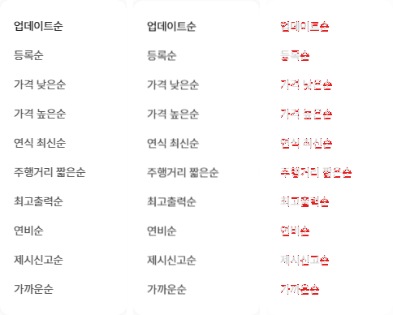
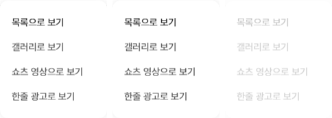
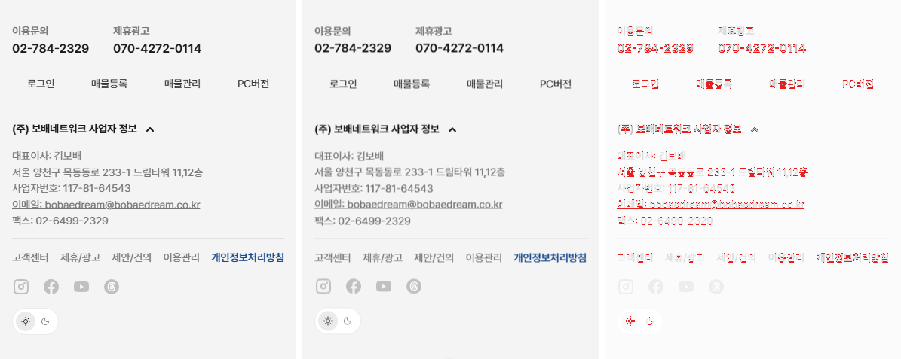
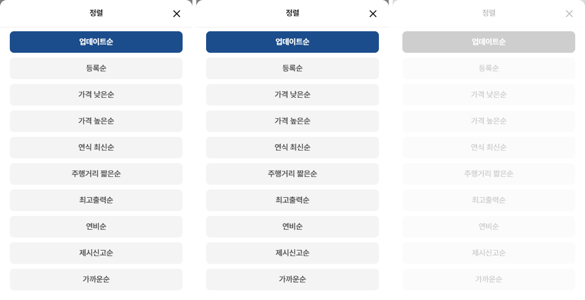
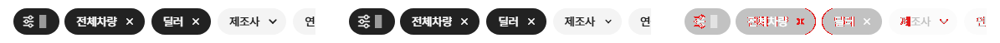

# PR #81 목록 영역을 개발 시안과 같게

## 1. 한 줄 요약
개발 시안 원본(dev.bbmuseum.co.kr/car/list)의 목록 영역을 과쯔 PC·모바일에 맞췄습니다(페이지 이동 · 푸터 · 정렬 · 보기 방식 · 모바일 칩 줄 고정). 새로 비교한 목록 영역 10곳과 시나리오 30단계가 모두 차이 3% 이하이고, 초톳·동처띠·초톳형 PC는 직전 배포본과 0% 차이입니다.

## 2. 기본 정보
| 항목 | 내용 |
|---|---|
| 과제 ID | QF-092 |
| 브랜치 | `feat/bbm-list-area` (main `f09e9cc`에서 시작) |
| 커밋 | `c325f82`(PR #80 보고서 최종본 d2f4378을 옮김) · `95d6bdb`(QF-092) · 보고서 커밋(이 파일) |
| PR | https://github.com/bobaekimboae/bobaedream/pull/81 |
| 상태 | 푸시 완료, PR 열림. 병합·배포는 하지 않았습니다(요청 시 진행) |
| 이번 병합으로 main에 함께 들어갈 것 | QF-092, 지난 후속 2건(PR #80 보고서 최종본, 회귀 점검 스크립트 `regress:modes`) |

## 3. 한 일
- **페이지 이동**: 원본처럼 한 페이지에 20대를 보여 줍니다. 번호는 PC 10개, 모바일 3개씩 묶어 보여 주고, 끝쪽에서는 묶음을 앞으로 당겨 채웁니다. 첫 페이지에서는 [첫·이전], 마지막 페이지에서는 [다음·마지막]을 숨깁니다. 필터·정렬·판매자 탭·검색을 바꾸면 1페이지로 돌아갑니다.
- **푸터**: 목록 끝에 원본 PC 푸터(사업자 정보·고객센터·링크·SNS·컬러 모드·앱 설치)와 모바일 푸터(연락처·바로가기·사업자 정보 접기·링크·SNS)를 붙였습니다. 링크는 "정식 서비스에서 이용" 안내만 띄웁니다.
- **정렬**: 원본 10개입니다. PC는 드롭다운이고, 예전에 PC에서 열리던 바텀시트는 뺐습니다. 모바일은 원본처럼 "정렬" 시트입니다. 등록·가격·연식·주행거리는 실제로 정렬하고, 나머지는 선택 표시만 합니다.
- **보기 방식**: PC는 드롭다운 4개, 모바일은 원본 "리스트 필터" 시트 6개입니다. "목록으로 보기"만 동작하고, 나머지는 "준비 중" 안내를 띄웁니다.
- **모바일 칩 줄**: 목록을 내려도 화면 위에 붙어 있습니다. 칩을 누르면 원본처럼 칩이 보이도록 줄이 밀리고, 줄이 밀려 있으면 "필터" 칩은 아이콘만 남고 구분선이 생깁니다.
- **샘플 사진**: 카니발 RV 2대는 기존 카니발 사진을 씁니다. 화물 2대는 사진 자리를 원본 카드처럼 빈 회색 칸(#EBEBEB)으로 두었습니다(새 이미지 없음).
- **원본 스타일 옮기기**: 원본 스타일시트에서 이 부품들의 규칙만 뽑아 변수를 실제 값으로 풀었습니다(`bbm-list-area.css`). 아이콘 12개는 원본 SVG를 그대로 파일로 저장했습니다.

## 4. 원본과 비교

### 새 영역 차이 비율(`npm run diff:bbm`)
"처음"은 영역을 만든 뒤 처음 잰 값입니다(작업 전에는 이 영역이 없어 잴 수 없었습니다).

| 영역 | 처음 | 최종 |
|---|---|---|
| PC 목록 끝(페이지 이동) | 0.2% | 0.2% |
| PC 푸터 | 0% | 0% |
| PC 정렬 드롭다운 열림 | 2.2% | 2.2% |
| PC 보기 방식 드롭다운 열림 | 0% | 0% |
| 모바일 목록 끝(페이지 이동) | 1% | 1% |
| 모바일 푸터 | 1.7% | 1.7% |
| 모바일 푸터 사업자 정보 펼침 | 5.2% | 2% |
| 모바일 정렬 시트 | 8.5% | 0% |
| 모바일 보기 방식 시트 | 12.3% | 0% |
| 모바일 스크롤 후 칩 줄 | 1.5% | 1.5% |

첫 화면 17개 영역은 모두 3% 이하를 유지합니다(0~2.6%, 모바일 카드 1.9%).

원본은 743쪽이라 PC 번호가 10개, 우리는 64대 4쪽입니다. 그래서 PC 페이지 이동 비교 때만 원본 번호를 5번부터 숨겨 개수를 맞췄습니다. 숫자·매물 글자·사진은 이전처럼 두 쪽 모두 가리고 비교했습니다.

### 시나리오(`npm run diff:bbm:flow`, 30단계)
| 새 단계 | 영역 | 최종 |
|---|---|---|
| PC ⑦ 정렬 드롭다운 열기 → 가격 낮은순 | 드롭다운 / 목록 툴바 / 칩 줄 | 2.2 / 2.6 / 0.3% |
| PC ⑧ 2페이지로 | 페이지 이동 / 툴바 | 0.3 / 2.6% |
| PC ⑨ 바디타입 SUV 체크 → 1페이지 | 페이지 이동 / 칩 줄 | 2.8 / 0.3% |
| 모바일 ⑤ 정렬 시트 → 가격 낮은순 | 시트 / 툴바 | 0 / 2.4% |
| 모바일 ⑥ 2페이지로 | 페이지 이동 / 칩 줄 | 1 / 1.5% |
| 모바일 ⑦ 필터 → 판매자 구분 → 딜러 → 1페이지 | 페이지 이동 / 칩 줄 | 0.7 / 2.4% |

기존 24단계도 모두 3% 이하입니다. 칩 줄 스크롤 규칙을 원본대로 다시 잡으면서 모바일 가격 적용 뒤 칩 줄은 2.3% → 1.9%로 바뀌었습니다.

작업 중 반복 대조 기록:
- 모바일 칩 줄(가격 적용 뒤): 6.1% → 2.1% → 1.9%
- 모바일 칩 줄(전체 필터 뒤): 6.5% → 3.2% → 3%
- 모바일 칩 줄(판매자 적용 뒤): 18.6% → 5.2% → 2.4%

### 동작 점검표
274개 항목이 모두 원본과 일치합니다. 이번에 "현재 페이지"와 "정렬 이름" 항목을 추가했습니다.

| 단계 | 현재 페이지(원본 = 우리) | 정렬 이름(원본 = 우리) |
|---|---|---|
| 정렬 열기 | 1 | 업데이트순 |
| 가격 낮은순 | 1 | 가격 낮은순 |
| 2페이지로 | 2 | 가격 낮은순 |
| 필터를 건 뒤(PC SUV · 모바일 딜러) | 1 | 가격 낮은순 |

스크롤 동작(원본 = 우리):
- PC: 600px·2,400px 내렸을 때 헤더·사이드바·칩 줄이 모두 함께 올라갑니다(고정 없음).
- 모바일: 헤더·지역 줄은 올라가고, 칩 줄은 top 0에 붙습니다.

### 원본 · 우리 나란히(원본 | 우리 | 차이)
PC 목록 끝 페이지 이동

PC 푸터

PC 정렬 드롭다운

PC 보기 방식 드롭다운

모바일 목록 끝 페이지 이동

모바일 푸터(사업자 정보 펼침)

모바일 정렬 시트

모바일 필터를 건 뒤 칩 줄(1페이지로 돌아온 상태)

## 5. 검증
| 항목 | 결과 |
|---|---|
| `npm run verify:qf` | 통과(런타임 보호 파일 28개 그대로, TypeScript, Vite 빌드) |
| 콘솔 오류 | measure:qf 모바일 0 · PC 0, diff:bbm 17개 상태(27개 영역) 모두 우리 쪽 0 |
| measure:qf 퀵필터 규격 | 레일 96 · 위/아래 12/12 · 카드 80×72 · 모델 이미지칸 56×28(제조사 로고 48×28) · 트림 칩 32(글자 14px) — 그대로 |
| 필터 선택지 | 303개(체크 232 + 구간 칩 59 + 광고기간 9 + 크기 칸 3) 그대로, 시트 마감 6개, 광고기간 "전체" 유지 |
| 회귀 점검(`npm run regress:modes`) | 직전 배포본(f09e9cc)과 비교해 10개 화면 모두 0%, 콘솔 오류 0: 초톳 모바일·동처띠 모바일·초톳형 PC(`pcl=chotot`)·초톳·동처띠 개발 시안형 PC, 각각 첫 화면·목록 끝 |

## 6. 원본과 다르게 남긴 것과 이유
- **스크롤 구조는 그대로 두었습니다**(CH-0039). 원본은 창 전체가 스크롤되지만, 우리는 보호 런타임의 안쪽 상자(.mobile-scroll)가 스크롤됩니다. 페이지 스크롤로 바꾸려면 보호 파일 `src/styles.css`의 `body { overflow: hidden }`과 `.mobile-page` 절대 위치, `src/mobile/MobileScroll`의 끌기·관성 처리를 덮어써야 해서 하지 않았습니다. 대신 칩 줄 고정과 페이지 이동 뒤 위치를 그 상자 기준으로 원본과 같게 맞췄습니다(스크롤 위치 실측 일치).
- **정렬 일부는 선택 표시만 합니다**(CH-0037). 최고출력순·연비순·제시신고순·가까운순은 우리 매물 데이터에 값이 없습니다.
- **보기 방식은 목록만 동작합니다**(CH-0038). 모바일은 지시문의 4개가 아니라 원본 모바일 시트의 6개(피드·텍스트로 보기 포함)를 그대로 넣었습니다.
- **모바일 칩 줄 규칙을 바꿨습니다**. 이전 "맨 앞 적용 칩을 47px에" 규칙은 이번 재실측에서 우연히 맞았던 값으로 드러나 뺐습니다. 원본은 칩을 누를 때 그 칩이 보이도록만 밉니다. 줄이 밀리면 "필터" 칩은 아이콘만 남고 구분선이 생깁니다. 적용 개수 글자는 원본 값(14px 500)으로 바로잡았습니다.
- **화물 샘플은 사진 없이 빈 회색 칸입니다**(CH-0041).

## 7. 못 한 것 · 다음에 할 것
- **남은 차이 1건**(CH-0040): 모바일에서 칩을 눌러 칩 줄이 끝까지 밀린 뒤 시트를 닫으면, 원본은 5px 덜 밀린 위치(190)로 한 번 움직이고 우리는 그대로(195)입니다. 원본 규칙을 찾지 못했습니다(스크롤 스냅·앵커링·최대값 모두 아님). 이 경로를 비교하면 칩 줄 차이가 5.2%라서, 시나리오는 칩 줄이 밀리지 않는 전체 필터 경로로 1페이지 복귀를 확인했습니다.
- 갤러리·쇼츠 영상·한줄 광고·피드·텍스트 보기는 다음 과제입니다.
- 원본 페이지를 바꾸면 주소에 `?page=2`가 붙지만, 우리는 주소를 바꾸지 않습니다.
- 병합·배포는 요청이 있을 때 합니다.

## 8. 확인 링크
로컬 미리보기(`feat/bbm-list-area` 빌드, vite preview 필요):
- 모바일: http://127.0.0.1:4173/bobaedream/?qf=guazi
- PC: http://127.0.0.1:4173/bobaedream/?qf=guazi&pc=1

배포본은 아직 이 PR 내용이 없습니다(v=f09e9cc):
- 모바일: https://bobaekimboae.github.io/bobaedream/?qf=guazi&v=f09e9cc
- PC: https://bobaekimboae.github.io/bobaedream/?qf=guazi&v=f09e9cc&pc=1
