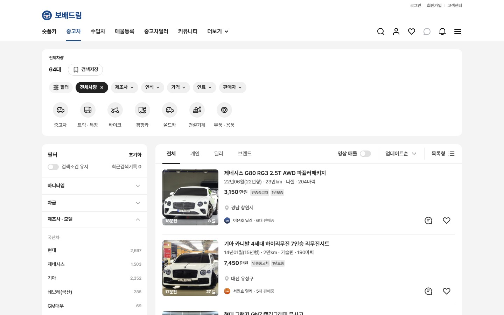
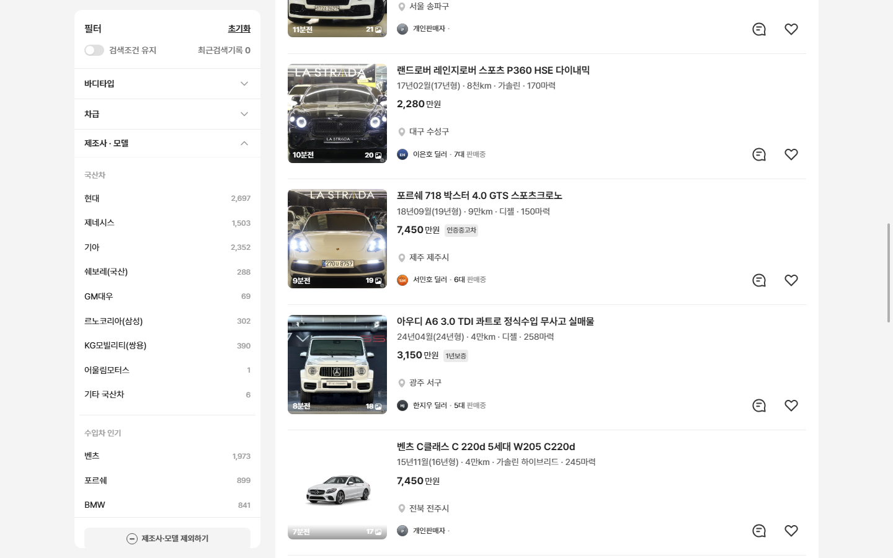
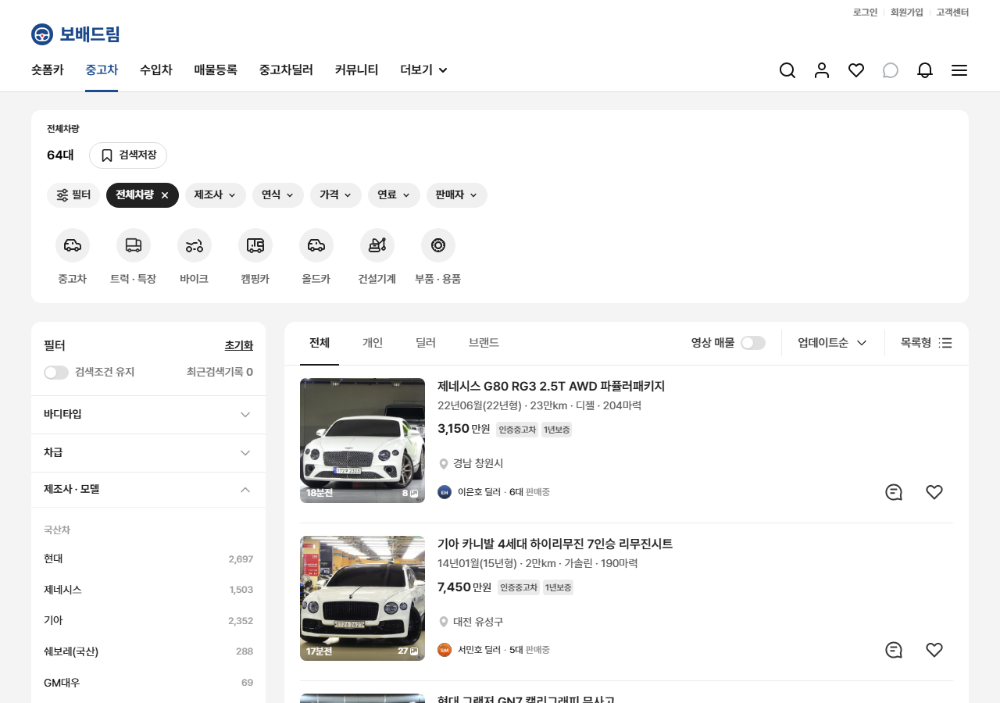
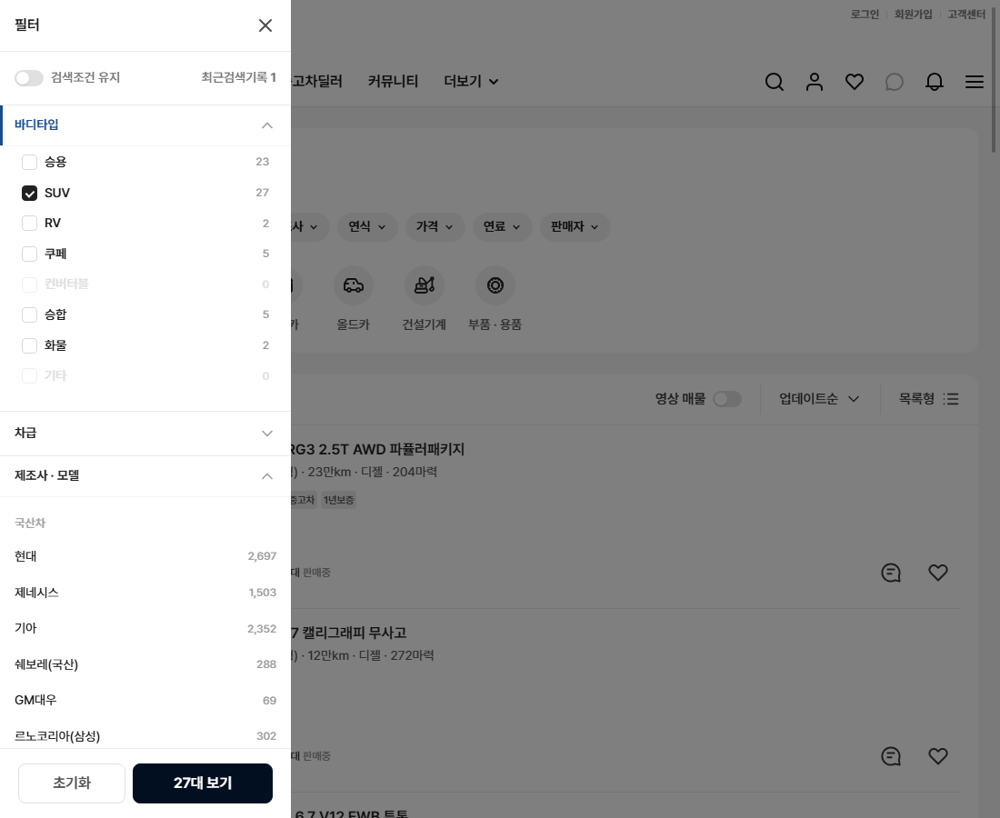

# PR #82 PC 혼합 배치 — 상단 전체 폭 칩·유형 줄 + 아래 좌측 필터·목록

> **개발팀·디자이너 합의가 필요한 배치 변경**입니다. 원본(dev.bbmuseum.co.kr/car/list)에 없는 배치이며, 원본과 다른 값은 change-log CH-0042~0051에 속성별로 기록했습니다.

## 1. 한 줄 요약
과쯔 PC에서 상단 패널(전체차량 · N대 · 검색저장 · 칩 줄 · 유형 줄/퀵필터 레일)을 목록 칸 밖으로 꺼내 본문 폭 1200 전체로 넓혔습니다. 그 아래는 좌측 필터(스크롤을 따라옴)와 목록 두 칸입니다. 1024~1279에서는 좌측 필터 대신 왼쪽 펼침판을 쓰고, 1024 가로 넘침은 없앴습니다.

## 2. 기본 정보
| 항목 | 내용 |
|---|---|
| 과제 ID | QF-093 (QF-051 1024 가로 넘침 · QF-059 좌측 필터 스크롤 고정 포함) |
| 브랜치 | `feat/pc-hybrid-layout` (main `a32b4b0`에서 시작) |
| 커밋 | `887f7f1`(QF-093) · 보고서 커밋(이 파일) |
| PR | https://github.com/bobaekimboae/bobaedream/pull/82 |
| 상태 | 푸시 완료, PR 열림. 병합·배포는 하지 않았습니다(요청 시 진행) |
| 이번 병합으로 main에 함께 들어갈 과제 | QF-093, QF-051, QF-059 |

## 3. 한 일
- **1280 이상**
  - 순서: 헤더 117 → 24 → 상단 영역(폭 1200) → 24 → 좌측 필터 300 + 24 + 목록 876
  - 상단 패널의 안쪽 여백·모서리·배경·줄 간격은 그대로 두고 폭만 넓혔습니다.
  - 좌측 필터 윗선과 목록 툴바 윗선을 맞췄습니다(차이 0).
- **좌측 필터가 스크롤을 따라옴(QF-059)**
  - 스크롤 상자(.mobile-scroll) 안에서 sticky(스크롤해도 붙어 있는 배치)로 구현했습니다.
  - 화면 위 16에 붙어 따라오고, 화면보다 길면 필터 안에서 스크롤됩니다.
  - 자기 칸 안에서만 움직여 푸터를 덮지 않습니다.
- **페이지 이동**: 페이지를 바꾸면 목록 툴바 윗선이 화면 위 16에 옵니다.
- **1024~1279**
  - 좌측 필터를 숨기고, 상단 영역과 목록이 화면 폭 − 양옆 24를 씁니다(최대 1200).
  - 이 폭에서만 상단 "필터" 칩을 누를 수 있고, 누르면 왼쪽 펼침판(폭 320, 딤)이 열립니다.
  - 펼침판 안은 좌측 필터와 같은 부품·같은 필터 상태입니다.
  - 아래 [초기화]는 원본과 같은 확인 창을 거치고, [N대 보기]는 펼침판을 닫습니다.
  - 바깥 누르기·닫기·Esc로 닫히고, 열린 동안 뒤 목록은 스크롤되지 않습니다.
- **1023 이하**: 모바일 화면이 나옵니다(과쯔 PC만 PC 화면 시작 폭을 820에서 1024로 올림).
- **헤더 좌우 여백(크로스체크 수정)**: 1024~1279에서 헤더 좌우 여백을 본문과 같은 24로 맞춰 로고와 상단 영역 왼쪽 선을 맞췄습니다(1280 이상은 그대로, CH-0052).
- **1024 가로 넘침(QF-051)**: 원본 푸터 두 구역이 폭 1168로 고정돼 있어 넘쳤습니다. 과쯔 PC에서만 본문 폭까지로 줄였습니다(1200 이상에서는 그대로 1168).
- **바꾸지 않은 것**
  - 화면: 모바일 과쯔·초톳·동처띠·초톳형 PC, 과쯔 PC의 목록 툴바 자리(목록 칸 안)
  - 모양: 카드·필터 안쪽·모달·푸터·칩, 퀵필터 레일 규격
  - 샘플 데이터·이미지

## 4. 원본과 비교

### 배치 수치(`npm run check:hybrid`, 20/20 통과)
| 항목 | 목표 | 결과 |
|---|---|---|
| 1440 상단 영역 | x 120 · 폭 1200 | x 120 · 폭 1200 (y 141, 높이 247) |
| 1280 상단 영역 | x 40 · 폭 1200 | x 40 · 폭 1200 |
| 1440 좌측 필터 / 목록 | 필터 x 120 · 300, 목록 x 444 · 876 | 같음 |
| 1280 좌측 필터 / 목록 | 필터 x 40 · 300, 목록 x 364 · 876 | 같음 |
| 좌측 필터 윗선 − 목록 툴바 윗선 | 0 | 0 (둘 다 y 412) |
| 상단 영역과 아래 두 칸 사이 | 예전 패널~툴바 간격 24 | 24 |
| 2,000px 스크롤 후 좌측 필터 | 화면 위 16 | 16 |
| 맨 끝까지 내렸을 때 | 필터가 푸터를 덮지 않음 | 필터 아래 455 < 푸터 위 517 |
| 2페이지 이동 후 | 목록 툴바 윗선 화면 위 16 | 16 (현재 페이지 2) |
| 1024 · 1100 · 1279 가로 넘침 | 0 | 0 · 0 · 0 (원본은 1024에서 160, 1100에서 84 넘침) |
| 1024~1279 | 좌측 필터 숨김, 목록 본문 폭 전체, 필터 칩 활성 | 1279 x40·1200 / 1100 x24·1052 / 1024 x24·976 |
| 1023 | 모바일 화면 | 모바일 화면 |
| 1100 펼침판 | 폭 320 · 딤 rgba(0,0,0,0.5) · 뒤 스크롤 막음 | 같음 |
| 1100 펼침판 SUV → N대 보기 | 닫힘 · 적용 칩 SUV · 목록 줄어듦 | "27대 보기" → 닫힘 · 적용 칩 SUV · 64대 → 27대 |
| 펼침판 닫기 | 바깥 누르기 · Esc | 둘 다 닫힘 |
| 펼침판 [초기화] | 원본 확인 창 | "필터 초기화 / 선택한 필터를 초기화하시겠습니까?" |
| 1280 이상 필터 칩 | 비활성(원본) | 비활성 |
| 로고 x = 상단 영역 x(크로스체크 수정) | 1024·1100·1279·1280·1440 | 24·24·40·40·120 모두 같음 |
| 퀵필터 레일에서 완전히 보이는 카드(1440, 제조사 레일) | 폭만 넓어짐 | 9개(폭 876, 배포본 a32b4b0) → 13개(폭 1200). 1280도 13개 |

### 원본 픽셀 대조
- **`npm run diff:bbm`**: 27개 영역이 모두 3% 이하입니다.
  - 상단 패널·유형 줄·좌측 필터는 위치·폭을 일부러 바꿨기 때문에, 두 쪽이 겹치는 왼쪽 위 부분만 비교합니다. 위치·폭은 위 배치 수치로 검증했습니다.
  - 그 결과 상단 패널 1.2%, 유형 줄 0%, 좌측 필터 1.4%(바디타입 펼침 2.7%)입니다.
  - 헤더 0% · 목록 툴바 2.6% · 카드 2% · 모달 2% · 페이지 이동 0.2% · 푸터 0%로 기준은 그대로이고, 모바일 과쯔 영역도 모두 3% 이하입니다.
- **`npm run diff:bbm:flow`**: 30단계가 모두 3% 이하이고, 동작 점검표 274/274 항목이 원본과 일치합니다.
  - PC 칩 줄은 폭이 넓어져 겹치는 부분만 비교했습니다(모두 0.3%).
  - 모달을 닫은 뒤에는 두 쪽 마우스를 왼쪽 위로 치웠습니다. 원본에서는 닫기 버튼 아래에 있던 칩에 hover(마우스를 올렸을 때의 색)가 남는데, 배치가 달라져 우리 쪽에만 없는 상태가 생기기 때문입니다. 이 조치로 해당 단계는 10.4% → 0.3%가 됐습니다.

### 캡처
1440 첫 화면

1440 목록 2,000px 스크롤 후(좌측 필터가 화면 위 16에 붙음)

1280 첫 화면

1100 "필터" 칩 → 왼쪽 펼침판(SUV 체크 상태)

## 5. 검증
| 항목 | 결과 |
|---|---|
| `npm run verify:qf` | 통과(런타임 보호 파일 28개 그대로, TypeScript, Vite 빌드) |
| 콘솔 오류 | check:hybrid 6개 폭 모두 0, measure:qf 모바일 0 · PC 0, diff:bbm 우리 쪽 0 |
| measure:qf 퀵필터 규격 | 레일 96 · 카드 80×72 · 모델 이미지칸 56×28(제조사 로고 48×28) · 트림 칩 32(14px) — 그대로, 가로 넘침 없음 |
| 필터 선택지 | 303개 · 시트 마감 6 · 광고기간 "전체" 유지 |
| 회귀 점검 `npm run regress:modes` | 직전 배포본 a32b4b0과 12개 화면 모두 0%: 초톳·동처띠 모바일, 초톳형 PC(`pcl=chotot`), 초톳·동처띠 개발 시안형 PC, **모바일 과쯔(이번에 추가)**, 각각 첫 화면·목록 끝 |

## 6. 원본과 다르게 남긴 것과 이유
이 절의 배치는 모두 원본에 없는 **개발팀·디자이너 합의가 필요한 배치 변경**입니다(CH-0042~0051).
- **상단 패널**: 폭 876 → 1200, 자리는 목록 칸 안 → 전체 폭(CH-0042·0043)
- **유형 줄 / 퀵필터 레일**: 폭 876 → 1200(CH-0044)
- **좌측 필터**: 시작 위치가 상단 패널과 같은 줄 → 목록 툴바와 같은 줄로 바뀌고(CH-0045), 원본에 없는 스크롤 따라옴을 넣었습니다(CH-0046)
- **페이지 이동 뒤 스크롤 위치**: 목록 칸 위 16 → 목록 툴바 위 16(CH-0047)
- **1024~1279**: 좌측 필터 숨김, 펼침판, 필터 칩 활성(CH-0048·0049)
- **1024 가로 넘침 해결**: 원본도 넘칩니다(CH-0050)
- **PC 화면 시작 폭**: 과쯔만 820 → 1024(CH-0051)
- **펼침판 머리**: 좌측 필터 머리의 "필터 · 초기화" 줄은 펼침판에서 숨기고, 펼침판 머리("필터" + 닫기)와 아래 [초기화]로 대신했습니다(같은 확인 창)
- **좌측 필터 스크롤바**: 필터 안에서 스크롤될 때 스크롤바를 숨겼습니다(원본은 목록형 가짜 스크롤바를 씀). 마우스 휠·터치패드로 스크롤됩니다

## 7. 못 한 것 · 다음에 할 것
- 좌측 필터 그룹핑은 다음 과제입니다(이번에는 내용·순서·동작을 바꾸지 않음).
- 원본 대조 스크립트는 1440 기준이라, 1280·1100 배치는 check:hybrid 수치로만 확인했습니다.
- 병합·배포는 요청이 있을 때 합니다.

## 8. 확인 링크
로컬 미리보기(`feat/pc-hybrid-layout` `887f7f1` 빌드, vite preview 필요). 1280 이상·1024~1279·1023 이하는 브라우저 창 폭을 바꿔서 확인합니다.
- PC: http://127.0.0.1:4173/bobaedream/?qf=guazi&pc=1
- 모바일: http://127.0.0.1:4173/bobaedream/?qf=guazi

배포본은 아직 이 PR 내용이 없습니다(v=a32b4b0):
- PC: https://bobaekimboae.github.io/bobaedream/?qf=guazi&v=a32b4b0&pc=1
- 모바일: https://bobaekimboae.github.io/bobaedream/?qf=guazi&v=a32b4b0
