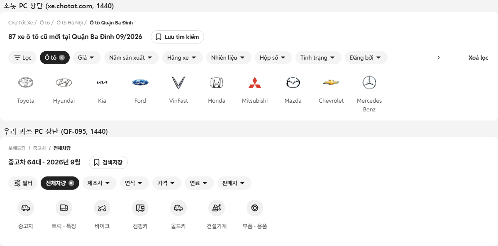
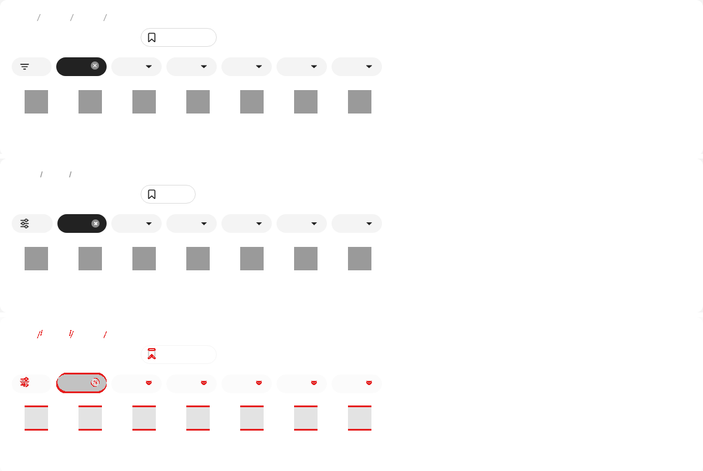
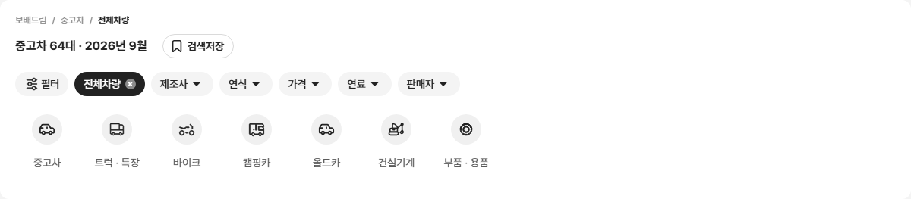
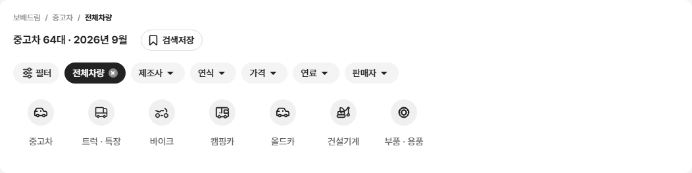
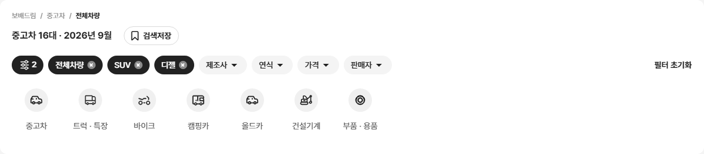

# PR #84 PC 상단 영역을 초톳 PC 상단과 같게

> **개발팀·디자이너 합의 필요**: 개발 시안(원본)과 다른 변경입니다. 과쯔 PC 상단 카드를 초톳 PC 상단 구조로 바꿨고, 원본과 다른 값은 change-log CH-0053~0060에 속성별로 기록했습니다.

## 1. 한 줄 요약
과쯔 PC 1024 이상의 상단 전체 폭 카드를 초톳 PC(xe.chotot.com) 상단과 같은 네 줄 구조로 바꿨습니다(경로 · 제목과 검색저장 · 칩 줄과 필터 초기화 · 유형 줄). 초톳과 줄별 비교에서 모두 차이 3% 이하이고, 수치·동작 점검 21/21을 통과했습니다.

## 2. 기본 정보
| 항목 | 내용 |
|---|---|
| 과제 ID | QF-095 |
| 브랜치 | `feat/pc-top-chotot` (main `ba64d38`에서 시작) |
| 커밋 | `f3aee28`(QF-095) · 보고서 커밋(이 파일) |
| PR | https://github.com/bobaekimboae/bobaedream/pull/84 |
| 상태 | 푸시 완료, PR 열림. 병합·배포는 하지 않았습니다(요청 시 진행) |
| 이번 병합으로 main에 함께 들어갈 과제 | QF-095 |
| 기준 | 초톳 PC https://xe.chotot.com/mua-ban-oto-quan-ba-dinh-ha-noi (1440, 2026-09-25 직접 다시 잼) |

## 3. 한 일
- **상단 카드 한 장**: 폭 1200(1024~1279는 화면 폭 − 48), 흰 배경, 모서리 12, 안쪽 여백 16/20, 헤더 아래 16, 높이 263. 아래 두 칸과 사이 24, 1280 이상·1024~1279 규칙은 QF-093 그대로입니다.
- **1줄 경로(새로 추가)**
  - 형식: "보배드림 / 중고차 / 전체차량(또는 유형) / 제조사 / 모델 / 세대"
  - 항목을 누르면 그 단계로 돌아가고, 더 깊은 선택은 풉니다. "보배드림"은 안내만 띄웁니다.
- **2줄 제목**
  - 형식: "[지역] [유형·제조사·모델] 중고차 N대 · 2026년 9월". 연월은 오늘 날짜로 자동입니다.
  - 제목 오른쪽 20에 검색저장 알약 버튼을 두었습니다.
- **3줄 칩 줄**
  - 초톳 칩 모양으로 바꿨습니다. 값이 걸린 칩은 × 14 회색 원입니다.
  - 줄 오른쪽 끝에 "필터 초기화"를 두었습니다. 좌측 필터와 같은 확인 창을 거치고, 걸린 조건이 없으면 숨깁니다.
  - 칩이 넘치면 오른쪽 화살표가 나옵니다. 칩 순서·동작·모달과 PC "필터" 칩 규칙은 그대로입니다.
- **4줄 유형 줄**
  - 초톳 브랜드 칸 규격입니다(84×102, 피치 92, 아이콘 40). 아이콘 그림은 원본 그대로 두고 크기만 바꿨습니다.
  - 유형을 고르면 같은 자리에 퀵필터 레일이 나옵니다(규격 그대로). 줄 높이를 110으로 고정해 카드 높이가 흔들리지 않습니다.
- **검증 도구 추가**: `npm run check:top`(수치·동작), `npm run diff:chotot-top`(초톳과 줄별 픽셀)
- **원본 대조 1곳 바로잡음**: 목록 툴바 "목록형" 버튼 상자 높이를 원본 24로 맞췄습니다(보기 방식 드롭다운 3.5% → 0%).

## 4. 원본(초톳)과 비교

### 초톳 실측이 지시 수치와 달랐던 곳(초톳 실측을 따름)
| 항목 | 지시 수치 | 초톳 실측(적용) |
|---|---|---|
| 1줄 경로 글자 | 14px 400 #222 | 12px/18px 400 #8C8C8C, 마지막 항목만 700 #222 (줄 높이 21은 같음) |
| 경로 구분 | › | / |
| 유형(브랜드) 이름 색 | #222 | #595959 |
| 칩 줄 위치 | 제목 줄 아래 약 18(칩 윗선) | 제목 줄 아래 8 + 칩 줄 위 여백 10 = 18 (같음) |
| 유형 줄 | 칩 줄 아래 | 칩 줄 바로 아래 + 위 여백 8, 칸 84×102 (같음) |
| 필터 칩 · 검색저장 아이콘 | 20 | 20 (검색저장 안쪽 여백은 왼쪽 8 · 오른쪽 12) |
| 적용 칩 × | 14 | 14, 회색 #8C8C8C 원 + 흰 ×, 글자와 사이 6 |

### 초톳과 나란히(`npm run diff:chotot-top`, 1440)
글자 내용·언어 차이는 두 쪽 모두 같은 방법으로 없앴습니다.
- 글자는 같은 폭의 투명 칸으로 바꿨습니다. 아이콘과 "/"는 그대로 보입니다.
- 칩과 유형 칸 개수는 우리 개수(칩 6 · 칸 7)에 맞췄습니다.
- 유형 아이콘·로고 그림은 가렸습니다.

| 줄 | 차이 |
|---|---|
| 1줄 경로 | 0.2% |
| 2줄 제목 · 검색저장 | 0.2% |
| 3줄 칩 줄 | 1.5% |
| 4줄 유형 줄 | 1.2% |
| 카드 전체 | 0.9% |

글자를 없애고 비교한 모습(초톳 | 우리 | 차이)

### 수치표(`npm run check:top`, 21/21 통과)
| 항목 | 결과 |
|---|---|
| 카드 1440 | x 120 · y 133(헤더 117 + 16) · 1200×263 · 모서리 12 · 안쪽 16px 20px · 흰 배경 |
| 줄 y(카드 기준) | 경로 16 · 제목 줄 45(제목 글자 49) · 칩 줄 85(칩 95) · 유형 줄 137(칸 145) — 초톳과 같음 |
| 경로 | 12/18 400 #8C8C8C, 마지막 700 #222, "보배드림/중고차/전체차량" |
| 제목 | 16/24 700 #222, "중고차 64대 · 2026년 9월" |
| 검색저장 | 제목 오른쪽 20 · 높이 32 · 알약 9999 · 흰 배경 · 테두리 1px #DADADA · 14/20 700 |
| 칩 | 높이 32 · 알약 · #F4F4F4 · 14/20 500 #222 · 안쪽 4/12 · 칩 사이 8 · 펼침 삼각형 20 |
| 필터 칩 | 같은 모양 + 필터 아이콘 20 |
| 적용 칩 | #222 · 흰 글자 · × 14 회색 원(#8C8C8C) |
| 필터 초기화 | 줄 오른쪽 끝(카드 오른쪽 안쪽 20) · 14/20 700 #222 · 배경 없음 · 걸린 조건이 없으면 숨김 |
| 유형 칸 | 84×102 · 피치 92 · 아이콘 40(칸 위 6) · 이름 14/21 400 #595959 |
| 1280 | x 40 · 1200×263 · 줄 위치 같음 |
| 1100 | x 24 · 1052×263 · 줄 위치 같음 |

### 동작
| 동작 | 결과 |
|---|---|
| 칩(연식) 누르기 | 모달 열림(그대로) |
| 좌측 SUV + 연료 디젤 → 적용 칩 2개 | 적용 칩 전체차량·SUV·디젤, 필터 초기화 보임 |
| 필터 초기화 | 좌측 필터와 같은 "필터 초기화" 확인 창 → 초기화, 64대로 돌아옴, 버튼 숨김 |
| 유형 "중고차" | 퀵필터 레일(제조사 17개)로 바뀜, 카드 높이 263 그대로 |
| 좌측 제조사 현대 | 경로 "보배드림/중고차/전체차량/현대", 제목 "현대 중고차 8대 · 2026년 9월" |
| 경로 "전체차량" 누르기 | 현대 해제, 제목 "중고차 64대 · 2026년 9월" |
| 칩이 넘칠 때(1024, 적용 칩 여러 개) | 오른쪽 화살표 나옴, 누르면 칩 줄이 옆으로 이동 |

### 원본 대신 이번 수치로 비교하는 영역
- **diff:bbm**: PC "상단 패널"·"유형 줄"은 원본 비교에서 빼고, 초톳 비교(`diff:chotot-top`)와 수치표(`check:top`)로 확인했습니다. 나머지 25개 영역은 원본과 3% 이하입니다(헤더 0% · 좌측 필터 0% · 목록 툴바 0.9% · 카드 1.8% · 모달 1.9% · 페이지 이동 0.1% · 푸터 0.4% · 정렬 0% · 보기 방식 0% · 모바일 전부).
- **diff:bbm:flow**: PC "칩 줄" 픽셀은 초톳 기준으로 바꿨습니다(표시 "초톳 기준"). 나머지 영역은 30단계 모두 3% 이하이고, **동작 점검표 274/274 항목은 원본과 그대로 비교해 모두 일치**합니다.

### 캡처
1280

1100

적용 칩 2개(SUV·디젤)를 건 상태, 필터 초기화 보임

## 5. 검증
| 항목 | 결과 |
|---|---|
| `npm run verify:qf` | 통과(런타임 보호 파일 28개 그대로, TypeScript, Vite 빌드) |
| 콘솔 오류 | check:top 1440·1280·1100 모두 0, measure:qf 모바일 0 · PC 0 |
| measure:qf 퀵필터 규격 | 레일 96 · 카드 80×72 · 모델 이미지칸 56×28(제조사 로고 48×28) · 트림 칩 32(14px) — 그대로, 가로 넘침 없음 |
| 필터 선택지 | 303개 · 시트 마감 6 · 광고기간 "전체" 유지 |
| check:hybrid | 20/20 (배치 · 로고 x · 스크롤 따라옴 · 펼침판 그대로) |
| regress:modes | 직전 배포본 ba64d38과 12개 화면 모두 0%(초톳·동처띠·초톳형 PC·모바일 과쯔) |

## 6. 원본과 다르게 남긴 것과 이유
이 절의 변경은 모두 개발팀·디자이너 합의가 필요합니다(CH-0053~0060).
- **카드·줄 구조**: 초톳 PC 상단 구조로 바꿨습니다. 원본은 흰 머리 + 유형 줄 두 부분이었습니다.
- **경로·제목**: 원본에는 없던 1줄 경로를 새로 넣었고, 제목 문구를 "… 중고차 N대 · 연월"로 바꿨습니다.
- **칩**: 초톳 모양으로 바꿨습니다(굵기 500, 안쪽 4/12, 채운 삼각형, 적용 칩 × 회색 원). 필터 초기화 버튼과 넘침 화살표를 새로 넣었습니다.
- **유형 줄**: 칸을 84×102로, 아이콘을 40으로 키웠습니다. 원형 배경은 원본 아이콘의 일부라 그대로 두었습니다(원 40 안 그림 22).
- **지시 수치와 다른 곳**: 경로 글자(12px 회색, "/")와 유형 이름 색(#595959)은 초톳 실측을 따랐습니다.
- **"전체차량" 적용 칩**: 걸린 조건으로 세지 않아, 이것만 있을 때는 필터 초기화를 숨깁니다(원본 규칙: 칩 개수 표시에서도 제외).

## 7. 못 한 것 · 다음에 할 것
- **초톳의 칩 넘침 화살표**: 초톳은 칩 줄 스크롤 영역 오른쪽에 90을 비웁니다. 우리도 같게 두어, 칩이 적을 때 화살표 자리가 빈칸으로 남습니다.
- **초톳 유형 칸 높이 102**: 두 줄 이름("Mercedes Benz") 때문에 생긴 높이입니다. 우리 이름은 한 줄이라 칸 아래가 비어 보입니다(지시대로 102 고정).
- **초톳 비교 조건**: 초톳 페이지는 외부 사이트라 날짜·매물 수·배너에 따라 바뀔 수 있습니다. 비교는 2026-09-25 모습 기준입니다.
- **병합·배포**: 요청이 있을 때 합니다.

## 8. 확인 링크
로컬 미리보기(`feat/pc-top-chotot` `f3aee28` 빌드, vite preview 필요). 창 폭 1280 이상 · 1024~1279에서 확인합니다.
- PC: http://127.0.0.1:4173/bobaedream/?qf=guazi&pc=1
- 모바일(변경 없음): http://127.0.0.1:4173/bobaedream/?qf=guazi

배포본은 아직 이 PR 내용이 없습니다(v=ba64d38):
- PC: https://bobaekimboae.github.io/bobaedream/?qf=guazi&v=ba64d38&pc=1
- 모바일: https://bobaekimboae.github.io/bobaedream/?qf=guazi&v=ba64d38
