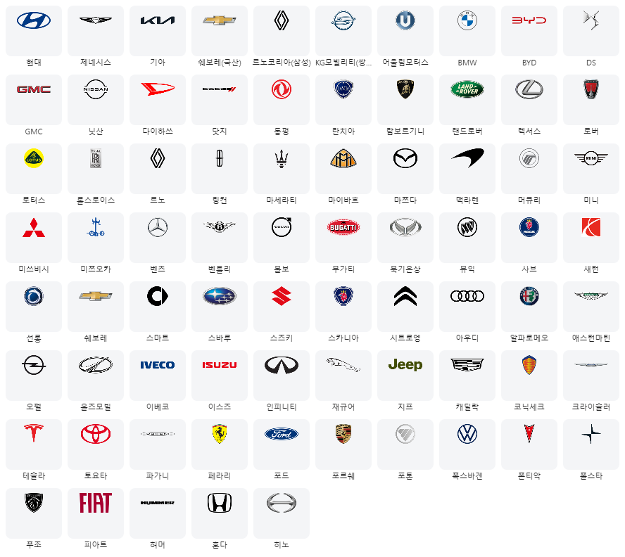
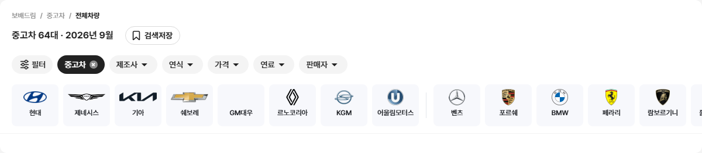
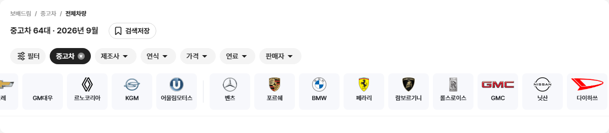
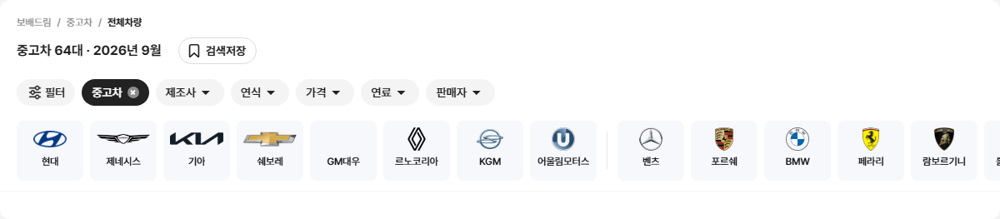
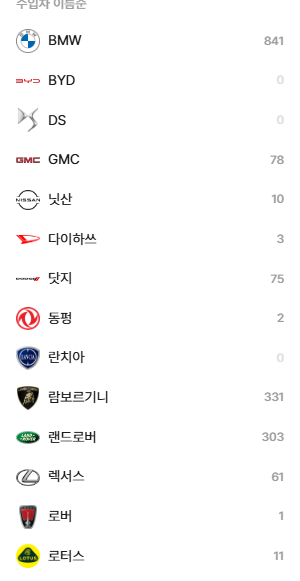
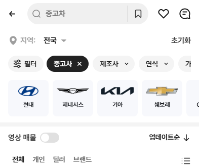

# PR #85 과쯔 모드 퀵필터·좌측 필터에 승용 제조사 로고 적용

## 1. 한 줄 요약
과쯔 모드 PC·모바일에 제조사 로고를 넣었습니다. 퀵필터 제조사 줄, 좌측 필터 제조사 목록, 제조사 칩 모달·시트가 대상이고, 로고 파일 73개를 새로 준비했습니다. 로고 점검 16/16과 기존 점검을 모두 통과했고, 다른 모드는 0% 변화입니다.

## 2. 기본 정보
| 항목 | 내용 |
|---|---|
| 과제 ID | QF-096 |
| 브랜치 | `feat/qf-096-brand-logos` (main `d956f61`에서 시작) |
| 커밋 | `1e813f0`(QF-096) · 보고서 커밋(이 파일) |
| PR | https://github.com/bobaekimboae/bobaedream/pull/85 |
| 상태 | 푸시 완료, PR 열림. 병합·배포는 하지 않았습니다(요청 시 진행) |
| 이번 병합으로 main에 함께 들어갈 과제 | QF-096 |

## 3. 한 일
- **보완(크로스체크 후)**
  - 퀵필터 제조사 카드에만 짧은 이름을 씁니다(쉐보레 · 르노코리아 · KGM, 그 밖에 괄호 앞까지, 80 칸에서 잘리는 이름 없음).
  - 전체 필터 "제조사 · 모델" 차종 시트에도 과쯔 모드만 로고 24×24를 넣었습니다(공용 부품이라 과쯔 조건으로만 켬, 로고 15 · 빈칸 2).
  - check:logos 20/20(CH-0066·0067).
- **로고 파일 준비(1단계)**: 지시 표 75개 이름의 원본을 받아 고유 slug 73개 PNG를 `public/assets/brand/kr/`에 만들었습니다.
  - 처리: 알파 16 이하 여백 자르기 → 비율 유지로 192×112 안(원본보다 키우지 않음)
  - chevrolet·renault는 파일 하나를 두 이름이 같이 씁니다.
  - 함께 만든 파일: manifest.json(이름 → slug·출처·URL·원본/잘라낸/최종 크기·비율), CREDITS.md, 검수용 한 장
  - kgm·renault는 임시 파일로 표시했습니다(`"replaceWithOfficial": true`).
  - 다시 만들기: `node scripts/brand-logos-kr.mjs`. 새 패키지 없이 Playwright 크로미움 캔버스로 처리합니다.
- **이름 맞추기(2단계)**: 기준은 좌측 필터 표기입니다. 퀵필터·매물 데이터의 제조사 값은 좌측 필터 key(예: 르노코리아 → 르노코리아(삼성))와 지시문의 대응표로 찾습니다.
- **퀵필터 제조사 줄(3단계, PC·모바일)**
  - 순서: 좌측 필터와 같게(국산 → 구분선 → 수입차 인기 → 수입차 이름순 나머지)
  - 0대·기타 국산차·기타 수입차는 뺐고, 로고 크기는 비율 규칙을 따릅니다.
  - 칩 줄에서 카드 줄까지 PC 18·모바일 16, 첫 카드 왼쪽 선은 첫 칩 왼쪽 선과 같습니다.
- **좌측 필터(PC)·펼침판 · 제조사 칩 모달 · 모바일 제조사 시트(4단계)**: 이름 앞에 로고 24×24를 넣었습니다(사이 8, 로고 없으면 빈 칸). 좌측 필터 행 높이 39.6은 원본 그대로입니다.
- **접근성(5단계)**: 로고 이미지는 alt=""이고, 버튼 이름은 브랜드명 그대로입니다.
- **점검 스크립트**: `npm run check:logos`를 추가했습니다.

## 4. 원본과 비교

### 로고 파일(1단계)
| 항목 | 결과 |
|---|---|
| 지시 표 이름 | 75개(고유 slug 73) |
| 로고 파일 | 73개 |
| 받기 실패 · 빈 파일 · 투명 아님 | 0 · 0 · 0 (`reports/qf-096/logo-problems.json` 빈 목록) |
| 출처 | 당근 65개 이름 · 오토홈 10개 이름(renault 2개 이름 포함, Referer 필요) |
| 로고 없음(파일 없음, 빈칸) | GM대우, 기타 국산차, 모건, 비이스만, 스파이커, 알핀, 어큐라, 오스틴, 웨스트필드, 이네오스, 피스커, 홀덴, 기타 수입차 |

검수용 한 장(#F4F5F7 80×72 칸 안 48×28 자리, 표 순서)

### 이름 대응을 찾지 못한 값(2단계, 추측으로 연결하지 않음 → 로고 없음)
퀵필터 데이터·매물 데이터의 제조사 값 45개 가운데 7개가 좌측 필터 이름과 대응되지 않습니다.
- **값**: 리막, 루시드, 애큐라, 야마하, 피아지오, 타타대우, 만트럭
- **영향**: 모두 바이크·트럭 등 다른 유형 레일이나 좌측 필터에 없는 제조사입니다. 과쯔 승용 제조사 줄에는 나오지 않습니다.
- **애큐라**: 좌측 필터에는 "어큐라"로 있지만 지시 대응표에 없어 연결하지 않았습니다. 어큐라도 로고 없음 목록에 있습니다.

### 로고 점검(`npm run check:logos`, 16/16)
| 위치 | 로고 / 빈칸 | 크기 규칙 · 가운데 |
|---|---|---|
| PC 1440 퀵필터 제조사 줄 | 59 / 4 | 모두 맞음 |
| PC 1280 퀵필터 제조사 줄 | 59 / 4 | 모두 맞음 |
| 모바일 393 퀵필터 제조사 줄 | 59 / 4 | 모두 맞음 |
| PC 1440 좌측 필터 제조사 목록 | 81 / 13 | 모두 맞음 |
| PC 1440 제조사 칩 모달 | 81 / 13 | 모두 맞음 |
| 모바일 393 제조사 시트 | 81 / 13 | 모두 맞음 |

- 퀵필터 순서: "현대 제네시스 기아 쉐보레(국산) GM대우 르노코리아(삼성) KG모빌리티(쌍용) 어울림모터스 | 벤츠 포르쉐 BMW 페라리 람보르기니 롤스로이스 GMC 닛산 …", 카드 63개(0대·기타 제외)
- 구분선: 폭 1 · 높이 44 · #E4E7EC · 좌우 4
- 간격: PC 칩 줄 → 카드 줄 18 · 카드 사이 8 · 첫 카드 x 140 = 첫 칩 x 140 · 카드 80×72 / 모바일 16 · 첫 카드 x 16 = 첫 칩 x 16
- 좌측 필터: 행 높이 39.6(원본 그대로) · 로고와 이름 사이 8
- 로고 404 0 · 콘솔 오류 0(PC 1440·1280·모바일) · 로고 alt="" · 행 이름 = 브랜드명
- 로고 크기 규칙
  - 비율 1.25 이하: 높이 28(폭 최대 44)
  - 1.25~2.5: 폭 min(44, 28√비율)
  - 2.5 초과(글자 로고): 폭 64(로고 칸 48 밖으로 퍼지되 카드 80 안)
  - 목록: 24×24 안에 비율 유지

### 원본 대조(로고 추가 영역 외)
- `diff:bbm` 25개 영역 3% 이하(PC 좌측 필터 2.5%: 로고 칸 포함)
- `diff:bbm:flow` 30단계 3% 이하, 동작 점검표 274/274 원본과 일치(모바일 제조사 시트 1.1%)

### 캡처(`reports/qf-096/`)
PC 1440 퀵필터 제조사 줄(국산)

PC 1440 퀵필터 제조사 줄(국산 · 구분선 · 수입)

PC 1280 퀵필터 제조사 줄

PC 좌측 필터 국산 · 수입 목록
 

모바일 393 퀵필터 제조사 줄 · 제조사 시트
 

## 5. 검증
| 항목 | 결과 |
|---|---|
| `npm run verify:qf` | 통과(런타임 보호 파일 28개 그대로, TypeScript, Vite 빌드) |
| 콘솔 오류 · 로고 404 | check:logos PC·모바일 0 · 0, measure:qf 모바일 0 · PC 0 |
| measure:qf 퀵필터 규격 | 레일 96 · 위/아래 12/12 · 카드 80×72 · 제조사 로고 칸 48×28 · 모델 이미지칸 56×28 — 그대로, 가로 넘침 없음 |
| 필터 선택지 | 303개 유지 |
| check:top · check:hybrid | 21/21 · 20/20 |
| regress:modes | 직전 배포본 d956f61과 12개 화면 0%(초톳·동처띠·초톳형 PC·모바일 과쯔 첫 화면·목록 끝) |

## 6. 원본과 다르게 남긴 것과 이유
change-log CH-0061~0065에 기록했습니다.
- **좌측 필터 제조사 목록**: 원본에 없던 로고 24×24를 넣었습니다.
- **퀵필터 제조사 줄**
  - 구분선을 넣고, 0대·기타를 뺐습니다. 매물 수는 좌측 필터에 보이는 숫자를 기준으로 했습니다.
  - 왼쪽 "제조사" 라벨을 없애고 첫 카드를 첫 칩과 맞췄습니다.
  - 칩 줄 아래 간격을 초톳 기준(PC 18·모바일 16)으로 바꿨습니다.
- **로고 크기 규칙**: 글자 로고는 폭 64로, 로고 칸 48을 넘어 카드 80 안까지 씁니다.
- **카드 배경**: 지시문의 #F4F5F7이 아니라 지금 과쯔 카드 값 #F7F8FC(퀵필터 규격)를 그대로 두었습니다. 지시문이 "과쯔 카드 칩 그대로"라고 해서 그대로 두는 쪽을 따랐습니다. 검수용 한 장은 지시대로 #F4F5F7로 그렸습니다.
- **모바일 "필터 서랍"**: 제조사 칩 시트(src/prototype/listing의 BbmMakerList)에 적용했습니다. 전체 필터 화면의 "제조사 · 모델" 항목이 여는 차종 시트는 다른 모드와 함께 쓰는 퀵필터 부품(src/prototype/quick-filter)이라 바꾸지 않았습니다.

## 7. 못 한 것 · 다음에 할 것
- kgm.png, renault.png는 임시입니다. 공식 파일이 오면 같은 이름으로 바꾸고 `node scripts/brand-logos-kr.mjs`를 다시 돌리면 비율 표가 갱신됩니다.
- 이름 대응을 찾지 못한 7개(위 표)는 대응표를 받으면 `bbm-brand-logos.tsx`의 krBrandAliases에 추가합니다.
- 병합·배포는 요청이 있을 때 합니다.

## 8. 확인 링크
로컬 미리보기(`feat/qf-096-brand-logos` `1e813f0` 빌드, vite preview 필요). 유형 줄에서 "중고차"를 누르면 제조사 줄이 나옵니다.
- PC: http://127.0.0.1:4173/bobaedream/?qf=guazi&pc=1
- 모바일: http://127.0.0.1:4173/bobaedream/?qf=guazi

배포본은 아직 이 PR 내용이 없습니다(v=d956f61):
- PC: https://bobaekimboae.github.io/bobaedream/?qf=guazi&v=d956f61&pc=1
- 모바일: https://bobaekimboae.github.io/bobaedream/?qf=guazi&v=d956f61
