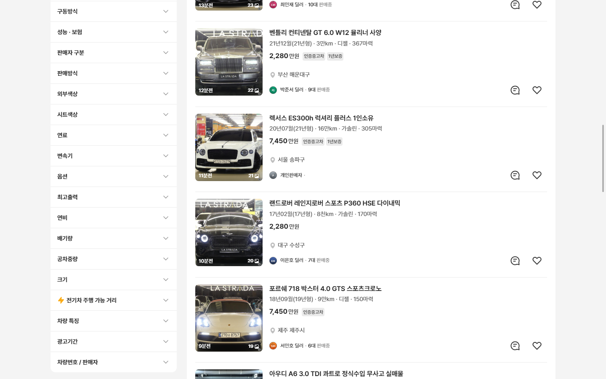
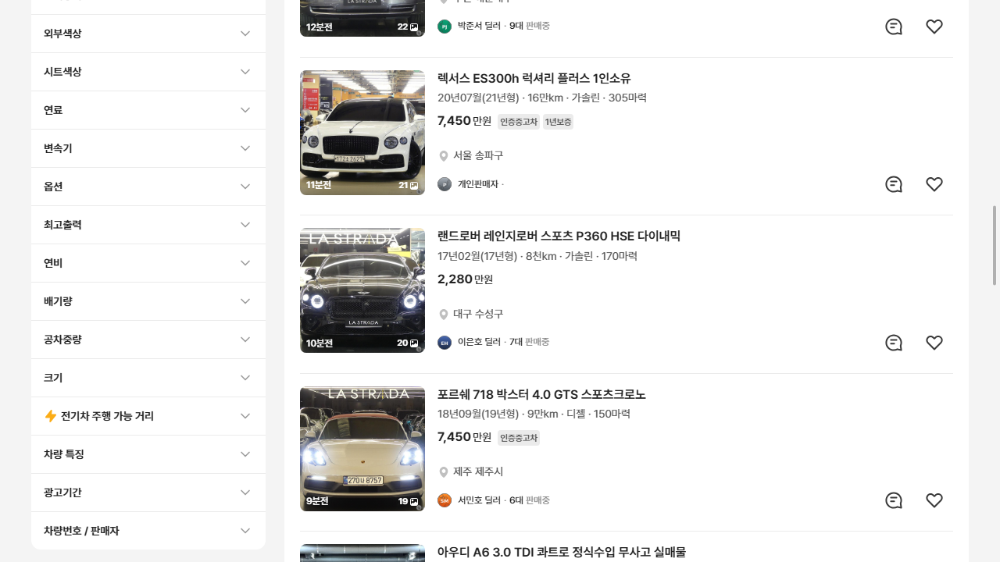
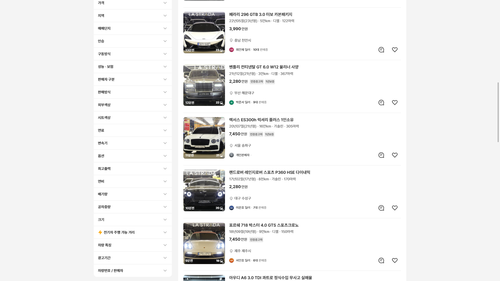
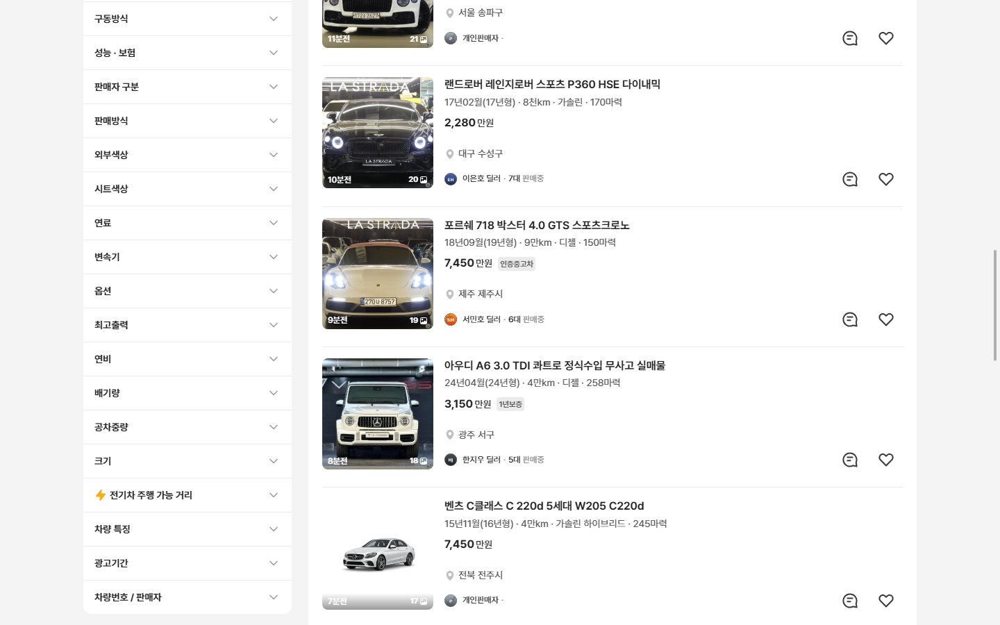

# PR #86 과쯔 PC 좌측 필터 — 칸 안 스크롤 없애고 페이지 스크롤로 전체 항목 보이게

> 개발팀·디자이너 합의가 필요한 배치 변경(원본 개발 시안의 좌측 필터는 고정 없이 페이지와 함께 올라감) — change-log CH-0068

## 1. 한 줄 요약
과쯔 PC 좌측 필터의 칸 안 스크롤을 없애고 "아래 붙는 사이드바"로 바꿨습니다. 이제 27개 항목 전체가 페이지 스크롤로 보입니다. 1440×900 · 1280×720 · 1920×1080에서 점검 31/31을 통과했습니다.

## 2. 기본 정보
| 항목 | 내용 |
|---|---|
| 과제 ID | QF-093 보완 |
| 브랜치 | `feat/qf-093-sidebar-scroll` (로고 작업 PR #85가 먼저 병합된 main `d4f9d0e`에서 시작) |
| 커밋 | `f12ae68` · 보고서 커밋(이 파일) |
| PR | https://github.com/bobaekimboae/bobaedream/pull/86 |
| 상태 | 푸시 완료, PR 열림. 병합·배포는 하지 않았습니다(지시대로) |

## 3. 한 일
- **바꾼 것**: 좌측 필터(과쯔 PC 1280 이상)의 높이 고정(화면 − 32)과 칸 안 스크롤(overflow-y:auto)을 없앴습니다. 필터는 전체 길이(모든 항목을 펼친 처음 상태 2063)로 그립니다.
- **아래 붙는 사이드바**: sticky top = min(16, 화면 높이 − 필터 높이 − 16)
  - 필터가 화면보다 길면: 페이지를 내릴 때 함께 올라가다가 맨 아래가 화면 아래 16에 닿으면 붙습니다. 다시 올리면 함께 내려와 맨 위가 원래 자리(상단 영역 아래 24)로 돌아옵니다.
  - 필터가 화면보다 짧으면: 위 16에 붙습니다.
- **다시 맞추기**: 항목을 펼치거나 접어 길이가 바뀌면 ResizeObserver가 top을 바로 다시 계산합니다(`src/prototype/listing/bbm-sticky-sidebar.ts`). 창 크기가 바뀔 때도 다시 계산합니다.
- **바꾸지 않은 것**
  - 27개 항목, "제조사·모델 제외하기" 버튼 위치·모양
  - 1024~1279 펼침판
  - 모바일·초톳·동처띠, 보호 파일
- **점검**: `npm run check:sidebar`를 추가했습니다. `check:hybrid`의 "2,000px 스크롤 후 좌측 필터 화면 위 16" 항목은 새 규칙(길면 아래 16 · 짧으면 위 16)으로 바꿨습니다.

## 4. 원본과 비교 · 점검 결과(`npm run check:sidebar`, 31/31)
| 항목 | 1440×900 | 1280×720 | 1920×1080 |
|---|---|---|---|
| 칸 안 스크롤(scrollHeight > clientHeight) | 없음(overflow-y clip) | 없음 | 없음 |
| 처음 필터 맨 위 − 상단 영역 아래 | 24 | 24 | 24 |
| 필터 높이 / 화면 | 2063 / 900 | 2063 / 720 | 2063 / 1080 |
| 내리면 마지막 항목 "차량번호 / 판매자" 보임 | 보임(필터 아래 884) | 보임(704) | 보임(1064) |
| 더 내려도 필터 아래 = 화면 아래 16 | 884 = 900 − 16 | 704 = 720 − 16 | 1064 = 1080 − 16 |
| 맨 끝에서 푸터를 덮지 않음 | 필터 아래 455 < 푸터 517 | 275 < 337 | 635 < 697 |
| 다시 올리면 필터 맨 위 원래 자리 | 420 → 420 | 420 → 420 | 420 → 420 |
| 제조사·모델 접음(필터 1486) | 여전히 길어 아래에 붙음 | 같음 | 같음 |
| 모든 항목 접음 → 다시 펼침 | top 바로 다시 계산(−1179px) | −1359px | −999px |
| 콘솔 오류 | 0 | 0 | 0 |

- **짧은 경우(위 16)**: 1440×1700 창에서 모든 항목을 접으면 필터 1486 < 화면 1700이 되고, 이때 위 16(top 16px)에 붙습니다.
- **지시와 다른 점**: 지시문은 "제조사·모델을 접으면 필터가 화면보다 짧아짐"이라고 했지만, 실제로는 모든 항목을 접어도 필터가 1486입니다. 그래서 1440×900 · 1280×720 · 1920×1080에서는 늘 아래 붙는 쪽으로 동작합니다.

캡처
1440×900 끝까지 내렸을 때(마지막 항목 보임)

1280×720

1920×1080

1440×900 모든 항목을 접은 뒤

## 5. 검증
| 항목 | 결과 |
|---|---|
| `npm run verify:qf` | 통과(런타임 보호 파일 28개 그대로) |
| check:hybrid · check:top | 20/20 · 21/21 |
| diff:bbm PC 좌측 필터 | 2.5% · 바디타입 펼침 2.3%(겹치는 부분 비교, 이전과 같음) |
| regress:modes | 직전 배포본 d4f9d0e와 12개 화면 0% |
| 콘솔 오류 | 0 |

## 6. 원본과 다르게 남긴 것과 이유
- 원본 좌측 필터는 고정 없이 페이지와 함께 올라갑니다. 우리는 QF-059에 따라 스크롤을 따라오게 했고, 이번에는 칸 안 스크롤 대신 아래에 붙는 방식으로 바꿨습니다(CH-0068, 합의 필요).

## 7. 못 한 것 · 다음에 할 것
- 병합·배포는 요청이 있을 때 합니다.

## 8. 확인 링크
로컬 미리보기(`feat/qf-093-sidebar-scroll` `f12ae68` 빌드, vite preview 필요)
- PC: http://127.0.0.1:4173/bobaedream/?qf=guazi&pc=1
