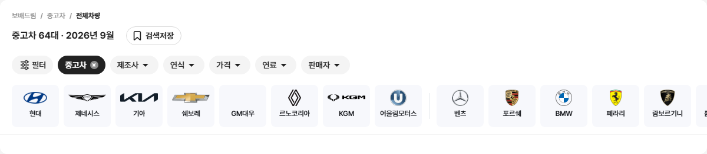
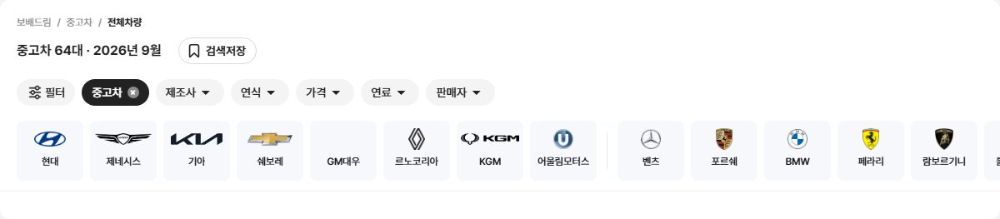
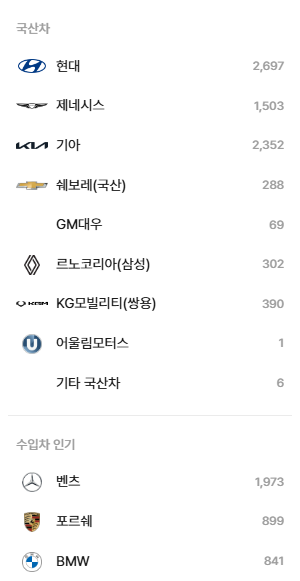
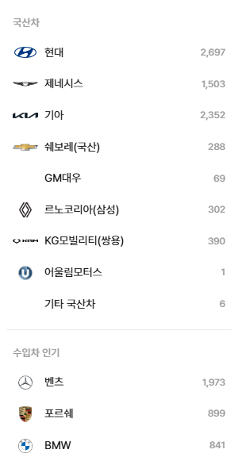
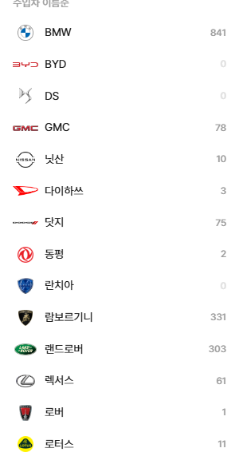
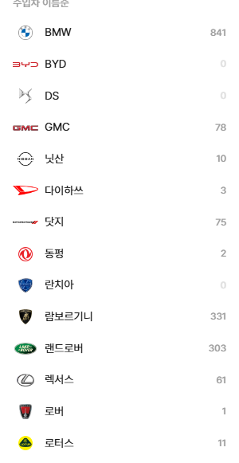

# PR #87 QF-096 보완 2·3 — 제조사 로고 6개 교체 · 목록 로고 칸 32×24 · 로고 높이 밸런스

## 1. 한 줄 요약
과쯔 모드 제조사 로고 6개(KGM·시트로엥·재규어·르노·란치아·히노)를 연도를 확인한 원본 파일로 바꿨습니다. 좌측 필터 같은 목록의 로고 칸은 24×24에서 32×24로 넓혔습니다. 벤틀리는 2025 로고의 연도를 확인하지 못해 그대로 두었습니다. 보완 3에서는 로고 크기 규칙을 높이 밸런스 식으로 바꿔, 넓은 로고와 엠블럼의 무게를 맞췄습니다. 점검은 모두 통과했고, 다른 모드 변화는 0%입니다. main에 병합해 배포했습니다.

## 2. 기본 정보
| 항목 | 내용 |
|---|---|
| 과제 ID | QF-096 (보완 2·3) |
| 브랜치 | `feat/qf-096-logo-refresh` (배포된 main `45b54d8`에서 시작) |
| 커밋 | `3f3c77e`(보완 2) · `704516e`(보고서) · 보완 3 커밋(이 파일과 함께) |
| PR | https://github.com/bobaekimboae/bobaedream/pull/87 |
| 상태 | 병합·배포(배포 v 값은 채팅 보고·노션에 적음) |
| 이번 병합으로 main에 함께 들어간 과제 | QF-096 보완 2·3 |

## 3. 한 일
- **보완 3 · 로고 높이 밸런스**: 비율(잘라낸 로고 폭÷높이)이 클수록 조금씩 낮게 그립니다.
  - 퀵필터 제조사 카드(80 칸): 높이 = min(28, 24 × 비율^-0.35), 폭 = 높이 × 비율. 폭이 72를 넘으면 폭 72, 높이 = 72 ÷ 비율입니다.
  - 목록 칸 32×24: 높이 = min(22, 18 × 비율^-0.35), 폭 32 한도입니다.
  - 로고 칸 위치(카드 가운데 · 세로 가운데)는 그대로입니다.
  - `check:logos`의 크기 규칙도 새 식으로 바꿨습니다.
- **보완 3 · 재규어 확인**: 원본(위키미디어 Jaguar_2024.svg)의 글자 색은 #4B494C(진한 회색)이고, 변환한 파일도 같은 색입니다.
  - 연해 보이는 까닭은 가는 획이 192×24로 줄며 가장자리가 반투명해졌기 때문입니다(불투명 1,603칸 중 완전 불투명 611칸).
  - 색이 바뀐 게 아니라서 지시대로 다시 만들지 않았습니다.
- **로고 교체**: 로고 6개를 같은 파일명으로 바꿨습니다.
  - 출처 순서는 공식 사이트 → 위키백과 정보 상자(오른쪽 요약 칸)의 로고 파일이었습니다.
  - 공식 사이트에서는 받을 수 있는 원본 파일을 찾지 못해, 6개 모두 위키백과·위키미디어 원본을 썼습니다.
  - AI로 만들거나 다시 그린 파일은 없습니다.
- **처리**: 투명 유지 → 알파 16 이하 여백 자르기 → 192×112 안에 맞춤(원본보다 키우지 않음) → PNG.
- **manifest.json 기록**: 브랜드마다 출처 URL, 설명 페이지, 로고 연도와 근거, `official`(공식 여부), 라이선스를 적었습니다.
  - 6개 모두 브랜드 공식 배포본이 아니라서 `official: false`입니다.
  - kgm·renault는 `replaceWithOfficial: false`로 바꿨습니다(더 이상 임시 파일 아님).
  - CREDITS.md도 새 출처로 갱신했습니다.
- **목록 로고 칸 32×24**: 적용 위치는 PC 좌측 필터·펼침판, 제조사 칩 모달, 모바일 제조사 시트, 차종 시트입니다.
  - 로고는 칸 가운데에 둡니다.
  - 비율 1.25 이하(엠블럼)는 높이 20입니다.
  - 1.25를 넘으면 폭 = min(32, 20×√비율), 높이 = 폭÷비율입니다.
  - 로고↔이름 사이 8, 행 높이 39.6은 그대로입니다. 로고가 없는 행은 32 칸을 비워 이름 시작선을 맞춥니다.
- **점검**: `check:logos`의 목록 크기 규칙과 칸 크기(32×24)를 새 기준으로 바꿨습니다.

## 4. 원본과 비교

### 보완 3 · 퀵필터 제조사 줄 로고 표시 크기(PC 1440 실측, 폭×높이, 괄호는 비율)
| 제조사 크기 (비율) | | | |
|---|---|---|---|
| 현대 38×19 (2.00) | 제네시스 68×14 (4.97) | 기아 61×14 (4.24) | 쉐보레 54×16 (3.46) |
| GM대우 빈칸 | 르노코리아 20×26 (0.76) | KGM 70×13 (5.18) | 어울림모터스 24×24 (1.00) |
| 벤츠 24×24 (1.02) | 포르쉐 20×26 (0.78) | BMW 24×24 (1.00) | 페라리 20×27 (0.74) |
| 람보르기니 22×25 (0.89) | 롤스로이스 16×28 (0.58) | GMC 64×14 (4.56) | 닛산 27×23 (1.19) |
| 다이하쓰 45×17 (2.63) | 닷지 72×10 (7.00) | 동펑 24×24 (1.00) | 랜드로버 36×19 (1.89) |
| 렉서스 30×21 (1.41) | 로버 21×26 (0.79) | 로터스 24×24 (1.00) | 르노 20×26 (0.76) |
| 링컨 13×28 (0.48) | 마세라티 19×27 (0.71) | 마이바흐 29×22 (1.33) | 마쯔다 27×22 (1.22) |
| 맥라렌 34×20 (1.70) | 모건 빈칸 | 미니 41×18 (2.31) | 미쓰비시 26×23 (1.16) |
| 미쯔오카 23×25 (0.93) | 벤틀리 50×16 (3.06) | 볼보 24×24 (1.00) | 부가티 38×19 (2.04) |
| 사브 24×24 (1.00) | 쉐보레 54×16 (3.46) | 스마트 25×23 (1.06) | 스바루 36×19 (1.84) |
| 스즈키 24×24 (1.00) | 시트로엥 24×24 (1.03) | 아우디 47×17 (2.85) | 알파로메오 24×24 (1.00) |
| 알핀 빈칸 | 애스턴마틴 64×14 (4.47) | 이네오스 빈칸 | 이베코 64×14 (4.57) |
| 인피니티 37×19 (1.92) | 재규어 72×9 (8.08) | 지프 45×17 (2.62) | 캐딜락 45×17 (2.63) |
| 크라이슬러 72×6 (11.43) | 테슬라 24×24 (1.01) | 토요타 32×21 (1.53) | 포드 45×17 (2.65) |
| 폭스바겐 24×24 (1.00) | 폰티악 15×28 (0.54) | 폴스타 24×24 (0.99) | 푸조 23×25 (0.91) |
| 피아트 33×20 (1.63) | 허머 72×8 (9.56) | 혼다 27×22 (1.23) |  |

- 지시 예상 값과 같습니다. 기아만 계산값 61.3이라 표에서 61로 보입니다(예상 62).

PC 1440 퀵필터 제조사 줄 전 → 후

좌측 필터 국산 전 → 후 · 수입 전 → 후
   

### 교체한 로고

| 브랜드 | 로고 연도 | 근거 | 출처(원본 파일) | 라이선스 | 파일 크기 전 → 후 |
|---|---|---|---|---|---|
| KG모빌리티 | 2023 | 2023년 3월 사명 변경·새 브랜딩, 파일 날짜 2024-01-01 | commons `KG_Mobility_brand_logo.svg` | 퍼블릭 도메인 | 141×112 → 192×37 |
| 시트로엥 | 2022 | 위키백과 정보 상자 "Logo since 2022" | commons `Citroen_2022.svg` | 퍼블릭 도메인 | 127×112 → 115×112 |
| 재규어 | 2024 | 2024-11-19 새 로고 공개 | commons `Jaguar_2024.svg` | 퍼블릭 도메인 | 192×79 → 192×24 |
| 르노 | 2021 | 파일 설명 "Renault logo since 2021", 원본 954×1255 | commons `Renault_2021.svg` | 퍼블릭 도메인 | 66×86 → 85×112 |
| 란치아 | 2022 | 위키백과 정보 상자 `Lancia_logo_2022.png` | 영문 위키백과 로컬 파일 | 공정 이용 | 111×112 → 110×112 |
| 히노 | 2026 | 파일 설명 "used since April, 2026" | commons `Hino_Motors_logo_2026.svg` | 퍼블릭 도메인 | 168×112 → 122×112 |

- **르노**: 르노와 르노코리아(삼성)가 같은 파일을 씁니다.
- **KGM·재규어**: 가로 글자 로고가 되었습니다. 보완 3 규칙으로 퀵필터에서는 KGM 70×13, 재규어 72×9로 보입니다.

### 교체하지 않은 로고
| 브랜드 | 이유 |
|---|---|
| 벤틀리 | 2025 새 날개 B 로고 파일을 공식 자료·위키백과에서 찾지 못했습니다. 위키백과 정보 상자는 2021 파일(Bentley logo 2.svg)이라 연도를 확인할 수 없어 그대로 두었습니다 |

### 좌측 필터 로고 표시 크기(PC 1440·1280 실측, 폭×높이)
| 브랜드 | 비율 | 전(24×24 칸) | 후(32×24 칸) |
|---|---|---|---|
| 기아 | 4.24 | 24.0×5.7 | 32.0×7.5 |
| 제네시스 | 4.97 | 24.0×4.8 | 32.0×6.4 |
| 쉐보레(국산) | 3.46 | 24.0×6.9 | 32.0×9.3 |
| 닷지 | 7.00 | 24.0×3.4 | 32.0×4.6 |
| 허머 | 9.56 | 24.0×2.5 | 32.0×3.3 |

- 5개 모두 칸 32×24 안 가운데에 있습니다(1440·1280 같음).
- 이 5개는 파일이 그대로라 비율이 같고, 칸만 넓어졌습니다.

- 보완 3 규칙으로도 이 5개는 폭 32 한도에 걸려 같은 크기입니다(예: 기아 32×7.6).

### 원본 대조(로고 칸 포함)
| 점검 | 결과 |
|---|---|
| `diff:bbm` | 25개 영역 모두 3% 이하(PC 좌측 필터 2.5%·2.3%, 이전과 같음) |
| `diff:bbm:flow` | 30단계 51개 영역 모두 3% 이하(최대 3.0% 모바일 칩 줄), 동작 점검 274/274 원본과 일치, 콘솔 오류 PC 0 · 모바일 0 |
| 제조사 시트 | 모바일 제조사 시트 1.1% → 2.7%(로고 칸이 넓어진 몫) |

## 5. 검증
| 항목 | 결과 |
|---|---|
| `npm run verify:qf` | 통과(런타임 보호 파일 그대로, TypeScript, Vite 빌드) |
| `check:logos` | 20/20(보완 3 새 크기 식). 로고 404 0 · 콘솔 오류 0(PC 1440·1280, 모바일 393) · 목록 칸 32×24 · 행 39.6 · 사이 8 |
| 보완 3 재검증 | diff:bbm 25개 영역 3% 이하(최대 PC 좌측 필터 2.5%) · flow 30단계 3% 이하(최대 3.0%), 274/274 · regress:modes 12화면 0% · check:top 21/21 · hybrid 20/20 · sidebar 31/31 · verify:qf 통과 |
| `check:top` · `check:hybrid` · `check:sidebar` | 21/21 · 20/20 · 31/31 |
| `regress:modes` | 배포본 45b54d8과 12개 화면 0%(초톳·동처띠·초톳형 PC·모바일 과쯔 첫 화면·목록 끝), 콘솔 오류 0 |
| measure:qf 퀵필터 규격 | 레일 96 · 카드 80×72 · 제조사 로고 칸 48×28 · 모델 이미지 칸 56×28 그대로, 가로 넘침 없음, 콘솔 오류 0 |
| 필터 선택지 | 필터 화면 코드는 바꾸지 않았습니다. 선택지 수를 직접 세지는 않았고, 전체 필터 대조 0.6%와 동작 점검 274/274로 변화 없음을 확인했습니다 |

## 6. 원본과 다르게 남긴 것과 이유
change-log CH-0069·0070·0073에 기록했습니다.
- **목록 로고 칸**: 원본 개발 시안은 24×24입니다. 지시대로 32×24로 넓혔습니다. 가로 글자 로고가 24 폭에서 너무 작게 보였기 때문입니다.
- **로고 크기(보완 3)**: 원본 개발 시안에는 없는 높이 밸런스 식입니다(퀵필터 폭 72 한도, 목록 32 한도).
- **로고 출처**: 브랜드 공식 배포본이 아니라 위키백과·위키미디어 원본 파일입니다(`official: false`).
- **란치아**: 영문 위키백과 로컬 파일(공정 이용)입니다.

## 7. 못 한 것 · 다음에 할 것
- 벤틀리 2025 로고는 공식 파일과 연도를 확인할 수 있으면 같은 이름으로 바꾸겠습니다. 바꾼 뒤 `node scripts/brand-logos-kr.mjs`를 다시 돌립니다.
- 브랜드 공식 보도자료 원본을 받으면 `official: true`로 바꿀 수 있습니다.
- 병합·배포는 지시대로 하지 않았습니다.

## 8. 확인 링크
로컬 미리보기(`feat/qf-096-logo-refresh` `3f3c77e` 빌드, vite preview 필요)
- PC: http://127.0.0.1:4173/bobaedream/?qf=guazi&pc=1
- 모바일: http://127.0.0.1:4173/bobaedream/?qf=guazi

배포본에는 아직 이 PR 내용이 없습니다(v=45b54d8)
- PC: https://bobaekimboae.github.io/bobaedream/?qf=guazi&v=45b54d8&pc=1
- 모바일: https://bobaekimboae.github.io/bobaedream/?qf=guazi&v=45b54d8
