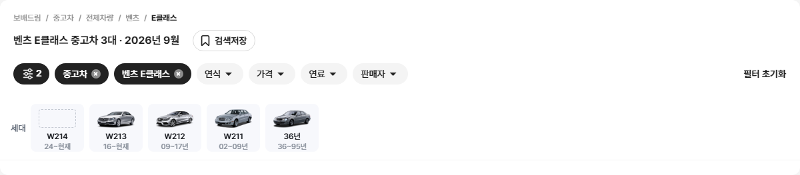
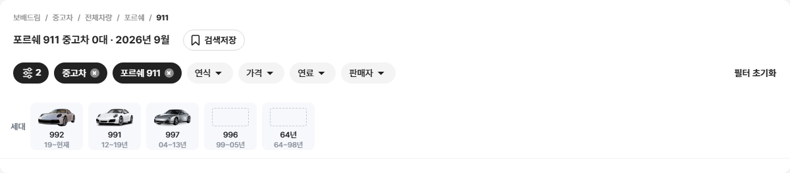
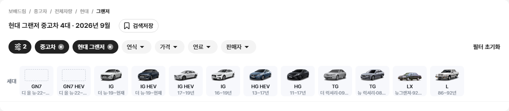
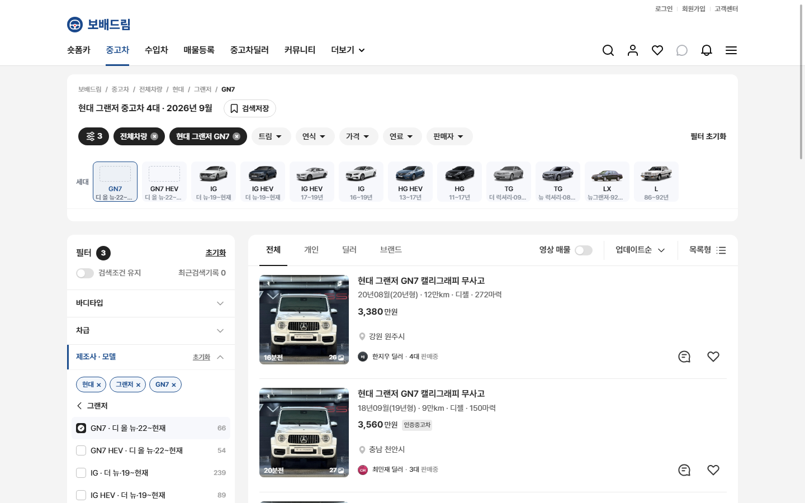
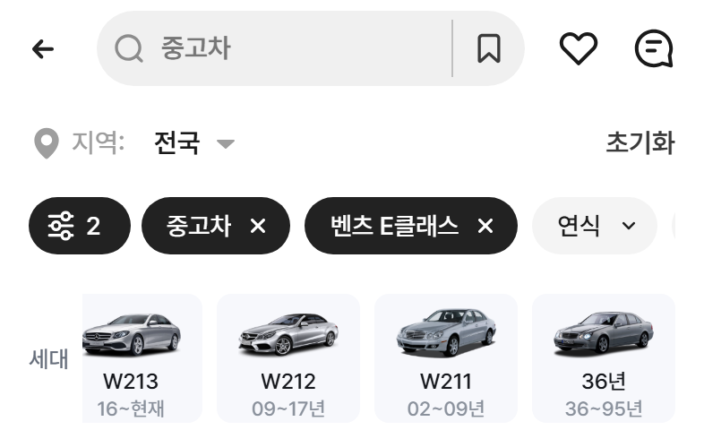
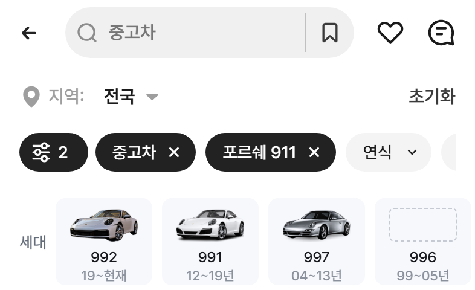
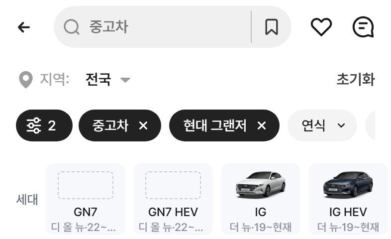

# PR #88 QF-097 과쯔 9개 제조사 모델·세부 모델 카탈로그와 이미지

## 1. 한 줄 요약
과쯔 모드에서 9개 제조사(벤츠·BMW·현대·기아·포르쉐·페라리·람보르기니·벤틀리·롤스로이스)의 모델·세부 모델 목록과 이미지를 개발 시안 카탈로그 스냅숏으로 바꿨습니다. 이 목록은 퀵필터 카드, 좌측 필터, 칩 모달·시트, 차종 시트가 모두 함께 씁니다. 이미지는 보배드림 322 · 당근 29 · 없음 98입니다. 점검은 모두 통과했고, 다른 모드 변화는 0%입니다.

## 2. 기본 정보
| 항목 | 내용 |
|---|---|
| 과제 ID | QF-097 |
| 브랜치 | `feat/qf-097-model-images` (배포된 main `45b54d8`에서 시작) |
| 커밋 | `fcf014d` · 보고서 커밋(이 파일) |
| PR | https://github.com/bobaekimboae/bobaedream/pull/88 |
| 상태 | 푸시 완료, PR 열림. 지시대로 병합·배포는 하지 않았습니다 |
| 이번 병합으로 main에 함께 들어갈 과제 | QF-097 |

## 3. 한 일
- **카탈로그 스냅숏**: 개발 시안 catalog-tree(POST, Origin dev.bbmuseum.co.kr)를 받아 `src/prototype/data/model-catalog-kr.json`에 저장했습니다.
  - 받은 날짜: 2026-09-27 07:07 UTC
  - 다시 받기: `node scripts/model-catalog-kr.mjs`
  - 화면은 API를 부르지 않습니다. 매물 있는 항목만 추린 생성 파일(`model-catalog-kr.generated.ts`)만 읽습니다.
- **이미지(`node scripts/model-images-kr.mjs`)**: `public/assets/models/kr/{maker_id}/{value}.png`로 저장했습니다.
  - 순서: ① 보배드림 image_url(확장자 없음·빈 파일·흰 배경이면 건너뜀) → ② 당근 GraphQL → ③ 없음(점선 빈 칸)
  - 처리: 여백 자르기 → 168×84 안(키우지 않음) → PNG
  - 함께 만든 파일: manifest.json(출처·연결 규칙·거절 이유), CREDITS.md, 검수용 한 장
- **당근 연결(추측 금지)**: 당근은 연식·코드를 주지 않습니다. 그래서 이름이 같아도 다른 세대일 수 있습니다(예: 당근 "더 뉴그랜저"는 GN7 부분변경, 보배드림 "더 뉴 그랜저"는 IG). 아래 세 경우만 연결했습니다.
  - 코드 일치: 당근 이름에 코드가 있고, 코드를 뺀 이름이 같을 때
  - 세대 일치: 당근 "모델(N세대)"와 카탈로그 세대 N이 같고, 그 세대의 세부 모델이 하나뿐일 때
  - 단일 일치: 보배드림·당근 모두 세부 모델이 1개이고 이름이 같을 때
- **화면(퀵필터 카드)**
  - 모델 카드: 모델 이름 + 매물이 가장 많은 세부 모델의 이미지(그 세부 모델에 이미지가 없으면 다음으로 많은 것)
  - 모델 순서: 숫자 → 영문 → 가나다. "기타"는 맨 뒤이고, 벤츠 A클래스는 A-클래스로 보고 정렬합니다.
  - 세부 모델 카드: 최신 먼저입니다.
  - 큰 글자: 코드(하이브리드는 +HEV) → 없으면 N세대 → 없으면 연식. 모델 안 코드가 모두 같으면(포르쉐 718) 세부 모델 이름을 씁니다.
  - 작은 글자: 부분변경 이름·연식("디 올 뉴·22~현재")
  - 이름은 괄호 앞까지만 씁니다.
  - 이미지 칸 56×28: 폭 56, 칸을 넘으면 높이 맞춤, 아래 정렬
  - 카드 규격(80×72 · #F7F8FC)과 누르는 동작은 그대로입니다.
- **트림 연결**: 코드가 같은 기존 세대 데이터가 있으면 트림 칩으로 이어집니다(예: 벤츠 E클래스 W214 → E200 등). 트림이 없으면 세부 모델 줄에 선택된 채로 남습니다.
- **좌측 필터(PC)**: 등급 단계에서 트림이 없는 세부 모델도 체크 한 줄로 고릅니다. 퀵필터와 같은 상태를 씁니다.
- **점검**: `npm run check:models`를 추가했습니다(메모리가 부족하면 `-- --only=pc-1440`처럼 화면 크기별로 나눠 돌립니다).

## 4. 원본과 비교

### 제조사별 개수 · 이미지 출처
모델·세부 모델 칸은 "전체 / 화면에 보이는 수(매물 있는 것)"입니다.

| 제조사 | maker_id | 모델 | 세부 모델 | 보배드림 | 당근 | 없음 |
|---|---|---|---|---|---|---|
| 벤츠 | 21 | 50 / 38 | 94 / 67 | 53 | 4 | 10 |
| BMW | 1 | 42 / 37 | 107 / 82 | 38 | 10 | 34 |
| 현대 | 49 | 68 / 42 | 209 / 126 | 102 | 1 | 23 |
| 기아 | 3 | 68 / 34 | 192 / 107 | 85 | 3 | 19 |
| 포르쉐 | 43 | 14 / 9 | 29 / 22 | 15 | 3 | 4 |
| 페라리 | 41 | 30 / 21 | 30 / 21 | 16 | 3 | 2 |
| 람보르기니 | 11 | 9 / 6 | 9 / 6 | 5 | 1 | 0 |
| 벤틀리 | 22 | 8 / 5 | 14 / 9 | 6 | 1 | 2 |
| 롤스로이스 | 16 | 10 / 7 | 15 / 9 | 2 | 3 | 4 |
| **합계** | | **299 / 199** | **699 / 449** | **322** | **29** | **98** |

- **보배드림 이미지를 못 쓴 이유**: image 값 확장자 없음 104 · 값 없음 13 · 흰 배경(JPG) 10
- **당근 연결 29건**: 코드 일치 1 · 세대 일치 15 · 단일 일치 13. 세대 번호가 실제 세대와 맞는지 하나씩 확인했습니다(예: C클래스 W206=5세대, 7시리즈 G70=7세대).
- **벤츠 E클래스 W214**: 보배드림 세대 번호는 11, 당근은 "E클래스(6세대)"라 번호가 달라 연결하지 않았습니다.

검수용 한 장(`reports/qf-097/contact-sheet.png`, 보=보배드림 · 당=당근 · 없음=점선)

### 이미지 없음(점선 빈 칸) 98건
- **벤츠**(10): E클래스 W214, CLE클래스 C236, 마이바흐 S클래스 마이바흐 W222, V클래스 W447, EQE, EQE SUV EQE X294, EQS SUV EQS X296, 마이바흐 EQS SUV 마이바흐 EQS X296, 280, 기타
- **BMW**(34): 2시리즈 G42, 2시리즈 2시리즈 액티브 투어러 U06, 2시리즈 2시리즈 그란쿠페 F44, 2시리즈 2시리즈 액티브 투어러 F45, 5시리즈, M2 G87, M3 G80, M3 E90, M3 E46, M3 E36, M4 G82, M5 G90, M5 F90, M5 F10, M5 E60, M5 E39, M6 E63, M8 F92, X3 M F97, X4 M F98, X5 M F95, X6 M F96, XM G09, X1 U11, X2 U10, X2 F39, X3 G45, X4 G02, X6 G06, iX i20, iX1 U11, i4 G26, i5 G60, i7 G70
- **현대**(23): 그랜저 디 올 뉴 그랜저 GN7, 그랜저 디 올 뉴 그랜저 하이브리드 GN7, 마이티 e마이티 WT1, 싼타페 싼타페 더스타일 CM, 쏘나타 쏘나타 DN8 DN8, 아반떼 더 뉴 아반떼 CN7, 아반떼 더 뉴 아반떼 하이브리드 CN7, 아반떼 더 뉴 아반떼 N CN7, 아이오닉 아이오닉 일렉트릭 AE, 아이오닉5 아이오닉 5 N NE-N, 아이오닉6, 캐스퍼 더 뉴 캐스퍼 AX1, 캐스퍼 캐스퍼 일렉트릭 AX1, 코나 디 올 뉴 코나 SX2, 코나 디 올 뉴 코나 하이브리드 SX2, 투싼 더 뉴 투싼 NX4, 투싼 더 뉴 투싼 하이브리드 NX4, 투싼 디 올 뉴 투싼 NX4, 투싼 디 올 뉴 투싼 하이브리드 NX4, 투싼 JM, 엑시언트 엑시언트 프로 QZ, 팰리세이드 더 뉴 팰리세이드 LX2, 팰리세이드 LX2
- **기아**(19): EV6 더 뉴 EV6 CV, K3 더 뉴 K3 BD, K5 더 뉴 K5 3세대 DL3, K5 더 뉴 K5 하이브리드 3세대 DL3, K8 더 뉴 K8 GL3, K8 더 뉴 K8 하이브리드 GL3, 니로 디 올 뉴 니로 SG2, 니로 디 올 뉴 니로 EV SG2, 레이 더 뉴 기아 레이 TAM, 모닝 더 뉴 모닝 JA, 봉고 봉고3 PU, 셀토스 디 올 뉴 셀토스 SP3, 셀토스 더 뉴 셀토스 SP2, 스포티지 더 뉴 스포티지 NQ5, 스포티지 더 뉴 스포티지 하이브리드 NQ5, 쏘울 쏘울 부스터 SK3, 카니발 더 뉴 카니발 4세대 KA4, 카니발 그랜드 카니발 R VQ, 카니발 뉴 카니발 R VQ
- **포르쉐**(4): 718 718 스파이더 982, 911 996, 911, 마칸 마칸 일렉트릭
- **페라리**(2): 296, F8
- **벤틀리**(2): 컨티넨탈 GT, 플라잉스퍼
- **롤스로이스**(4): 고스트, 팬텀, 팬텀, 실버 클라우드 실버 클라우드Ⅱ

### 매물 ↔ 카탈로그 연결(19종)
- **모델 단위**: 19종 모두 연결됩니다.
  - 두 모델에 함께 걸리는 매물이 있습니다. "현대 아이오닉 5"는 아이오닉·아이오닉 5에, "포르쉐 718 박스터"는 718·박스터에 걸립니다(기존 모델 거르기가 이름 포함 방식이기 때문).
- **세부 모델 단위 연결됨**: 그랜저 GN7(GN7·GN7 HEV), 쏘렌토 MQ4(MQ4·MQ4 HEV), A클래스 W177, C클래스 W206 ×2, C클래스 W205, 페라리 296(세부 모델 1개)
- **세부 모델 단위 연결 안 됨(13종)**: 매물 이름·트림에 카탈로그 코드가 없어 추측하지 않았습니다.
  - 기아: 카니발 4세대 ×2, 카니발 하이리무진, 봉고3
  - 현대: 아이오닉 5, 포터2
  - BMW 5시리즈 530i
  - 벤츠 E클래스 E 300
  - 포르쉐 718 박스터
  - 벤틀리 컨티넨탈 GT
  - 람보르기니 우라칸 EVO
  - 롤스로이스 팬텀

### 캡처(PC 1440 · 1280 · 모바일 393)
벤츠 → E클래스 · 포르쉐 → 911 · 현대 → 그랜저(PC 1440)

PC 1280 그랜저 · PC 1440 좌측 필터에서 GN7 선택(퀵필터와 같은 상태)

모바일 393 E클래스 · 911 · 그랜저
  

### 원본 대조
| 점검 | 결과 |
|---|---|
| `diff:bbm` | 25개 영역 모두 3% 이하(최대 PC 좌측 필터 2.5%, 이전과 같음) |
| `diff:bbm:flow` | 30단계 모두 3% 이하(최대 3.0%), 동작 점검 274/274 원본과 일치, 콘솔 오류 PC 0 · 모바일 0 |

## 5. 검증
| 항목 | 결과 |
|---|---|
| `npm run verify:qf` | 통과(런타임 보호 파일 28개 그대로, TypeScript, Vite 빌드) |
| `check:models` | PC 1440 · 1280 · 모바일 393 각 13/13 |
| check:models 세부 확인 | 모델 카드 수 = 스냅숏 수(9개 제조사), 순서, 이미지 56×28 안(폭 56 또는 높이 28 · 아래 정렬), 빈 칸 점선 56×28, 카드 80×72 · #F7F8FC, 세부 모델 최신 먼저, 404 0, 콘솔 오류 0 |
| `check:logos` · `check:top` · `check:hybrid` · `check:sidebar` | 20/20 · 21/21 · 20/20 · 31/31 |
| `regress:modes` | 배포본 45b54d8과 12개 화면 0%(초톳·동처띠·초톳형 PC·모바일 과쯔 첫 화면·목록 끝), 콘솔 오류 0 |
| measure:qf | 레일 96 · 카드 80×72 · 이미지 칸 56×28, 가로 넘침 없음, 콘솔 오류 PC 0 · 모바일 0 |
| measure:qf 흐름 | 벤츠 → E클래스 → W214 → 트림 줄 정상 |
| 필터 선택지 | 개발 시안형 필터 항목은 바꾸지 않았습니다. 동작 점검 274/274로 변화 없음을 확인했습니다 |

## 6. 원본과 다르게 남긴 것과 이유
change-log CH-0071·0072에 기록했습니다. CH-0069·0070은 PR #87에서 이미 썼습니다.
- **0대 숨김**: 매물이 0대인 모델·세부 모델은 숨겼습니다. 제조사 줄(QF-096)과 같은 규칙입니다.
- **세부 모델 이미지 대체 없음**: 세부 모델에 이미지가 없으면 모델 이미지로 대체하지 않고 점선 빈 칸으로 둡니다. 지시 ③을 따랐습니다.
- **모델 카드 2줄째(바디타입)**: 카탈로그에 바디타입이 없습니다. 기존 데이터에 같은 이름이 있을 때만 보이고, 없으면 비웁니다(추측 안 함).
- **이미지 색·방향**: 보배드림·당근 원본 그대로입니다. 일부는 진한 색입니다(에셋 지침의 흰색·은색 기준과 다름).
- **"현대 기타"**: 카탈로그 이미지가 윤곽 그림입니다.
- **옛 모델 연도**: 두 자리 연도 30 이상은 1900년대로 봅니다. 벤츠 E클래스 "36~95년"은 연식 "36년" 카드로 맨 뒤에 둡니다.

## 7. 못 한 것 · 다음에 할 것
- 이미지 없음 98건: 보배드림 카탈로그의 확장자 없는 이미지 값(104건)이 고쳐지면, `node scripts/model-images-kr.mjs`를 다시 돌려 채울 수 있습니다.
- 샘플 매물 13종은 세부 모델 코드가 이름에 없어 세부 모델로 걸리지 않습니다. 매물 데이터에 코드가 들어오면 연결됩니다.
- 주소(`model=`)로 여는 첫 화면의 모델 확인은 기존 목록 기준이라, 카탈로그에만 있는 모델은 새로고침하면 풀립니다(공용 코드라 바꾸지 않음).
- 병합·배포는 지시대로 하지 않았습니다.

## 8. 확인 링크
로컬 미리보기(`feat/qf-097-model-images` `fcf014d` 빌드, vite preview 필요). 유형 줄에서 "중고차"를 누르면 제조사 줄이 나옵니다.
- PC: http://127.0.0.1:4173/bobaedream/?qf=guazi&pc=1
- 모바일: http://127.0.0.1:4173/bobaedream/?qf=guazi

배포본에는 아직 이 PR 내용이 없습니다(v=45b54d8)
- PC: https://bobaekimboae.github.io/bobaedream/?qf=guazi&v=45b54d8&pc=1
- 모바일: https://bobaekimboae.github.io/bobaedream/?qf=guazi&v=45b54d8
