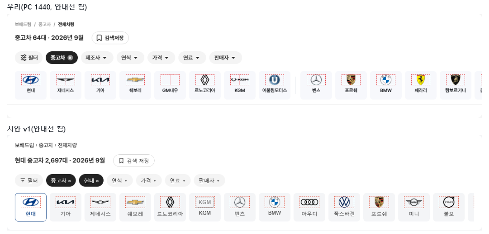
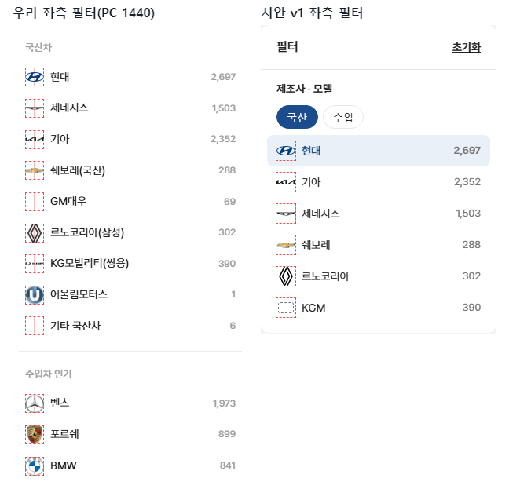
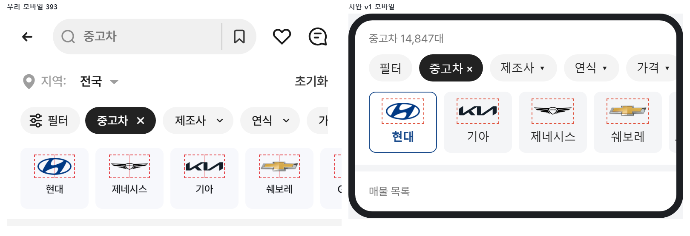
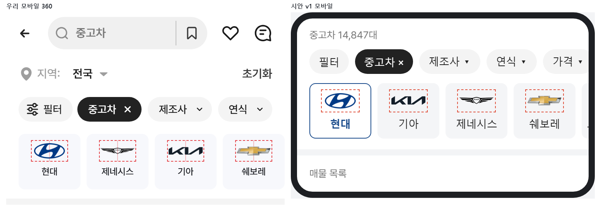
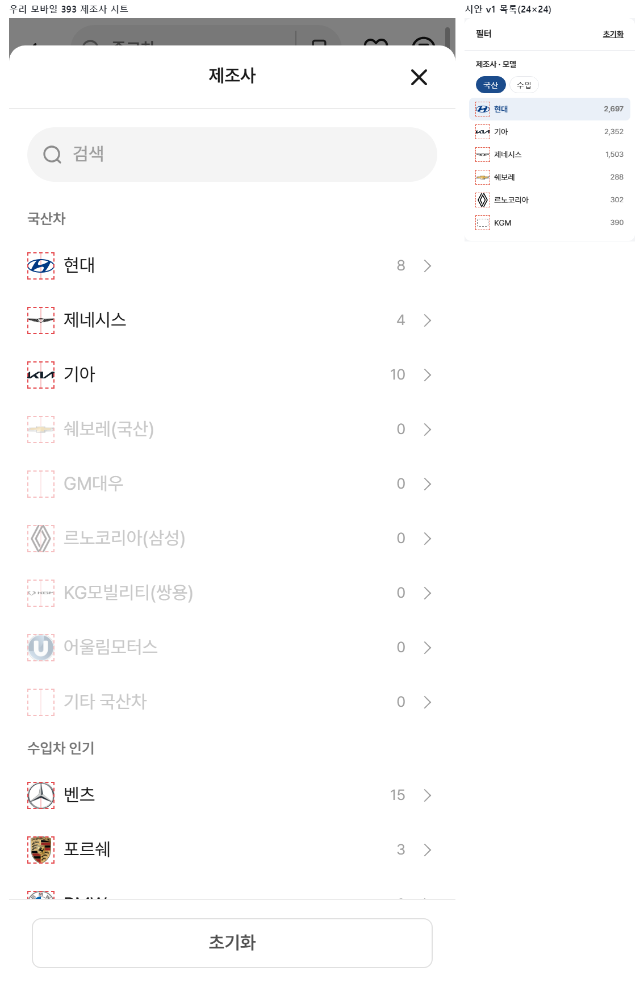
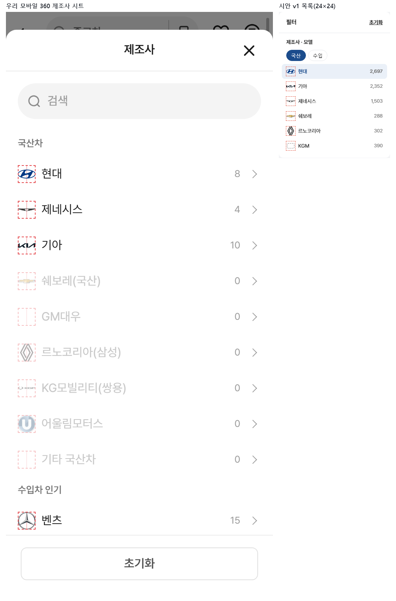

# PR #89 QF-096 보완 3 · QF-097 보완 — 로고 시안 v1 규격 복원 · 로고 칸 안내선 · 제목 세부모델 · BMW 순서

## 1. 한 줄 요약
제조사 로고 크기를 시안 v1 규격(퀵필터 48×28, 목록 24×24)으로 되돌렸습니다. 모든 로고가 칸 안에 있습니다(칸 밖 0개). &debug=1일 때 "로고 칸 안내선" 체크박스를 넣었고, 제목에 세부모델까지 보이게 했습니다. BMW N시리즈는 숫자 순서대로 앞에 둡니다. 점검은 모두 통과했고, 다른 모드 변화는 0%입니다.

## 2. 기본 정보
| 항목 | 내용 |
|---|---|
| 과제 ID | QF-096(보완 3) · QF-097(보완) |
| 브랜치 | `feat/qf-096-v1-restore`(main `11daf48`에서 시작) |
| 커밋 | `b243e90` · 캡처·보고서 커밋 |
| PR | https://github.com/bobaekimboae/bobaedream/pull/89 |
| 상태 | 병합·배포(배포 v 값은 채팅 보고·노션에 적음) |
| 이번 병합으로 main에 함께 들어간 과제 | QF-096 보완 3, QF-097 보완 |

## 3. 한 일
- **퀵필터 제조사 카드**: 로고 칸 48×28, 카드 위 8, 카드 안 가로 가운데. 로고는 칸 안 가로·세로 가운데입니다.
  - 비율 1.25 이하: 폭 = min(44, 28×비율), 높이 = min(28, 폭÷비율)
  - 비율 1.25 초과: 폭 = min(44, 28×√비율), 높이 = 폭÷비율
- **목록형**: 로고 칸 24×24, 비율 유지로 칸 안에 맞춰 가운데에 둡니다(로고↔이름 8, 행 39.6).
  - 적용 위치: 좌측 필터, 펼침판, 칩 모달, 모바일 제조사 시트, 차종 시트
- **취소한 규칙**: 이전의 "폭 72 높이 밸런스", "로고 틀 56×26", "정사각 36×36", "글자 로고 폭 64"
- **로고 파일**: 교체한 6개를 포함해 그대로입니다.
- **check:logos**: 크기 식을 v1으로 되돌리고, "칸 밖 0개" 점검과 "카드 위 8·가로 가운데" 점검을 더했습니다.
- **&debug=1 "로고 칸 안내선"**: 버전 배지 옆 체크박스입니다.
  - 켜면 퀵필터 로고 칸 48×28, 모델·세부모델 이미지 칸 56×28, 목록 로고 칸 24×24에 1px #E5484D 점선과 연한 빨강 세로 중심선이 보입니다.
  - 칸 밖으로 나간 로고·이미지에는 빨간 점 8px가 붙습니다.
  - outline·배경만 쓰므로 레이아웃은 바뀌지 않습니다.
  - 켠 상태는 브라우저 저장소에 기억합니다. 저장소를 못 쓰면 꺼진 상태로 시작합니다.
- **제목**: 세부모델까지 이어 씁니다("벤츠 C클래스 W206 중고차 6대 · 2026년 9월"). N은 목록 수와 같습니다.
- **BMW 순서**: N시리즈(1~8시리즈)는 "~현재"가 없어도 숫자 순서대로 앞에 둡니다.
  - 맨 뒤 구형 숫자 모델: 벤츠 190·220·280·600, BMW 02 시리즈, 포르쉐 356·928·944 등

## 4. 원본(시안 v1)과 비교

### 전 브랜드 표시 크기(PC 1440 실측, 폭×높이 반올림)
| 제조사 | 퀵필터(48×28 칸) | 목록(24×24 칸) |
|---|---|---|
| 현대 | 40×20 | 24×12 |
| 제네시스 | 44×9 | 24×5 |
| 기아 | 44×10 | 24×6 |
| 쉐보레(국산) | 44×13 | 24×7 |
| GM대우 | 빈칸 | 빈칸 |
| 르노코리아(삼성) | 21×28 | 18×24 |
| KG모빌리티(쌍용) | 44×8 | 24×5 |
| 어울림모터스 | 28×28 | 24×24 |
| 벤츠 | 29×28 | 24×24 |
| 포르쉐 | 22×28 | 19×24 |
| BMW | 28×28 | 24×24 |
| 페라리 | 21×28 | 18×24 |
| 람보르기니 | 25×28 | 21×24 |
| 롤스로이스 | 16×28 | 14×24 |
| GMC | 44×10 | 24×5 |
| 닛산 | 33×28 | 24×20 |
| 다이하쓰 | 44×17 | 24×9 |
| 닷지 | 44×6 | 24×3 |
| 동펑 | 28×28 | 24×24 |
| 랜드로버 | 38×20 | 24×13 |
| 렉서스 | 33×24 | 24×17 |
| 로버 | 22×28 | 19×24 |
| 로터스 | 28×28 | 24×24 |
| 르노 | 21×28 | 18×24 |
| 링컨 | 13×28 | 11×24 |
| 마세라티 | 20×28 | 17×24 |
| 마이바흐 | 32×24 | 24×18 |
| 마쯔다 | 34×28 | 24×20 |
| 맥라렌 | 36×21 | 24×14 |
| 모건 | 빈칸 | 빈칸 |
| 미니 | 43×18 | 24×10 |
| 미쓰비시 | 32×28 | 24×21 |
| 미쯔오카 | 26×28 | 22×24 |
| 벤틀리 | 44×14 | 24×8 |
| 볼보 | 28×28 | 24×24 |
| 부가티 | 40×20 | 24×12 |
| 사브 | 28×28 | 24×24 |
| 쉐보레 | 44×13 | 24×7 |
| 스마트 | 30×28 | 24×23 |
| 스바루 | 38×21 | 24×13 |
| 스즈키 | 28×28 | 24×24 |
| 시트로엥 | 29×28 | 24×23 |
| 아우디 | 44×15 | 24×8 |
| 알파로메오 | 28×28 | 24×24 |
| 알핀 | 빈칸 | 빈칸 |
| 애스턴마틴 | 44×10 | 24×5 |
| 이네오스 | 빈칸 | 빈칸 |
| 이베코 | 44×10 | 24×5 |
| 인피니티 | 39×20 | 24×12 |
| 재규어 | 44×5 | 24×3 |
| 지프 | 44×17 | 24×9 |
| 캐딜락 | 44×17 | 24×9 |
| 크라이슬러 | 44×4 | 24×2 |
| 테슬라 | 28×28 | 24×24 |
| 토요타 | 35×23 | 24×16 |
| 포드 | 44×17 | 24×9 |
| 폭스바겐 | 28×28 | 24×24 |
| 폰티악 | 15×28 | 13×24 |
| 폴스타 | 28×28 | 24×24 |
| 푸조 | 26×28 | 22×24 |
| 피아트 | 36×22 | 24×15 |
| 허머 | 44×5 | 24×3 |
| 혼다 | 34×28 | 24×20 |
| 기타 국산차 | - | 빈칸 |
| BYD | - | 24×5 |
| DS | - | 20×24 |
| 란치아 | - | 24×24 |
| 머큐리 | - | 24×24 |
| 북기은상 | - | 24×15 |
| 뷰익 | - | 24×24 |
| 비이스만 | - | 빈칸 |
| 새턴 | - | 24×24 |
| 선롱 | - | 24×24 |
| 스카니아 | - | 24×23 |
| 스파이커 | - | 빈칸 |
| 어큐라 | - | 빈칸 |
| 오스틴 | - | 빈칸 |
| 오펠 | - | 24×19 |
| 올즈모빌 | - | 24×12 |
| 웨스트필드 | - | 빈칸 |
| 이스즈 | - | 24×4 |
| 코닉세크 | - | 17×24 |
| 파가니 | - | 24×3 |
| 포톤 | - | 24×24 |
| 피스커 | - | 빈칸 |
| 홀덴 | - | 빈칸 |
| 히노 | - | 24×22 |
| 기타 수입차 | - | 빈칸 |

- 칸 밖 0개입니다(check:logos, 안내선 빨간 점 0개: PC 1440 · 모바일 393 · 360 퀵필터와 제조사 시트).
- 지시 예상 값과 반올림 차이만 있습니다: 벤츠는 비율 1.021이라 28.6×28(표 29×28), KGM은 44×8.5(표 44×8).

### 나란히 비교(안내선 켬 · 왼쪽/위 우리 · 오른쪽/아래 시안 v1)
PC 1440 퀵필터 · 좌측 필터

모바일 393 · 360 퀵필터

모바일 393 · 360 제조사 시트

### 안내선 동작 점검
| 화면 | debug 없음 → 체크박스 없음 | 켜기 전후 레이아웃 | 켠 뒤 새로고침(기억) | 칸 밖 빨간 점 | 콘솔 오류 |
|---|---|---|---|---|---|
| PC 1440 | 없음 | 같음 | 켜짐 유지 | 0개 | 0 |
| 모바일 393 | 없음 | 같음 | 켜짐 유지 | 0개(시트 0개) | 0 |
| 모바일 360 | 없음 | 같음 | 켜짐 유지 | 0개(시트 0개) | 0 |

### 제목 · BMW 순서
- 벤츠 → C클래스 → W206: 제목 "벤츠 C클래스 W206 중고차 6대 · 2026년 9월"(PC 1440·1280), 목록 6대
- BMW(좌측 필터 전체 목록): 1시리즈 → 2시리즈 → 3시리즈 → 4시리즈 → 5시리즈 → 6시리즈 → 7시리즈 → 8시리즈 → i3 → i4 …

### 원본 대조
| 점검 | 결과 |
|---|---|
| `diff:bbm` | 25개 영역 3% 이하(최대 PC 좌측 필터 2.4%) |
| `diff:bbm:flow` | 30단계 3% 이하(최대 3.0%), 동작 점검 274/274, 콘솔 오류 0 |

## 5. 검증
| 항목 | 결과 |
|---|---|
| `npm run verify:qf` | 통과(런타임 보호 파일 28개 그대로) |
| `check:logos` | 21/21(크기 v1 식 · 카드 위 8 · 칸 밖 0개 · 행 39.6 · 사이 8 · 404 0 · 콘솔 0) |
| `check:models` | PC 1440 17/17 · 1280 17/17 · 모바일 393 13/13(BMW 순서 · 제목 세부모델 · 전수 0대 없음 · 단계별 칩) |
| `check:top` · `check:hybrid` · `check:sidebar` | 21/21 · 20/20 · 31/31 |
| `regress:modes` | 배포본 11daf48과 12개 화면 0% |
| measure:qf | 레일 96 · 카드 80×72 · 제조사 로고 칸 48×28 · 모델 이미지 칸 56×28, 가로 넘침 없음, 콘솔 오류 0 |

## 6. 원본과 다르게 남긴 것과 이유
change-log CH-0077~0080에 기록했습니다.
- **안내선 체크박스**: 원본에 없는 디버그 도구입니다. &debug=1일 때만 보입니다.
- **제목에 세부모델**: 원본 제목은 모델까지이지만, 지시대로 이어 씁니다.

## 7. 못 한 것 · 다음에 할 것
- 없음

## 8. 확인 링크
배포본(v 값은 채팅 보고와 노션에 적음). 안내선은 `&debug=1`을 붙이고 오른쪽 아래 체크박스로 켭니다.
- 모바일: https://bobaekimboae.github.io/bobaedream/?qf=guazi
- PC: https://bobaekimboae.github.io/bobaedream/?qf=guazi&pc=1
