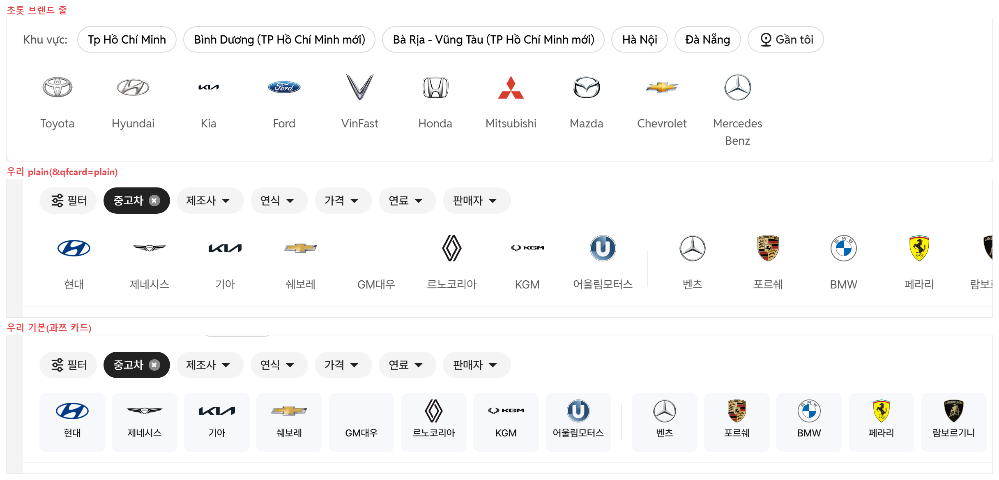
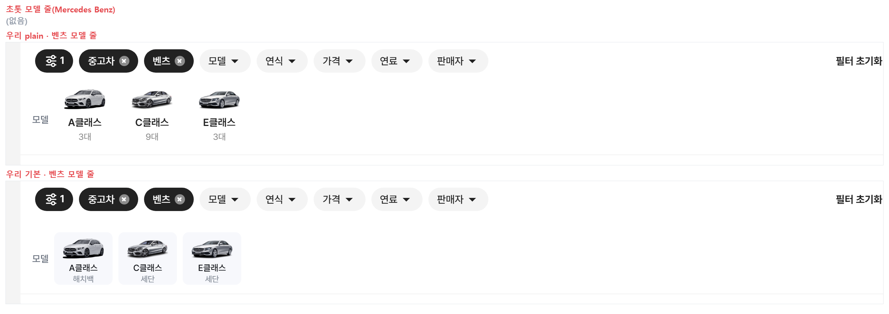
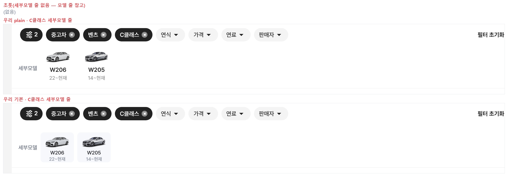
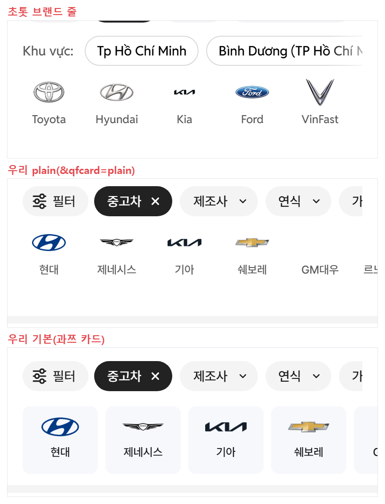
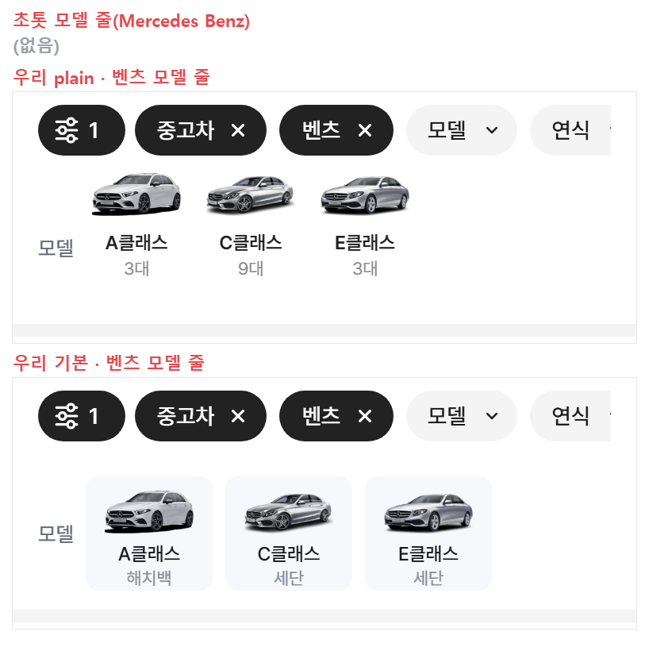
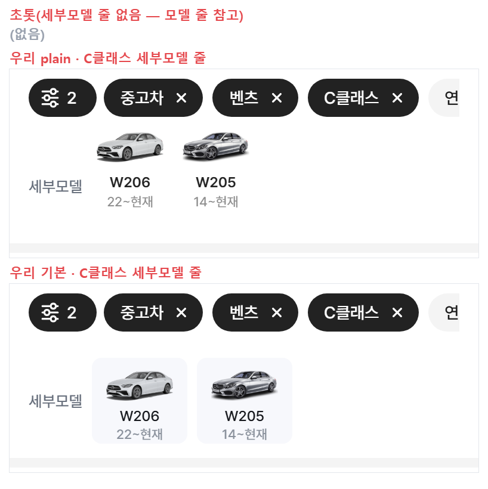
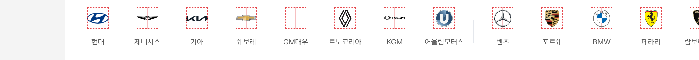
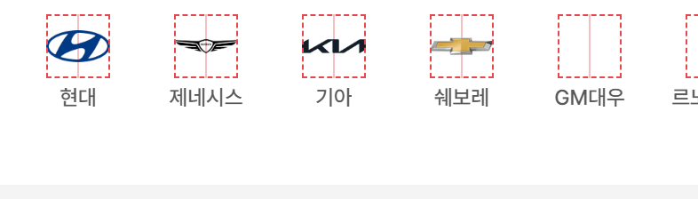

# PR #90 QF-100 과쯔 퀵필터 "바탕 없는(초톳식)" — 최종: plain 기본 · &qfcard=card 비교

## 최종(병합 전 보완)
- **기본값 전환**: 주소에 값이 없으면 plain입니다. `&qfcard=card`는 이전 과쯔 카드(비교용), `&qfcard=plain`도 plain입니다.
- **칩 줄 → 줄 간격**: PC 18 · 모바일 14로 바꿨습니다. 과쯔에는 지역 칩 줄이 없어서, 초톳의 "필터 칩 줄 → 지역 칩 줄" 값을 씁니다.
  - 나중에 지역 칩 줄이 생기면 그 줄 → 제조사 줄은 PC 16 · 모바일 10입니다(qf-plain.css 주석).
- **모델 카드 보조 글자**: plain·card 모두 차종입니다(예: A클래스 해치백, C·E클래스 세단). 세부모델은 연식 그대로이고, 매물 수는 뺐습니다.
- **점검 스크립트를 plain 기준으로 갱신**
  - check:logos: 로고 상자 40×40·36×36, 로고 크기 82%·100%, 칸 84×102 · 64×74, 간격 18 · 14, 모바일 첫 칸 −4
  - check:models: 칸 폭 84·64, 이미지 칸 위 6·0, 이미지 → 이름 8, 모델 보조 글자 = 차종

### 최종 검증(수치)
| 항목 | PC 1440 | PC 1280 | 모바일 393 |
|---|---|---|---|
| 주소 값 없음 = plain | 예 | 예 | 예 |
| 칩 줄 → 제조사 · 모델 · 세부모델 줄 | 18 · 18 · 18 | 18 · 18 · 18 | 14 · 14 · 14 |
| 제조사 칸 | 84×102 | 84×102 | 64×74 |
| 모델 보조 글자(plain · card) | 해치백 · 세단 · 세단(두 모드 같음) | 같음 | 같음 |
| &qfcard=card vs 배포본 ed527d0(제조사·모델·세부모델 줄) | 픽셀 같음 | 픽셀 같음 | 픽셀 같음 |
| &debug=1 안내선 켬, 칸 밖 | 0(상자 40×40) | 0 | 0(상자 36×36) |
| 콘솔 오류 | 0 | 0 | 0 |

- **점검 스크립트**
  - check:logos 21/21 · check:models 18/18 · 18/18 · 14/14 · top 21/21 · hybrid 20/20 · sidebar 31/31 · verify:qf 통과
  - check:models 모바일은 처음에 메모리 부족 오류(ERR_INSUFFICIENT_RESOURCES)로 13/14였고, 다시 돌려 14/14였습니다.
- **원본 대조**: diff:bbm 최대 2.4% · flow 30단계 최대 3.0%, 274/274 · regress:modes 12화면 0%
- **card 모드 픽셀 비교**: 한 번은 PC 1440 제조사 줄 한 장이 이미지 로딩 타이밍 때문에 달랐습니다. 두 번 다시 돌려 모두 같았습니다.
- **캡처(plain 기본)**: `reports/qf-100-final/{pc-1440,m-393}-{maker,model-benz,sub-c-class}.png`
- **change-log**: CH-0084~0086

## 1. 한 줄 요약
과쯔 퀵필터(제조사·모델·세부모델 줄)에 회색 카드 배경이 없는 초톳식 모양을 추가했습니다. 주소에 `&qfcard=plain`을 붙일 때만 바뀌고, 없으면 지금 과쯔 카드 그대로입니다(배포본과 픽셀까지 같음). 병합·배포는 하지 않았습니다. 두 모양을 캡처로 비교한 뒤 결정합니다.

## 2. 기본 정보
| 항목 | 내용 |
|---|---|
| 과제 ID | QF-100 |
| 브랜치 | `feat/qf-100-plain-rail`(main `ed527d0`에서 시작) |
| 커밋 | `44cb736` · 보고서 커밋(이 파일) |
| PR | https://github.com/bobaekimboae/bobaedream/pull/90 |
| 상태 | 푸시 완료, PR 열림. 병합·배포 안 함(지시) |
| 이번 병합으로 main에 함께 들어갈 과제 | QF-100 |

## 3. 한 일
- **0단계 초톳 실측**: xe.chotot.com/mua-ban-oto의 PC 1440·모바일 393 브랜드 줄을 쟀습니다. 실측표는 `reports/qf-100/chotot-measure.md`입니다.
  - 모바일 칸은 64×74로 확정됐습니다(이전 추정값과 같음).
- **제조사 줄(plain)**: 초톳 실측과 같게 만들었습니다.
  - PC: 칸 84×102·피치 92, 로고 상자 40×40(칸 위 6), 이름 14/21 400 #595959(상자 아래 14)
  - 모바일: 칸 64×74·피치 72, 로고 상자 36×36(칸 위 0), 이름 12/18 500(상자 아래 2)
  - 공통: 칸 배경·테두리·모서리 없음, 이름은 두 줄까지, 짧은 이름 규칙·국산/수입 구분선은 그대로
- **로고 상자 안 크기(초톳 실측 평균)**: 엠블럼(비율 1.25 이하)은 긴 변 82%, 가로형·글자 로고는 폭 100%, 가운데입니다.
- **모델·세부모델 줄(plain)**: 제조사 줄과 같은 칸 폭·피치(PC 84·92 / 모바일 64·72), 배경 없음입니다.
  - 이미지 칸 56×28(칸 위 6 / 0), 이름 PC 14/21 600 #222 · 모바일 12/18 600 #222(이미지 아래 8)
  - 보조 글자 12px(모바일 11px) 400 #8C8C8C. 모델 카드는 매물 수, 세부모델은 연식을 보입니다.
  - 줄 이름표("모델"·"세부모델")와 트림 줄은 그대로입니다.
- **선택·눌림**: 선택 표시는 없고, 누르는 순간만 칸 전체 opacity 0.6(0.1초)입니다.
- **디버그**: &debug=1 "로고 칸 안내선"이 plain 로고 상자 40×40(모바일 36×36)과 이미지 칸 56×28에도 점선을 그립니다. 칸 밖은 0입니다.
- **범위**: 동작(한 줄 전환·단계별 칩·순서·로고 파일)과 초톳·동처띠 모드는 그대로입니다. CSS는 `qf-plain.css` 한 파일이고, `.marketplace.is-qf-plain` 아래에서만 적용됩니다.

## 4. 초톳 실측과 비교
| 항목 | 초톳 PC | 우리 plain PC(1440·1280) | 초톳 모바일 | 우리 plain 모바일 |
|---|---|---|---|---|
| 칸 · 피치 | 84×102 · 92 | 84×102 · 92 | 64×74 · 72 | 64×74 · 72 |
| 로고 상자(칸 위) | 40×40(6) | 40×40(6) | 36×36(0) | 36×36(0) |
| 이름 | 14/21 400 #595959 · 아래 14 | 같음 | 12/18 500 #595959 · 아래 2 | 같음 |
| 로고: 벤츠 · 포드 · 현대 | 32.7×33 · 40×15.3 · 39.3×21 | 32.8×32.2 · 40×15 · 40×20 | 29.7×29.7 · 36×14 · 35.7×19 | 29.5×29 · 36×13.5 · 36×18 |
| 로고: 토요타 · 기아 | 36.7×25.3 · 24.7×6 | 40×26.2 · 40×9.4 | 33×22.7 · 22×5.3 | 36×23.6 · 36×8.4 |
| 칩 줄 → 줄 | 16(지역 칩 줄 → 브랜드 줄) | 16 | 10 | 10 |
| 첫 칸 왼쪽 | 첫 칩과 같음 | 같음 | 첫 칩보다 4 왼쪽 | 4 왼쪽 |

전체 표(5개 이상 브랜드, 모델·세부모델 줄 포함)는 `reports/qf-100/chotot-measure.md`에 있습니다.

### 캡처(위부터 초톳 · 우리 plain · 우리 기본)
PC 1440 제조사 줄 · 벤츠 모델 줄 · C클래스 세부모델 줄

모바일 393 제조사 줄 · 벤츠 모델 줄 · C클래스 세부모델 줄
  

plain 모드 &debug=1 안내선(PC 1440 · 모바일 393)
 

## 5. 검증
| 항목 | 결과 |
|---|---|
| `npm run verify:qf` | 통과(런타임 보호 파일 28개 그대로) |
| `check:logos` · `check:models` | 21/21 · PC 1440 17/17 · 1280 17/17 · 모바일 393 13/13(기본 모드) |
| `check:top` · `check:hybrid` · `check:sidebar` | 21/21 · 20/20 · 31/31 |
| `regress:modes` | 배포본 ed527d0과 12개 화면 0% |
| `diff:bbm` | 기존과 같음(최대 2.4%) |
| 기본 모드 퀵필터 줄 | 제조사·벤츠 모델·C클래스 세부모델 줄 모두 배포본과 픽셀 같음(PC 1440 · 모바일 393) |
| 콘솔 오류 | plain 모드 PC 1440·1280·모바일 393 0 |
| measure:qf 규격(기본 모드) | 레일 96 · 카드 80×72 · 로고 칸 48×28 · 이미지 칸 56×28 그대로 |

## 6. 지시와 다르게 한 것과 이유
change-log CH-0081~0083에 기록했습니다.
- **칩 줄 → 줄 간격**: 지시값은 PC 18·모바일 16이었지만, 초톳 실측대로 PC 16·모바일 10으로 했습니다.
  - 초톳은 필터 칩 줄과 브랜드 줄 사이에 지역 칩 줄이 있습니다. 16·10은 브랜드 줄 바로 위 칩 줄과의 간격입니다.
  - 필터 칩 줄 → 지역 칩 줄은 PC 18·모바일 14입니다.
- **모바일 첫 칸 왼쪽**: 초톳 실측처럼 첫 칩보다 4 왼쪽입니다. 칸 안 여백이 4라서 칸 안 내용은 칩 선과 맞습니다.
- **로고 크기**: 초톳 기아는 원본 그림이 작고(24.7×6), 토요타는 폭 92%라 우리와 다릅니다. 우리는 실측 평균 규칙(엠블럼 82% · 가로형 100%)을 모든 로고에 똑같이 적용했습니다.
- **모델 줄 기준**: 초톳 모델 줄은 찾지 못했습니다(메르세데스 페이지에 같은 칸 없음). 그래서 모델·세부모델 줄은 지시 값으로 만들었습니다.

## 7. 못 한 것 · 다음에 할 것
- 두 모양을 비교한 뒤 병합·배포와 기본값을 정합니다.

## 8. 확인 링크(로컬 미리보기, `feat/qf-100-plain-rail` 44cb736 빌드, vite preview 필요)
- PC 기본: http://127.0.0.1:4173/bobaedream/?qf=guazi&pc=1
- PC plain: http://127.0.0.1:4173/bobaedream/?qf=guazi&pc=1&qfcard=plain
- 모바일 기본: http://127.0.0.1:4173/bobaedream/?qf=guazi
- 모바일 plain: http://127.0.0.1:4173/bobaedream/?qf=guazi&qfcard=plain
