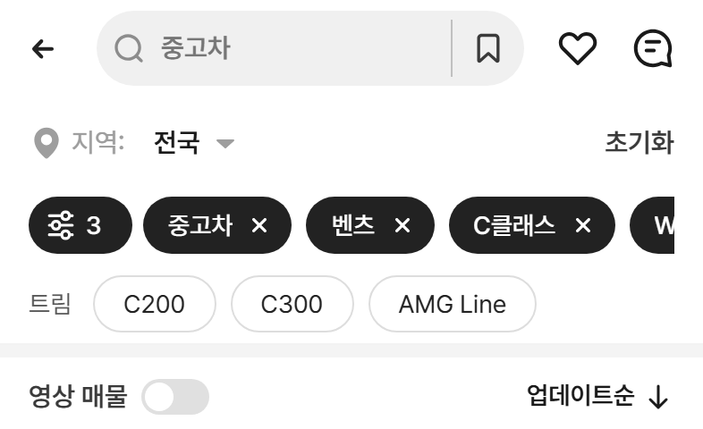
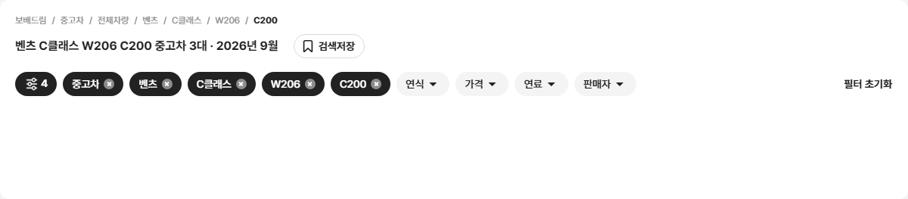
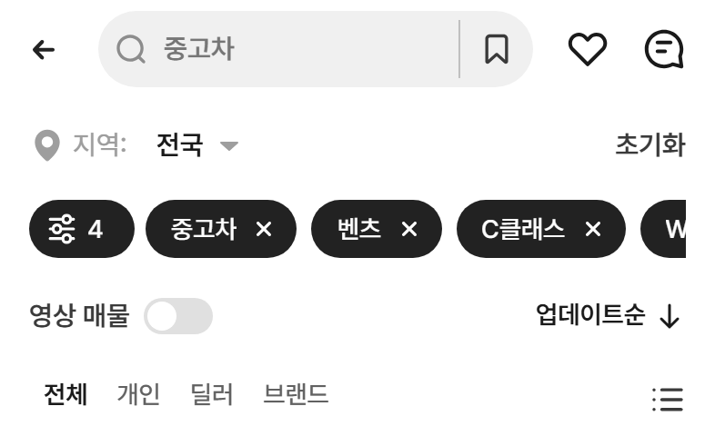
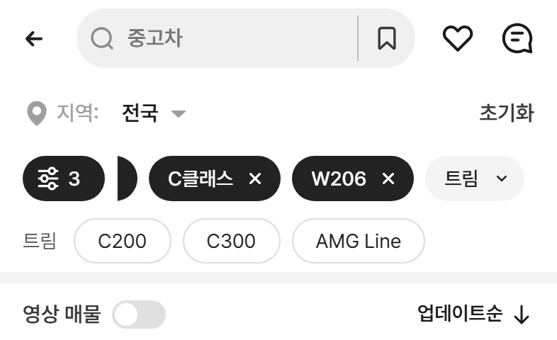
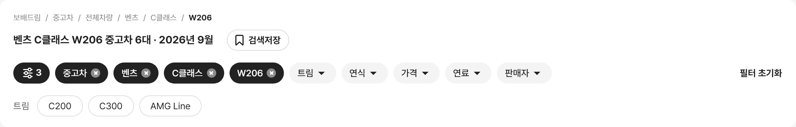

# PR #91 QF-105 과쯔 퀵필터 트림 줄 — 초톳 알약 줄 규칙

## 1. 한 줄 요약
과쯔 퀵필터 트림 줄을 초톳 알약 줄 규칙으로 바꿨습니다. 빈 공간 없는 32 높이, "전체"와 선택 표시가 없는 알약입니다. 알약을 누르면 바로 적용되어 단계 칩 [C200 ×]이 붙고 줄이 닫힙니다. 모델·세부모델·트림 줄 이름표도 통일했습니다. plain·card 두 모양 모두 같고, 점검을 모두 통과해 병합·배포했습니다.

## 2. 기본 정보
| 항목 | 내용 |
|---|---|
| 과제 ID | QF-105 |
| 브랜치 | `feat/qf-105-trim-row`(main `db1d740`에서 시작) |
| 커밋 | `5330d61` · 보고서 커밋(이 파일) |
| PR | https://github.com/bobaekimboae/bobaedream/pull/91 |
| 상태 | 병합·배포(배포 v 값은 채팅 보고·노션에 적음) |
| 이번 병합으로 main에 함께 들어간 과제 | QF-105 |

## 3. 한 일
- **트림 줄 상자**: 96 고정을 없앴습니다(빈 공간 0).
  - PC: 알약 32만 남기고, 칩 줄 → 알약 18, 알약 아래 → 상단 카드 끝 16
  - 모바일: 위 2 + 32 + 아래 6 = 40
  - PC 퀵필터 칸(110 고정)은 트림 줄일 때만 내용 높이에 맞춥니다.
- **알약**: 흰 바탕 · 1px #DDDDDD · 높이 32 · 완전 둥근 · 좌우 16 · 14px 400 #222 · 사이 8 · 가로 스크롤
  - 앞에 선택돼 있던 "전체" 칩과 파랑 선택 스타일을 없앴습니다.
  - 누르는 순간 opacity 0.6(0.1초)
- **동작**
  - 처음엔 모든 트림이 보입니다.
  - 알약을 누르면 그 트림 하나로 바로 적용됩니다: 칩 줄에 [C200 ×](세부모델 칩 뒤), 트림 줄 닫힘, 제목·경로에 트림 이름.
  - [C200 ×]를 누르면 트림만 풀리고 트림 줄이 다시 열립니다.
  - 트림이 1개뿐인 세부모델은 트림 줄을 띄우지 않습니다.
  - 좌측 필터 등급 목록은 지금처럼 여러 개를 고를 수 있습니다.
- **줄 이름표(모델·세부모델·트림)**: 14px 400 #595959, 콜론 없음
  - 왼쪽 = 첫 칩 왼쪽 선, 첫 칸·첫 알약까지 12, 칸·알약 세로 가운데
- **check:models**: 트림 줄 점검(상자 높이·알약 규격·이름표·C200 흐름)을 더했습니다. 전수 점검도 새 동작(누르면 적용 → ×로 복귀)에 맞췄습니다.

## 4. 원본과 비교(수치)
| 화면 | 트림 줄 상자 | 알약 위 · 아래 | 알약 → 상단 카드 끝 | 알약 높이 · 좌우 · 사이 | 이름표 왼쪽 · → 첫 알약 · 세로 차 |
|---|---|---|---|---|---|
| PC 1440 | 32 | 0 · 0 | 16 | 32 · 16px · 8 | 140 (첫 칩 140) · 12 · -0.5 |
| PC 1280 | 32 | 0 · 0 | 16 | 32 · 16px · 8 | 60 (첫 칩 60) · 12 · -0.5 |
| 모바일 393 | 40 | 2 · 6 | - | 32 · 16px · 8 | 16 (첫 칩 16) · 12 · -0.5 |

- **이름표 → 첫 칸 12, 세로 차 −0.5**: 모델·세부모델 줄에서도 같습니다(PC 1440·1280·모바일 393, plain·card).
- **두 모양 결과 같음**
  - 트림 줄: PC 32 · 모바일 40, 칩 → 알약 PC 18 · 모바일 10(모바일 칩 줄 아래 여백 10 + 위 2)
  - 알약 규격, 이름표 위치
  - 흐름: C200 → 칩 [벤츠][C클래스][W206][C200] · 줄 닫힘 · 제목 "벤츠 C클래스 W206 C200 중고차 3대" · 경로 …/W206/C200 → × → 트림 줄 3개
  - 콘솔 오류 0

### 흐름 캡처(PC 1440 · 모바일 393)
W206 선택 → 트림 줄
 

C200 누름 → 단계 칩 [C200 ×] · 트림 줄 닫힘 · 제목
 

[C200 ×] → 트림 줄 다시 열림
 

card 모양(&qfcard=card)도 같은 트림 줄
 

### 원본 대조
| 점검 | 결과 |
|---|---|
| `diff:bbm` | 25개 영역 3% 이하(최대 2.4%) |
| `diff:bbm:flow` | 30단계 3% 이하(최대 3.0%), 동작 점검 274/274, 콘솔 오류 0 |

## 5. 검증
| 항목 | 결과 |
|---|---|
| `npm run verify:qf` | 통과(런타임 보호 파일 28개 그대로) |
| `check:models` | PC 1440 23/23 · 1280 23/23 · 모바일 393 19/19(트림 줄 점검 포함, 전수 0대 없음) |
| `check:logos` · `check:top` · `check:hybrid` · `check:sidebar` | 21/21 · 21/21 · 20/20 · 31/31 |
| `regress:modes` | 배포본 db1d740과 12개 화면 0% |
| 콘솔 오류 | 0 |

## 6. 지시와 다르게 한 것과 이유
change-log CH-0087~0089에 기록했습니다.
- **시작 위치**: QF-103·104 브랜치, "bare" 모양, `docs/report-template.md`가 main과 원격 어디에도 없었습니다.
  - 그래서 main(db1d740)에서 시작했고, 지금 있는 plain(기본)·card 두 모양에 적용했습니다.
  - 보고서는 기존 양식을 썼습니다.
- **QF-103 여백 규칙**: 규칙 파일이 없어 지시문 숫자를 그대로 썼습니다.
  - 모바일: 위 2 · 아래 6
  - PC: 알약 아래 → 상단 카드 끝 16. 칩 줄 → 알약은 다른 퀵필터 줄과 같은 18로 두었습니다.
- **초톳 앱 알약 줄과 나란히 캡처**: 초톳 웹(xe.chotot.com)에는 "Dòng xe" 알약 줄이 없습니다(앱 화면). 그래서 나란히 캡처를 만들지 못했고, 지시 규격으로 비교했습니다.
- **트림 1개뿐인 세부모델**: 지금 샘플 데이터에 없어서, 화면으로는 확인하지 못했습니다. 코드 규칙(트림 2개 이상일 때만 줄 표시)으로만 넣었습니다.
- **높이 전환 0.15초**: 넣지 않았습니다. PC는 트림 줄일 때만 칸 높이가 바뀌고, 목록 튐은 확인하지 못했습니다.

## 7. 못 한 것 · 다음에 할 것
- 초톳 앱 캡처는 자료를 받으면 나란히 비교합니다.

## 8. 확인 링크(배포본 v 값은 채팅 보고·노션)
- 모바일: https://bobaekimboae.github.io/bobaedream/?qf=guazi
- PC: https://bobaekimboae.github.io/bobaedream/?qf=guazi&pc=1
- card 비교: 위 주소 끝에 `&qfcard=card`를 붙입니다.
