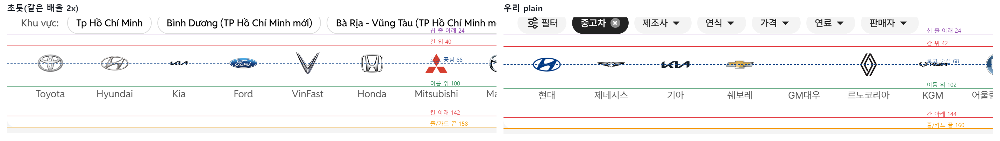
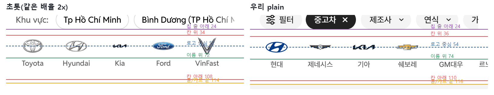
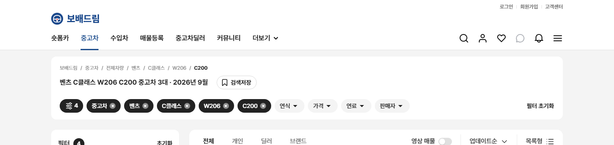

# PR #92 QF-103 과쯔 퀵필터 줄 위아래 간격 초톳과 같게 · PC 상단 카드 빈 공간 제거

## 1. 한 줄 요약
과쯔 퀵필터(제조사·모델·세부모델) 줄의 위아래 간격을 초톳 실측과 같게 맞췄습니다. PC는 줄 상자가 칸 높이와 같고 칸 아래 → 상단 카드 끝이 16입니다. 트림까지 고르면 빈 공간 없이 칩 줄 아래 16에서 카드가 끝납니다(263 → 148). 모바일은 위 2 · 아래 6입니다. plain·card 모두 같은 규칙이고, 점검을 통과해 병합·배포했습니다.

## 2. 기본 정보
| 항목 | 내용 |
|---|---|
| 과제 ID | QF-103 |
| 브랜치 | `feat/qf-103-rail-vertical`(main `3832fa8`에서 시작) |
| 커밋 | `c38194f` · 보고서 커밋(이 파일) |
| PR | https://github.com/bobaekimboae/bobaedream/pull/92 |
| 상태 | 병합·배포(배포 v 값은 채팅 보고·노션에 적음) |
| 이번 병합으로 main에 함께 들어간 과제 | QF-103 |

## 3. 한 일
- **PC**
  - 퀵필터 칸(110 고정)과 줄 상자(96)를 칸 높이에 맞췄습니다(제조사 102 · 모델·세부모델 81 · card 72). 넘침은 0입니다.
  - 칩 줄 → 칸은 18, 칸 아래 → 상단 카드 끝은 16입니다.
  - 줄이 닫히면(트림까지 선택) 퀵필터 칸을 없애고, 칩 줄 아래 여백도 없애 칩 줄 아래 → 카드 끝을 16으로 맞췄습니다.
  - 첫 화면 유형 줄의 110 칸은 그대로입니다.
- **모바일**: 줄 상자는 위 2 · 칸 · 아래 6입니다(지금까지 아래 22~26). 칩 줄 → 칸은 12입니다.
- **공통**: 가로 스크롤바를 숨겼습니다(스크롤은 그대로). 칸 안쪽과 트림 줄 규칙(QF-105)은 바꾸지 않았습니다.
- **점검**
  - 간격 점검 `npm run check:rail-vertical`을 추가했습니다(card는 `-- --mode=card`).
  - check:logos의 모바일 간격 기준을 14에서 12로 바꿨습니다(줄 위 2).

## 4. 초톳과 비교
### 같은 배율(2x) 나란히 · 안내선(칩 줄 아래 · 칸 위 · 로고 중심 · 이름 위 · 칸 아래 · 줄/카드 끝)
| 위치(캡처 기준 y) | 초톳 PC | 우리 PC | 초톳 모바일 | 우리 모바일 |
|---|---|---|---|---|
| 칩 줄 아래 → 칸 위 | 16(지역 칩 줄) | 18(필터 칩 줄) | 10(지역 칩 줄) | 12(필터 칩 줄) |
| 칸 위 → 로고 중심 | 26 | 26 | 18 | 18 |
| 칸 위 → 이름 위 | 60 | 60 | 38 | 38 |
| 칸 높이 | 102 | 102 | 74 | 74 |
| 칸 아래 → 끝 | 16(카드 끝) | 16(카드 끝) | 6(줄 끝) | 6(줄 끝) |

트림 선택 뒤 PC 상단 카드(칩 줄 아래 → 카드 끝 16)

### 단계별 높이(제조사 → 모델 → 세부모델 → 트림 → 닫힘)
PC 1440(PC 1280도 같음)
| 단계 | 작업 전(plain) | 작업 후 plain | 작업 후 card |
|---|---|---|---|
| 제조사 | 상자 96 · 칸 102 · 칸 아래 → 끝 16 · 카드 263 | 상자 102 · 칸 102 · 칸 아래 → 끝 16 · 카드 263 | 상자 72 · 칸 72 · 칸 아래 → 끝 16 · 카드 233 |
| 모델(벤츠) | 상자 96 · 칸 81 · 칸 아래 → 끝 37 · 카드 263 | 상자 81 · 칸 81 · 칸 아래 → 끝 16 · 카드 242 | 상자 72 · 칸 72 · 칸 아래 → 끝 16 · 카드 233 |
| 세부모델(C클래스) | 상자 96 · 칸 81 · 칸 아래 → 끝 37 · 카드 263 | 상자 81 · 칸 81 · 칸 아래 → 끝 16 · 카드 242 | 상자 72 · 칸 72 · 칸 아래 → 끝 16 · 카드 233 |
| 트림(W206) | 상자 32 · 칸 32 · 칸 아래 → 끝 16 · 카드 193 | 상자 32 · 칸 32 · 칸 아래 → 끝 16 · 카드 193 | 상자 32 · 칸 32 · 칸 아래 → 끝 16 · 카드 193 |
| 닫힘(C200) | 줄 없음 · 칩 줄 아래 → 끝 136 · 카드 263 | 줄 없음 · 칩 줄 아래 → 끝 16 · 카드 148 | 줄 없음 · 칩 줄 아래 → 끝 16 · 카드 148 |

모바일 393(360도 같음)
| 단계 | 작업 전(plain) | 작업 후 plain | 작업 후 card |
|---|---|---|---|
| 제조사 | 상자 96 · 칸 74 · 위 0 · 아래 22 | 상자 82 · 칸 74 · 위 2 · 아래 6 | 상자 80 · 칸 72 · 위 2 · 아래 6 |
| 모델(벤츠) | 상자 96 · 칸 70 · 위 0 · 아래 26 | 상자 78 · 칸 70 · 위 2 · 아래 6 | 상자 80 · 칸 72 · 위 2 · 아래 6 |
| 세부모델(C클래스) | 상자 96 · 칸 70 · 위 0 · 아래 26 | 상자 78 · 칸 70 · 위 2 · 아래 6 | 상자 80 · 칸 72 · 위 2 · 아래 6 |
| 트림(W206) | 상자 40 · 칸 32 · 위 2 · 아래 6 | 상자 40 · 칸 32 · 위 2 · 아래 6 | 상자 40 · 칸 32 · 위 2 · 아래 6 |
| 닫힘(C200) | 줄 없음 | 줄 없음 | 줄 없음 |

### 원본 대조
| 점검 | 결과 |
|---|---|
| `diff:bbm` | 25개 영역 3% 이하(최대 2.4%) |
| `diff:bbm:flow` | 30단계 3% 이하(최대 3.0%), 274/274, 콘솔 오류 0 |

## 5. 검증
| 항목 | 결과 |
|---|---|
| `check:rail-vertical` | plain 14/14 · card 14/14(PC 1440·1280 · 모바일 393·360) |
| `check:models` | PC 1440 23/23 · 1280 23/23 · 모바일 393 19/19 |
| `check:logos` · `check:top` · `check:hybrid` · `check:sidebar` | 21/21 · 21/21 · 20/20 · 31/31 |
| `verify:qf` | 통과 |
| `regress:modes` | 배포본 3832fa8과 12개 화면 0% |
| 콘솔 오류 | 0 |

## 6. 원본과 다르게 남긴 것과 이유
change-log CH-0090~0092에 기록했습니다.
- **칩 줄 → 칸 간격**: 초톳은 지역 칩 줄에서 PC 16 · 모바일 10입니다. 과쯔에는 지역 칩 줄이 없어서 필터 칩 줄에서 잽니다.
  - PC 18: QF-100 규칙 그대로입니다.
  - 모바일 12: 칩 줄 아래 여백 10 + 줄 위 2입니다. QF-100의 14를 대신합니다.

## 7. 못 한 것 · 다음에 할 것
- 없음

## 8. 확인 링크(배포본 v 값은 채팅 보고·노션)
- 모바일: https://bobaekimboae.github.io/bobaedream/?qf=guazi
- PC: https://bobaekimboae.github.io/bobaedream/?qf=guazi&pc=1
- card: 위 주소 끝에 `&qfcard=card`를 붙입니다.
